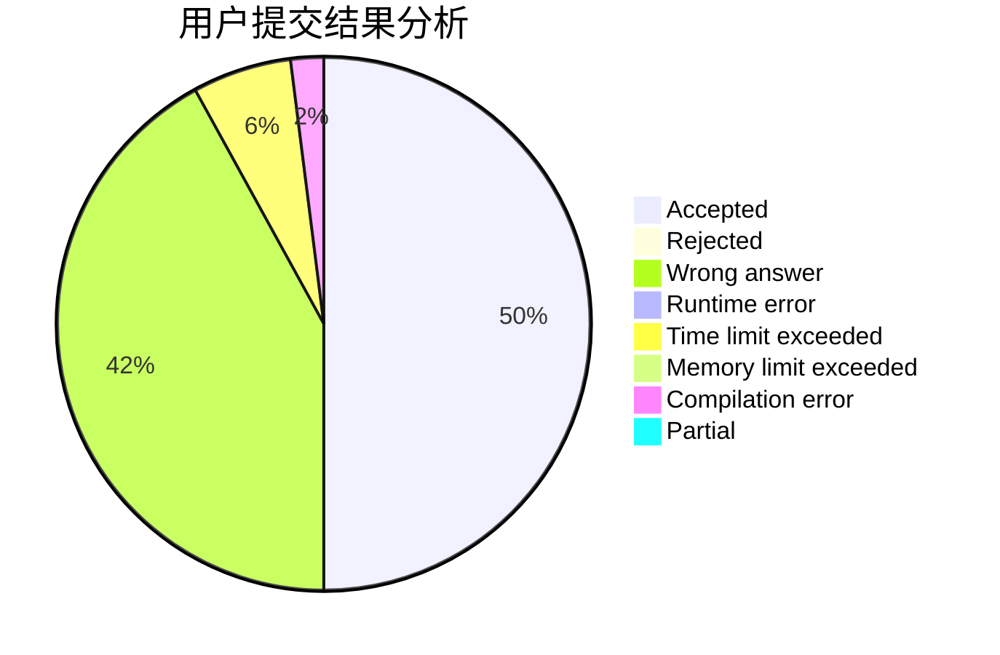
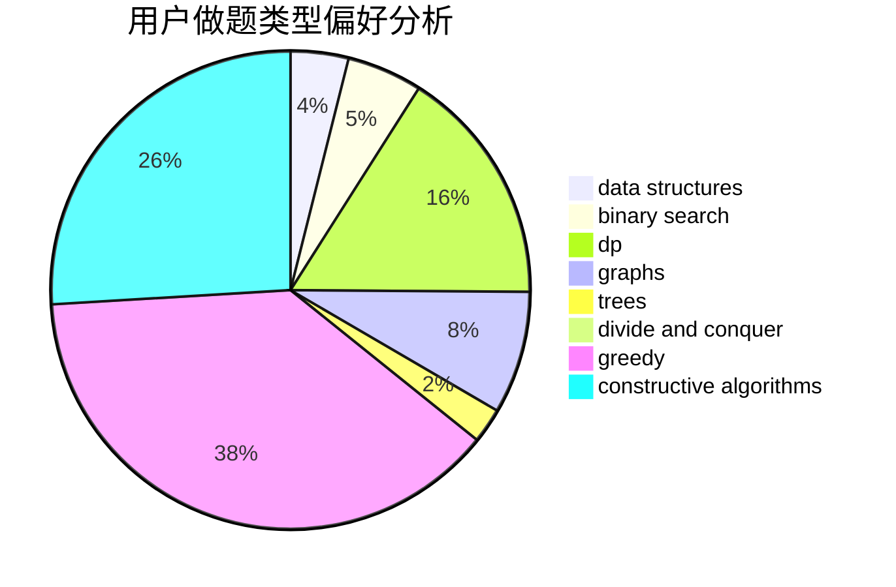
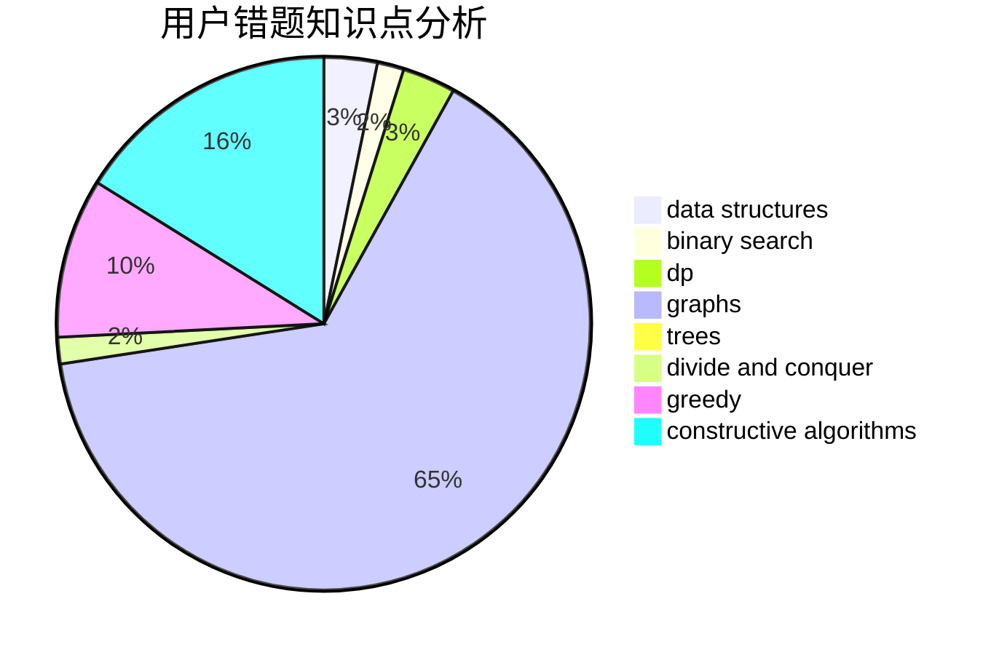

# KeeWuuuuu

<!-- tabs:start -->

#### **用户提交结果分析**

#### **用户做题类型偏好分析**

#### **用户错题知识点分析**

<!-- tabs:end -->
# 推荐题目
[1490C](https://codeforces.com/contest/1490/problem/C)		binary search,
                        brute force,
                        brute force,
                        math		  
[720D](https://codeforces.com/contest/720/problem/D)		data structures,
                        dp,
                        sortings		  
[300A](https://codeforces.com/contest/300/problem/A)		brute force,
                        constructive algorithms,
                        implementation		  
[767B](https://codeforces.com/contest/767/problem/B)		brute force,
                        greedy		  
[631E](https://codeforces.com/contest/631/problem/E)		data structures,
                        dp,
                        geometry		  
[812A](https://codeforces.com/contest/812/problem/A)		implementation		  
[436C](https://codeforces.com/contest/436/problem/C)		dsu,
                        graphs,
                        greedy,
                        trees		  
[721D](https://codeforces.com/contest/721/problem/D)		constructive algorithms,
                        data structures,
                        greedy,
                        math		  
[1368A](https://codeforces.com/contest/1368/problem/A)		brute force,
                        greedy,
                        implementation,
                        math		  
[518B](https://codeforces.com/contest/518/problem/B)		greedy,
                        implementation,
                        strings		  
