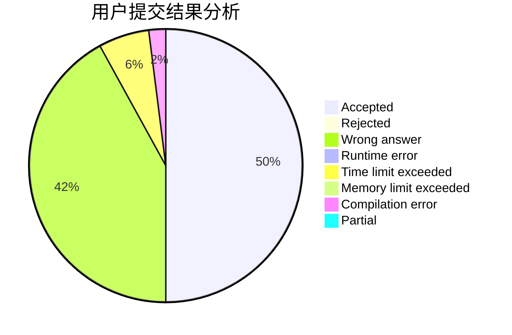
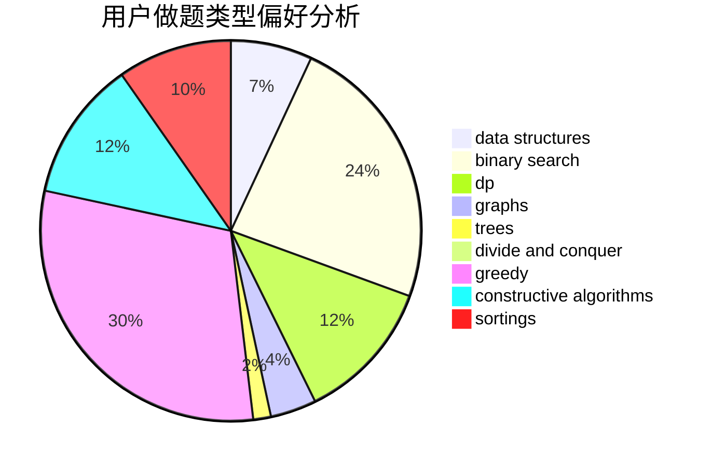
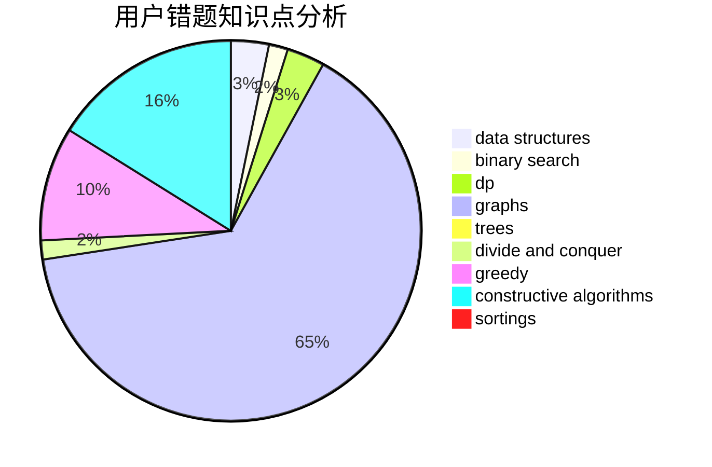

# KeeWuuuuu
<!-- tabs:start -->
#### **用户提交结果分析**

#### **用户做题类型偏好分析**

#### **用户错题知识点分析**

<!-- tabs:end -->
# 推荐题目
[798A](http://codeforces.com/problemset/problem/798/A)		brute force,
                        constructive algorithms,
                        strings		  
[1320E](http://codeforces.com/problemset/problem/1320/E)		data structures,
                        dfs and similar,
                        dp,
                        shortest paths,
                        trees		  
[612C](http://codeforces.com/problemset/problem/612/C)		data structures,
                        expression parsing,
                        math		  
[702F](http://codeforces.com/problemset/problem/702/F)		data structures		  
[750A](http://codeforces.com/problemset/problem/750/A)		binary search,
                        brute force,
                        implementation,
                        math		  
[407E](http://codeforces.com/problemset/problem/407/E)		data structures		  
[1482E](http://codeforces.com/problemset/problem/1482/E)		data structures,
                        divide and conquer,
                        dp		  
[28C](http://codeforces.com/problemset/problem/28/C)		combinatorics,
                        dp,
                        probabilities		  
[1417F](https://codeforces.com/contest/1417/problem/F)		data structures,
                        dsu,
                        graphs,
                        implementation,
                        trees		  
[497E](http://codeforces.com/problemset/problem/497/E)		dp,
                        matrices		  
<!-- tabs:start -->
#### **data structures**
[1320E](http://codeforces.com/problemset/problem/1320/E)		data structures,
                        dfs and similar,
                        dp,
                        shortest paths,
                        trees		  
[612C](http://codeforces.com/problemset/problem/612/C)		data structures,
                        expression parsing,
                        math		  
[702F](http://codeforces.com/problemset/problem/702/F)		data structures		  
[407E](http://codeforces.com/problemset/problem/407/E)		data structures		  
[1482E](http://codeforces.com/problemset/problem/1482/E)		data structures,
                        divide and conquer,
                        dp		  
[1417F](https://codeforces.com/contest/1417/problem/F)		data structures,
                        dsu,
                        graphs,
                        implementation,
                        trees		  
[938G](http://codeforces.com/problemset/problem/938/G)		bitmasks,
                        data structures,
                        dsu,
                        graphs		  
[1056G](http://codeforces.com/problemset/problem/1056/G)		brute force,
                        data structures,
                        graphs		  
[1379F2](http://codeforces.com/problemset/problem/1379/F2)		data structures,
                        divide and conquer		  
[1447F2](https://codeforces.com/contest/1447/problem/F2)		data structures,
                        greedy,
                        two pointers		  
#### **binary search**
[750A](http://codeforces.com/problemset/problem/750/A)		binary search,
                        brute force,
                        implementation,
                        math		  
[866C](https://codeforces.com/contest/866/problem/C)		binary search,
                        dp		  
[1493C](http://codeforces.com/problemset/problem/1493/C)		binary search,
                        brute force,
                        constructive algorithms,
                        greedy,
                        strings		  
[1352C](http://codeforces.com/problemset/problem/1352/C)		binary search,
                        math		  
[1492C](http://codeforces.com/problemset/problem/1492/C)		binary search,
                        data structures,
                        dp,
                        greedy,
                        two pointers		  
[1463D](http://codeforces.com/problemset/problem/1463/D)		binary search,
                        constructive algorithms,
                        greedy,
                        two pointers		  
[1490G](http://codeforces.com/problemset/problem/1490/G)		binary search,
                        data structures,
                        math		  
[1479D](http://codeforces.com/problemset/problem/1479/D)		binary search,
                        bitmasks,
                        brute force,
                        data structures,
                        probabilities,
                        trees		  
[1436E](http://codeforces.com/problemset/problem/1436/E)		binary search,
                        data structures,
                        two pointers		  
[1461D](http://codeforces.com/problemset/problem/1461/D)		binary search,
                        brute force,
                        data structures,
                        divide and conquer,
                        implementation,
                        sortings		  
#### **dp**
[1320E](http://codeforces.com/problemset/problem/1320/E)		data structures,
                        dfs and similar,
                        dp,
                        shortest paths,
                        trees		  
[1482E](http://codeforces.com/problemset/problem/1482/E)		data structures,
                        divide and conquer,
                        dp		  
[28C](http://codeforces.com/problemset/problem/28/C)		combinatorics,
                        dp,
                        probabilities		  
[497E](http://codeforces.com/problemset/problem/497/E)		dp,
                        matrices		  
[702A](http://codeforces.com/problemset/problem/702/A)		dp,
                        greedy,
                        implementation		  
[866C](https://codeforces.com/contest/866/problem/C)		binary search,
                        dp		  
[1041F](http://codeforces.com/problemset/problem/1041/F)		data structures,
                        divide and conquer,
                        dp,
                        math		  
[285E](http://codeforces.com/problemset/problem/285/E)		combinatorics,
                        dp,
                        math		  
[1439D](http://codeforces.com/problemset/problem/1439/D)		combinatorics,
                        dp,
                        fft		  
[755G](http://codeforces.com/problemset/problem/755/G)		combinatorics,
                        divide and conquer,
                        dp,
                        fft,
                        math,
                        number theory		  
#### **graph**
[1417F](https://codeforces.com/contest/1417/problem/F)		data structures,
                        dsu,
                        graphs,
                        implementation,
                        trees		  
[938G](http://codeforces.com/problemset/problem/938/G)		bitmasks,
                        data structures,
                        dsu,
                        graphs		  
[1056G](http://codeforces.com/problemset/problem/1056/G)		brute force,
                        data structures,
                        graphs		  
[1487C](http://codeforces.com/problemset/problem/1487/C)		brute force,
                        constructive algorithms,
                        dfs and similar,
                        graphs,
                        greedy,
                        implementation,
                        math		  
[1437C](http://codeforces.com/problemset/problem/1437/C)		dp,
                        flows,
                        graph matchings,
                        greedy,
                        math,
                        sortings		  
[1470D](http://codeforces.com/problemset/problem/1470/D)		constructive algorithms,
                        dfs and similar,
                        graph matchings,
                        graphs,
                        greedy		  
[1476C](http://codeforces.com/problemset/problem/1476/C)		dp,
                        graphs,
                        greedy		  
[1304D](http://codeforces.com/problemset/problem/1304/D)		constructive algorithms,
                        graphs,
                        greedy,
                        two pointers		  
[1475C](http://codeforces.com/problemset/problem/1475/C)		combinatorics,
                        graphs,
                        math		  
[553E](http://codeforces.com/problemset/problem/553/E)		dp,
                        fft,
                        graphs,
                        math,
                        probabilities		  
#### **trees**
[1320E](http://codeforces.com/problemset/problem/1320/E)		data structures,
                        dfs and similar,
                        dp,
                        shortest paths,
                        trees		  
[1417F](https://codeforces.com/contest/1417/problem/F)		data structures,
                        dsu,
                        graphs,
                        implementation,
                        trees		  
[1305D](http://codeforces.com/problemset/problem/1305/D)		constructive algorithms,
                        dfs and similar,
                        interactive,
                        trees		  
[1207G](http://codeforces.com/problemset/problem/1207/G)		data structures,
                        dfs and similar,
                        hashing,
                        string suffix structures,
                        strings,
                        trees		  
[1479D](http://codeforces.com/problemset/problem/1479/D)		binary search,
                        bitmasks,
                        brute force,
                        data structures,
                        probabilities,
                        trees		  
[1511C](http://codeforces.com/problemset/problem/1511/C)		brute force,
                        data structures,
                        implementation,
                        trees		  
[1499F](http://codeforces.com/problemset/problem/1499/F)		combinatorics,
                        dfs and similar,
                        dp,
                        trees		  
[1491E](http://codeforces.com/problemset/problem/1491/E)		brute force,
                        dfs and similar,
                        divide and conquer,
                        number theory,
                        trees		  
[1466D](http://codeforces.com/problemset/problem/1466/D)		data structures,
                        greedy,
                        sortings,
                        trees		  
[1495D](http://codeforces.com/problemset/problem/1495/D)		combinatorics,
                        dfs and similar,
                        graphs,
                        math,
                        shortest paths,
                        trees		  
#### **divide and conquer**
[1482E](http://codeforces.com/problemset/problem/1482/E)		data structures,
                        divide and conquer,
                        dp		  
[1379F2](http://codeforces.com/problemset/problem/1379/F2)		data structures,
                        divide and conquer		  
[1041F](http://codeforces.com/problemset/problem/1041/F)		data structures,
                        divide and conquer,
                        dp,
                        math		  
[755G](http://codeforces.com/problemset/problem/755/G)		combinatorics,
                        divide and conquer,
                        dp,
                        fft,
                        math,
                        number theory		  
[1461D](http://codeforces.com/problemset/problem/1461/D)		binary search,
                        brute force,
                        data structures,
                        divide and conquer,
                        implementation,
                        sortings		  
[1466G](http://codeforces.com/problemset/problem/1466/G)		combinatorics,
                        divide and conquer,
                        hashing,
                        math,
                        string suffix structures,
                        strings		  
[1490D](http://codeforces.com/problemset/problem/1490/D)		dfs and similar,
                        divide and conquer,
                        implementation		  
[1483C](https://codeforces.com/contest/1483/problem/C)		data structures,
                        divide and conquer,
                        dp		  
[1491E](http://codeforces.com/problemset/problem/1491/E)		brute force,
                        dfs and similar,
                        divide and conquer,
                        number theory,
                        trees		  
[1303G](http://codeforces.com/problemset/problem/1303/G)		data structures,
                        divide and conquer,
                        geometry,
                        trees		  
#### **greedy**
[730D](http://codeforces.com/problemset/problem/730/D)		greedy,
                        implementation,
                        math		  
[702A](http://codeforces.com/problemset/problem/702/A)		dp,
                        greedy,
                        implementation		  
[1360B](http://codeforces.com/problemset/problem/1360/B)		greedy,
                        sortings		  
[468A](http://codeforces.com/problemset/problem/468/A)		constructive algorithms,
                        greedy,
                        math		  
[1267E](http://codeforces.com/problemset/problem/1267/E)		greedy		  
[1447F2](https://codeforces.com/contest/1447/problem/F2)		data structures,
                        greedy,
                        two pointers		  
[1406A](http://codeforces.com/problemset/problem/1406/A)		greedy,
                        implementation,
                        math		  
[1252E](http://codeforces.com/problemset/problem/1252/E)		greedy,
                        two pointers		  
[1493C](http://codeforces.com/problemset/problem/1493/C)		binary search,
                        brute force,
                        constructive algorithms,
                        greedy,
                        strings		  
[1355B](http://codeforces.com/problemset/problem/1355/B)		dp,
                        greedy,
                        sortings		  
#### **constructive algorithms**
[798A](http://codeforces.com/problemset/problem/798/A)		brute force,
                        constructive algorithms,
                        strings		  
[468A](http://codeforces.com/problemset/problem/468/A)		constructive algorithms,
                        greedy,
                        math		  
[1196A](http://codeforces.com/problemset/problem/1196/A)		brute force,
                        constructive algorithms,
                        math		  
[1262C](https://codeforces.com/contest/1262/problem/C)		constructive algorithms		  
[1375A](http://codeforces.com/problemset/problem/1375/A)		constructive algorithms,
                        math		  
[1305D](http://codeforces.com/problemset/problem/1305/D)		constructive algorithms,
                        dfs and similar,
                        interactive,
                        trees		  
[1456B](https://codeforces.com/contest/1456/problem/B)		bitmasks,
                        brute force,
                        constructive algorithms		  
[128B](http://codeforces.com/problemset/problem/128/B)		brute force,
                        constructive algorithms,
                        hashing,
                        implementation,
                        string suffix structures,
                        strings		  
[1493C](http://codeforces.com/problemset/problem/1493/C)		binary search,
                        brute force,
                        constructive algorithms,
                        greedy,
                        strings		  
[1493A](http://codeforces.com/problemset/problem/1493/A)		constructive algorithms,
                        greedy		  
#### **sortings**
[1360B](http://codeforces.com/problemset/problem/1360/B)		greedy,
                        sortings		  
[1355B](http://codeforces.com/problemset/problem/1355/B)		dp,
                        greedy,
                        sortings		  
[1496C](https://codeforces.com/contest/1496/problem/C)		geometry,
                        greedy,
                        math,
                        sortings		  
[1495A](http://codeforces.com/problemset/problem/1495/A)		geometry,
                        greedy,
                        math,
                        sortings		  
[1497A](http://codeforces.com/problemset/problem/1497/A)		brute force,
                        data structures,
                        greedy,
                        sortings		  
[1427A](http://codeforces.com/problemset/problem/1427/A)		math,
                        sortings		  
[1461D](http://codeforces.com/problemset/problem/1461/D)		binary search,
                        brute force,
                        data structures,
                        divide and conquer,
                        implementation,
                        sortings		  
[1437C](http://codeforces.com/problemset/problem/1437/C)		dp,
                        flows,
                        graph matchings,
                        greedy,
                        math,
                        sortings		  
[1473A](http://codeforces.com/problemset/problem/1473/A)		greedy,
                        implementation,
                        math,
                        sortings		  
[1486B](http://codeforces.com/problemset/problem/1486/B)		binary search,
                        geometry,
                        shortest paths,
                        sortings		  
<!-- tabs:end -->
