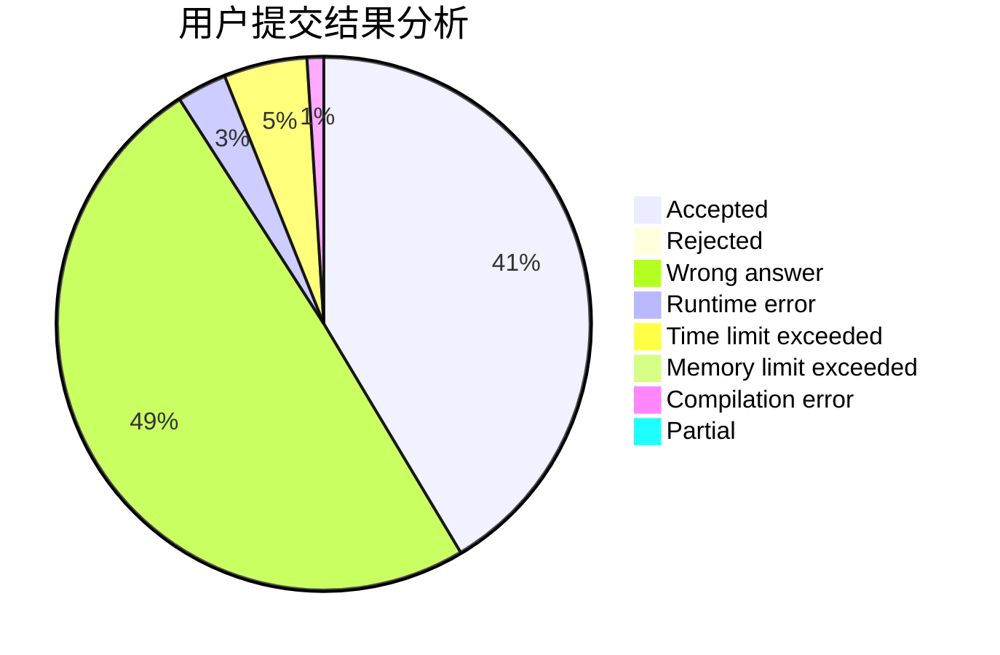
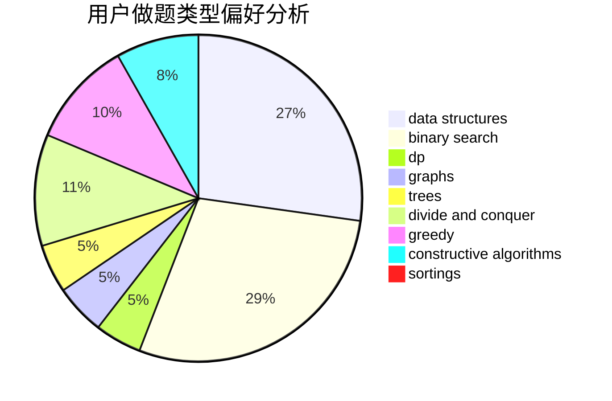
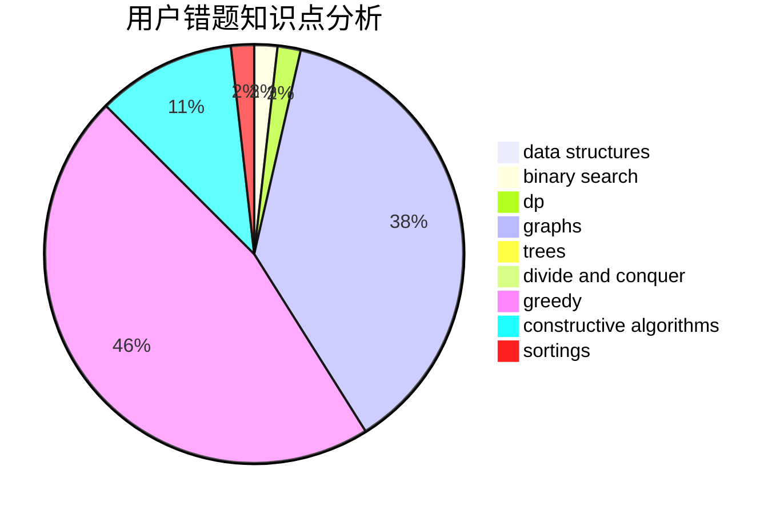

# Kelin
<!-- tabs:start -->
#### **用户提交结果分析**

#### **用户做题类型偏好分析**

#### **用户错题知识点分析**

<!-- tabs:end -->
# 推荐题目
[1511G](http://codeforces.com/problemset/problem/1511/G)		bitmasks,
                        brute force,
                        data structures,
                        games,
                        two pointers		  
[1254D](http://codeforces.com/problemset/problem/1254/D)		data structures,
                        probabilities,
                        trees		  
[1496F](https://codeforces.com/contest/1496/problem/F)		combinatorics,
                        dfs and similar,
                        graphs,
                        math,
                        shortest paths,
                        trees		  
[587D](http://codeforces.com/problemset/problem/587/D)		2-sat,
                        binary search		  
[1038D](http://codeforces.com/problemset/problem/1038/D)		dp,
                        greedy,
                        implementation		  
[1388E](http://codeforces.com/problemset/problem/1388/E)		data structures,
                        geometry,
                        sortings		  
[782A](https://codeforces.com/contest/782/problem/A)		implementation		  
[737E](http://codeforces.com/problemset/problem/737/E)		graph matchings,
                        graphs,
                        greedy,
                        schedules		  
[1199B](http://codeforces.com/problemset/problem/1199/B)		geometry,
                        math		  
[643D](http://codeforces.com/problemset/problem/643/D)		nan		  
<!-- tabs:start -->
#### **data structures**
[1511G](http://codeforces.com/problemset/problem/1511/G)		bitmasks,
                        brute force,
                        data structures,
                        games,
                        two pointers		  
[1254D](http://codeforces.com/problemset/problem/1254/D)		data structures,
                        probabilities,
                        trees		  
[1388E](http://codeforces.com/problemset/problem/1388/E)		data structures,
                        geometry,
                        sortings		  
[631E](http://codeforces.com/problemset/problem/631/E)		data structures,
                        dp,
                        geometry		  
[1385F](http://codeforces.com/problemset/problem/1385/F)		data structures,
                        greedy,
                        implementation,
                        trees		  
[629D](http://codeforces.com/problemset/problem/629/D)		data structures,
                        dp		  
[1294D](http://codeforces.com/problemset/problem/1294/D)		data structures,
                        greedy,
                        implementation,
                        math		  
[600E](http://codeforces.com/problemset/problem/600/E)		data structures,
                        dfs and similar,
                        dsu,
                        trees		  
[813F](http://codeforces.com/problemset/problem/813/F)		data structures,
                        dsu,
                        graphs		  
[765F](http://codeforces.com/problemset/problem/765/F)		data structures		  
#### **binary search**
[587D](http://codeforces.com/problemset/problem/587/D)		2-sat,
                        binary search		  
[815E](http://codeforces.com/problemset/problem/815/E)		binary search,
                        constructive algorithms,
                        implementation		  
[866C](https://codeforces.com/contest/866/problem/C)		binary search,
                        dp		  
[822C](http://codeforces.com/problemset/problem/822/C)		binary search,
                        greedy,
                        implementation,
                        sortings		  
[833B](http://codeforces.com/problemset/problem/833/B)		binary search,
                        data structures,
                        divide and conquer,
                        dp,
                        two pointers		  
[1100C](http://codeforces.com/problemset/problem/1100/C)		binary search,
                        geometry,
                        math		  
[1114E](http://codeforces.com/problemset/problem/1114/E)		binary search,
                        interactive,
                        number theory,
                        probabilities		  
[1492C](http://codeforces.com/problemset/problem/1492/C)		binary search,
                        data structures,
                        dp,
                        greedy,
                        two pointers		  
[1463D](http://codeforces.com/problemset/problem/1463/D)		binary search,
                        constructive algorithms,
                        greedy,
                        two pointers		  
[1490G](http://codeforces.com/problemset/problem/1490/G)		binary search,
                        data structures,
                        math		  
#### **dp**
[1038D](http://codeforces.com/problemset/problem/1038/D)		dp,
                        greedy,
                        implementation		  
[631E](http://codeforces.com/problemset/problem/631/E)		data structures,
                        dp,
                        geometry		  
[629D](http://codeforces.com/problemset/problem/629/D)		data structures,
                        dp		  
[866C](https://codeforces.com/contest/866/problem/C)		binary search,
                        dp		  
[833B](http://codeforces.com/problemset/problem/833/B)		binary search,
                        data structures,
                        divide and conquer,
                        dp,
                        two pointers		  
[1277C](https://codeforces.com/contest/1277/problem/C)		dp,
                        greedy		  
[855C](http://codeforces.com/problemset/problem/855/C)		dp,
                        trees		  
[353D](http://codeforces.com/problemset/problem/353/D)		constructive algorithms,
                        dp		  
[1060E](http://codeforces.com/problemset/problem/1060/E)		dfs and similar,
                        dp,
                        trees		  
[1437F](http://codeforces.com/problemset/problem/1437/F)		combinatorics,
                        dp,
                        math,
                        two pointers		  
#### **graph**
[1496F](https://codeforces.com/contest/1496/problem/F)		combinatorics,
                        dfs and similar,
                        graphs,
                        math,
                        shortest paths,
                        trees		  
[737E](http://codeforces.com/problemset/problem/737/E)		graph matchings,
                        graphs,
                        greedy,
                        schedules		  
[33D](http://codeforces.com/problemset/problem/33/D)		geometry,
                        graphs,
                        shortest paths,
                        sortings		  
[441D](http://codeforces.com/problemset/problem/441/D)		constructive algorithms,
                        dsu,
                        graphs,
                        implementation,
                        math,
                        string suffix structures		  
[120H](http://codeforces.com/problemset/problem/120/H)		graph matchings		  
[939A](http://codeforces.com/problemset/problem/939/A)		graphs		  
[813F](http://codeforces.com/problemset/problem/813/F)		data structures,
                        dsu,
                        graphs		  
[1487C](http://codeforces.com/problemset/problem/1487/C)		brute force,
                        constructive algorithms,
                        dfs and similar,
                        graphs,
                        greedy,
                        implementation,
                        math		  
[1437C](http://codeforces.com/problemset/problem/1437/C)		dp,
                        flows,
                        graph matchings,
                        greedy,
                        math,
                        sortings		  
[1470D](http://codeforces.com/problemset/problem/1470/D)		constructive algorithms,
                        dfs and similar,
                        graph matchings,
                        graphs,
                        greedy		  
#### **trees**
[1254D](http://codeforces.com/problemset/problem/1254/D)		data structures,
                        probabilities,
                        trees		  
[1496F](https://codeforces.com/contest/1496/problem/F)		combinatorics,
                        dfs and similar,
                        graphs,
                        math,
                        shortest paths,
                        trees		  
[1385F](http://codeforces.com/problemset/problem/1385/F)		data structures,
                        greedy,
                        implementation,
                        trees		  
[1086B](https://codeforces.com/contest/1086/problem/B)		constructive algorithms,
                        implementation,
                        trees		  
[600E](http://codeforces.com/problemset/problem/600/E)		data structures,
                        dfs and similar,
                        dsu,
                        trees		  
[855C](http://codeforces.com/problemset/problem/855/C)		dp,
                        trees		  
[1060E](http://codeforces.com/problemset/problem/1060/E)		dfs and similar,
                        dp,
                        trees		  
[1479D](http://codeforces.com/problemset/problem/1479/D)		binary search,
                        bitmasks,
                        brute force,
                        data structures,
                        probabilities,
                        trees		  
[1511C](http://codeforces.com/problemset/problem/1511/C)		brute force,
                        data structures,
                        implementation,
                        trees		  
[1499F](http://codeforces.com/problemset/problem/1499/F)		combinatorics,
                        dfs and similar,
                        dp,
                        trees		  
#### **divide and conquer**
[833B](http://codeforces.com/problemset/problem/833/B)		binary search,
                        data structures,
                        divide and conquer,
                        dp,
                        two pointers		  
[1461D](http://codeforces.com/problemset/problem/1461/D)		binary search,
                        brute force,
                        data structures,
                        divide and conquer,
                        implementation,
                        sortings		  
[1466G](http://codeforces.com/problemset/problem/1466/G)		combinatorics,
                        divide and conquer,
                        hashing,
                        math,
                        string suffix structures,
                        strings		  
[1490D](http://codeforces.com/problemset/problem/1490/D)		dfs and similar,
                        divide and conquer,
                        implementation		  
[1483C](https://codeforces.com/contest/1483/problem/C)		data structures,
                        divide and conquer,
                        dp		  
[1491E](http://codeforces.com/problemset/problem/1491/E)		brute force,
                        dfs and similar,
                        divide and conquer,
                        number theory,
                        trees		  
[1303G](http://codeforces.com/problemset/problem/1303/G)		data structures,
                        divide and conquer,
                        geometry,
                        trees		  
[1494D](http://codeforces.com/problemset/problem/1494/D)		constructive algorithms,
                        data structures,
                        dfs and similar,
                        divide and conquer,
                        dsu,
                        greedy,
                        sortings,
                        trees		  
[1482E](http://codeforces.com/problemset/problem/1482/E)		data structures,
                        divide and conquer,
                        dp		  
[566C](http://codeforces.com/problemset/problem/566/C)		dfs and similar,
                        divide and conquer,
                        trees		  
#### **greedy**
[1038D](http://codeforces.com/problemset/problem/1038/D)		dp,
                        greedy,
                        implementation		  
[737E](http://codeforces.com/problemset/problem/737/E)		graph matchings,
                        graphs,
                        greedy,
                        schedules		  
[1068F](https://codeforces.com/contest/1068/problem/F)		constructive algorithms,
                        greedy		  
[1385F](http://codeforces.com/problemset/problem/1385/F)		data structures,
                        greedy,
                        implementation,
                        trees		  
[297B](http://codeforces.com/problemset/problem/297/B)		constructive algorithms,
                        greedy		  
[1362E](https://codeforces.com/contest/1362/problem/E)		greedy,
                        implementation,
                        math,
                        sortings		  
[1294D](http://codeforces.com/problemset/problem/1294/D)		data structures,
                        greedy,
                        implementation,
                        math		  
[822C](http://codeforces.com/problemset/problem/822/C)		binary search,
                        greedy,
                        implementation,
                        sortings		  
[1277C](https://codeforces.com/contest/1277/problem/C)		dp,
                        greedy		  
[1492C](http://codeforces.com/problemset/problem/1492/C)		binary search,
                        data structures,
                        dp,
                        greedy,
                        two pointers		  
#### **constructive algorithms**
[1068F](https://codeforces.com/contest/1068/problem/F)		constructive algorithms,
                        greedy		  
[1086B](https://codeforces.com/contest/1086/problem/B)		constructive algorithms,
                        implementation,
                        trees		  
[441D](http://codeforces.com/problemset/problem/441/D)		constructive algorithms,
                        dsu,
                        graphs,
                        implementation,
                        math,
                        string suffix structures		  
[815E](http://codeforces.com/problemset/problem/815/E)		binary search,
                        constructive algorithms,
                        implementation		  
[297B](http://codeforces.com/problemset/problem/297/B)		constructive algorithms,
                        greedy		  
[353D](http://codeforces.com/problemset/problem/353/D)		constructive algorithms,
                        dp		  
[1493A](http://codeforces.com/problemset/problem/1493/A)		constructive algorithms,
                        greedy		  
[1463D](http://codeforces.com/problemset/problem/1463/D)		binary search,
                        constructive algorithms,
                        greedy,
                        two pointers		  
[1456B](https://codeforces.com/contest/1456/problem/B)		bitmasks,
                        brute force,
                        constructive algorithms		  
[1492D](http://codeforces.com/problemset/problem/1492/D)		bitmasks,
                        constructive algorithms,
                        greedy,
                        math		  
#### **sortings**
[1388E](http://codeforces.com/problemset/problem/1388/E)		data structures,
                        geometry,
                        sortings		  
[33D](http://codeforces.com/problemset/problem/33/D)		geometry,
                        graphs,
                        shortest paths,
                        sortings		  
[1362E](https://codeforces.com/contest/1362/problem/E)		greedy,
                        implementation,
                        math,
                        sortings		  
[822C](http://codeforces.com/problemset/problem/822/C)		binary search,
                        greedy,
                        implementation,
                        sortings		  
[1496C](https://codeforces.com/contest/1496/problem/C)		geometry,
                        greedy,
                        math,
                        sortings		  
[1495A](http://codeforces.com/problemset/problem/1495/A)		geometry,
                        greedy,
                        math,
                        sortings		  
[1497A](http://codeforces.com/problemset/problem/1497/A)		brute force,
                        data structures,
                        greedy,
                        sortings		  
[1427A](http://codeforces.com/problemset/problem/1427/A)		math,
                        sortings		  
[1461D](http://codeforces.com/problemset/problem/1461/D)		binary search,
                        brute force,
                        data structures,
                        divide and conquer,
                        implementation,
                        sortings		  
[1437C](http://codeforces.com/problemset/problem/1437/C)		dp,
                        flows,
                        graph matchings,
                        greedy,
                        math,
                        sortings		  
<!-- tabs:end -->
