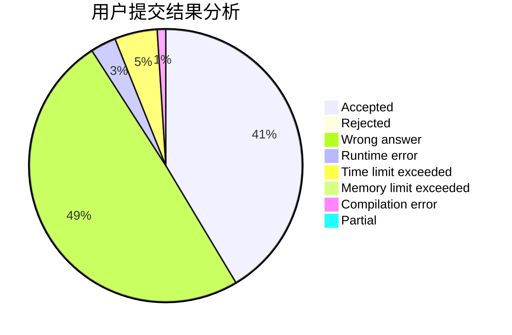
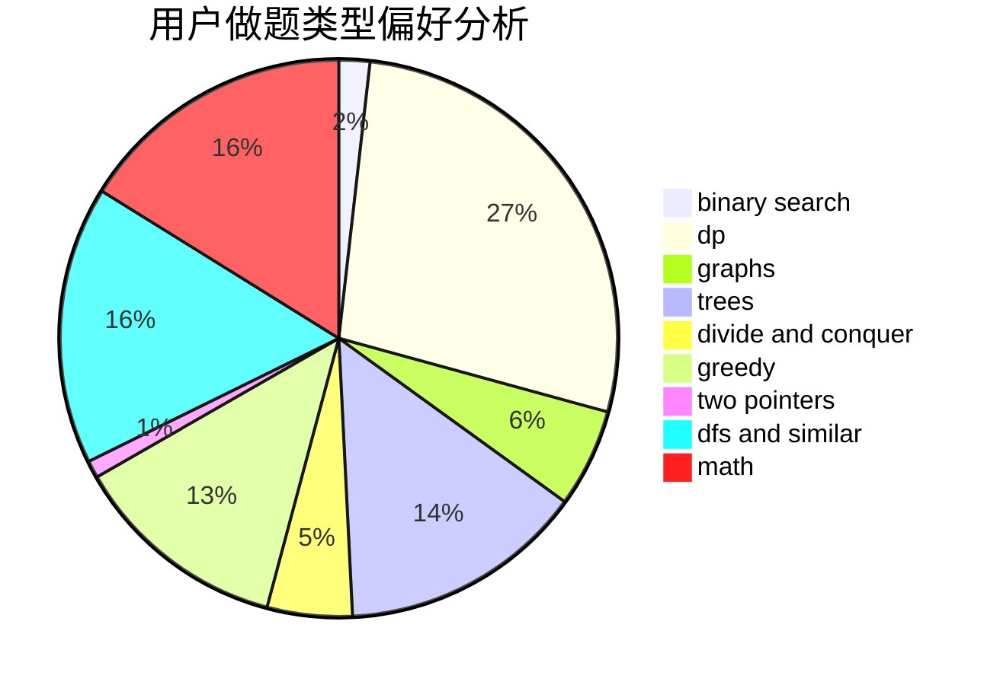

# Kelin

<!-- tabs:start -->

#### **用户提交结果分析**

#### **用户做题类型偏好分析**

<!-- tabs:end -->
# 推荐题目
[1301A](https://codeforces.com/contest/1301/problem/A)
[1505F](https://codeforces.com/contest/1505/problem/F)
[1398C](https://codeforces.com/contest/1398/problem/C)
[886E](https://codeforces.com/contest/886/problem/E)
[12621](https://codeforces.com/contest/1262/problem/1)
[607E](https://codeforces.com/contest/607/problem/E)
[106C](https://codeforces.com/contest/106/problem/C)
[16E](https://codeforces.com/contest/16/problem/E)
[1395F](https://codeforces.com/contest/1395/problem/F)
[620A](https://codeforces.com/contest/620/problem/A)
