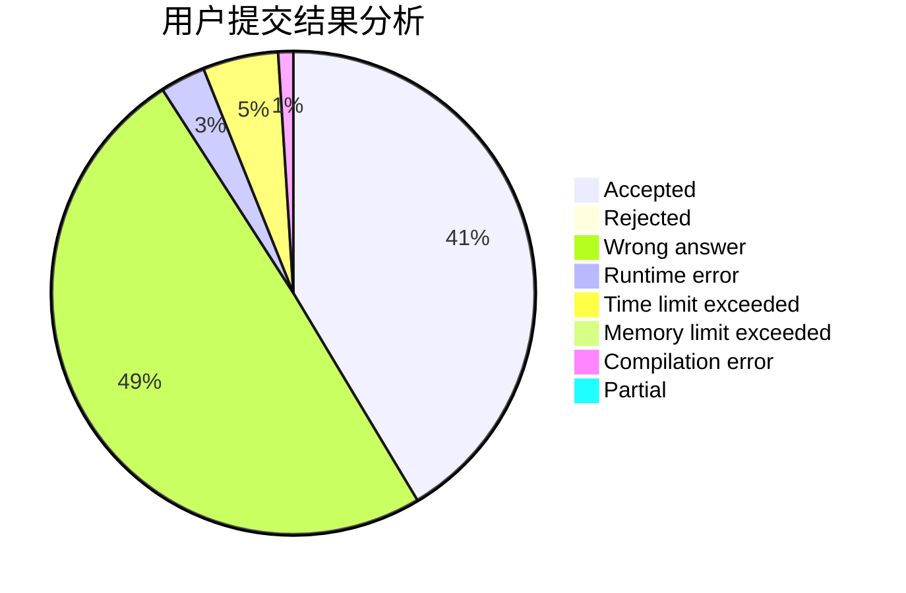
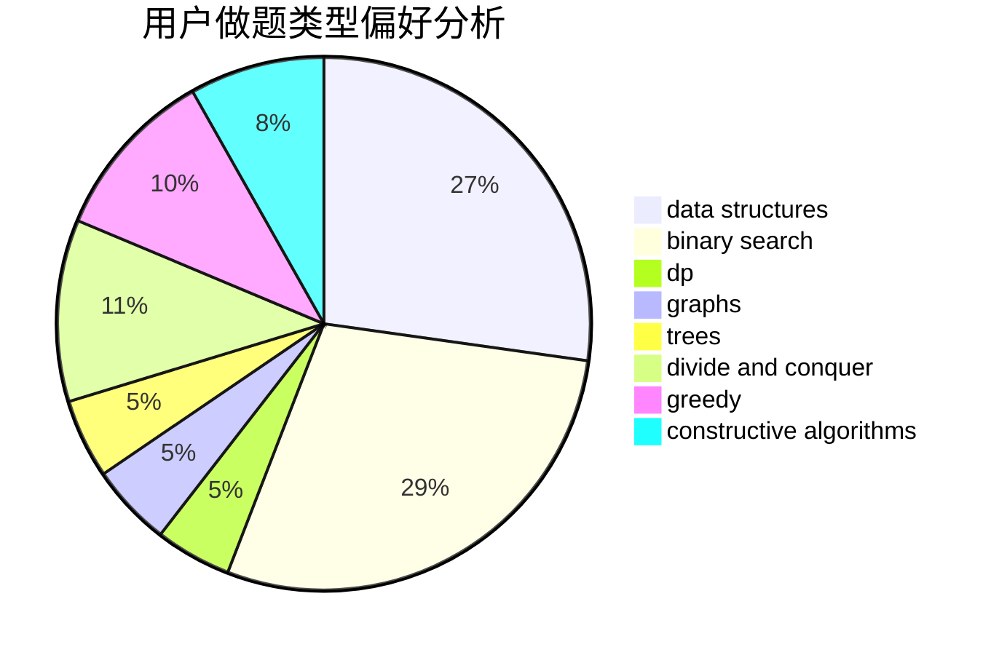
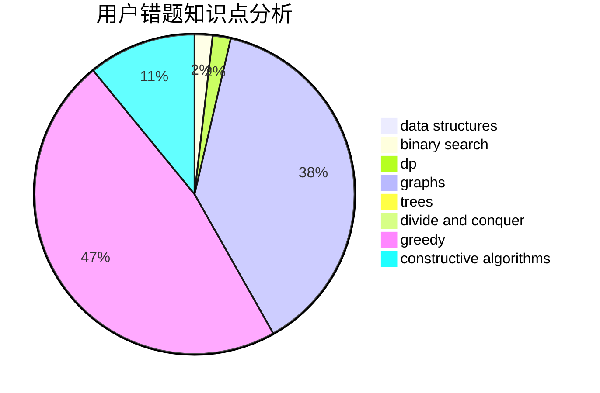

# Kelin

<!-- tabs:start -->

#### **用户提交结果分析**

#### **用户做题类型偏好分析**

#### **用户错题知识点分析**

<!-- tabs:end -->
# 推荐题目
[1294D](https://codeforces.com/contest/1294/problem/D)		data structures,
                        greedy,
                        implementation,
                        math		  
[1496F](https://codeforces.com/contest/1496/problem/F)		dsu,graphs,sortings,trees		  
[1388E](https://codeforces.com/contest/1388/problem/E)		data structures,
                        geometry,
                        sortings		  
[866C](https://codeforces.com/contest/866/problem/C)		dsu,graphs,sortings,trees		  
[1254D](https://codeforces.com/contest/1254/problem/D)		data structures,
                        probabilities,
                        trees		  
[587D](https://codeforces.com/contest/587/problem/D)		2-sat,
                        binary search		  
[1068F](https://codeforces.com/contest/1068/problem/F)		dsu,graphs,sortings,trees		  
[1511G](https://codeforces.com/contest/1511/problem/G)		bitmasks,
                        brute force,
                        data structures,
                        games,
                        two pointers		  
[1385F](https://codeforces.com/contest/1385/problem/F)		data structures,
                        greedy,
                        implementation,
                        trees		  
[600E](https://codeforces.com/contest/600/problem/E)		data structures,
                        dfs and similar,
                        dsu,
                        trees		  
