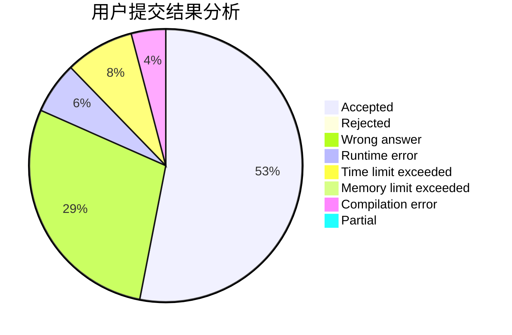
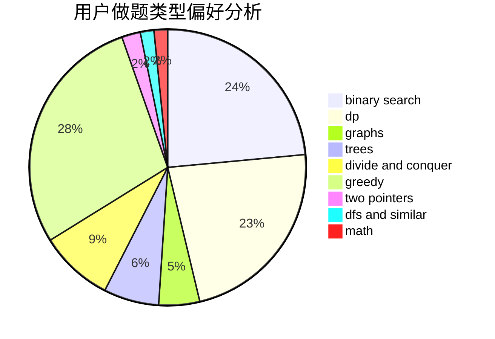

# 3fukin

<!-- tabs:start -->

#### **用户提交结果分析**

#### **用户做题类型偏好分析**

<!-- tabs:end -->
# 推荐题目
[1236B](https://codeforces.com/contest/1236/problem/B)
[1243E](https://codeforces.com/contest/1243/problem/E)
[1366F](https://codeforces.com/contest/1366/problem/F)
[1374D](https://codeforces.com/contest/1374/problem/D)
[1374F](https://codeforces.com/contest/1374/problem/F)
[11292](https://codeforces.com/contest/1129/problem/2)
[1034D](https://codeforces.com/contest/1034/problem/D)
[1372F](https://codeforces.com/contest/1372/problem/F)
[1374C](https://codeforces.com/contest/1374/problem/C)
[1372C](https://codeforces.com/contest/1372/problem/C)
