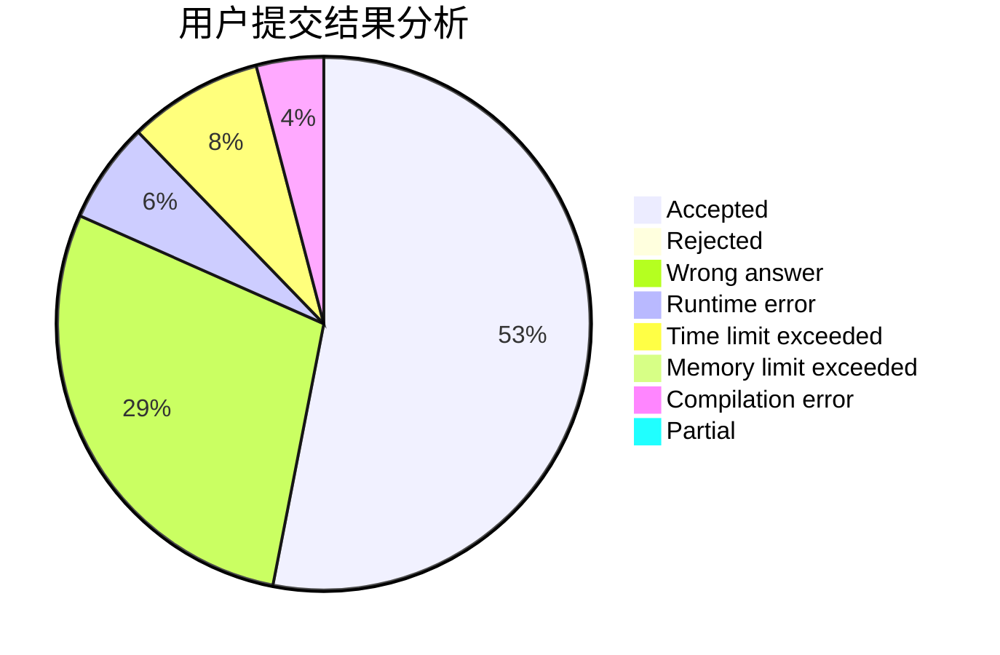
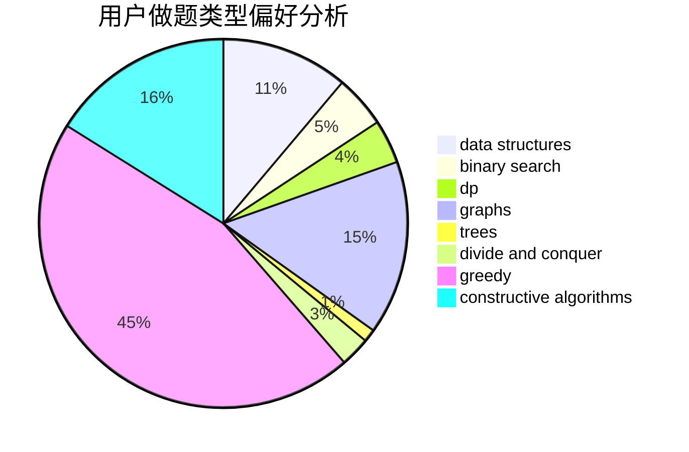
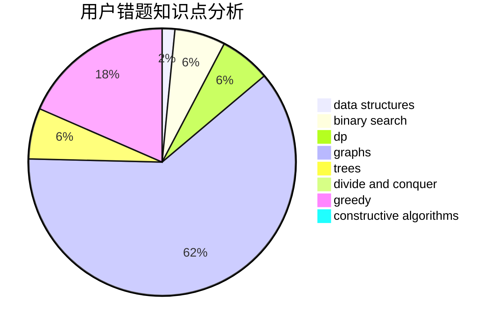

# 3fukin
<!-- tabs:start -->
#### **用户提交结果分析**

#### **用户做题类型偏好分析**

#### **用户错题知识点分析**

<!-- tabs:end -->
# 推荐题目
[Jog Around The Graph](http://codeforces.com/problemset/problem/1366/F)		binary search,
                        dp,
                        geometry,
                        graphs		  
[Keyboard Purchase](http://codeforces.com/problemset/problem/1238/E)		bitmasks,
                        dp		  
[Optimal Subsequences (Hard Version)](http://codeforces.com/problemset/problem/1227/D2)		data structures,
                        greedy		  
[The Best Vacation](http://codeforces.com/problemset/problem/1358/D)		binary search,
                        brute force,
                        greedy,
                        implementation,
                        two pointers		  
[Flying Sort (Hard Version)](http://codeforces.com/problemset/problem/1367/F2)		binary search,
                        data structures,
                        dp,
                        greedy,
                        sortings,
                        two pointers		  
[Shovels and Swords](http://codeforces.com/problemset/problem/1366/A)		binary search,
                        greedy,
                        math		  
[Enlarge GCD](http://codeforces.com/problemset/problem/1034/A)		number theory		  
[Necklace Assembly](http://codeforces.com/problemset/problem/1367/E)		brute force,
                        dfs and similar,
                        dp,
                        graphs,
                        greedy,
                        number theory		  
[Palindromic Paths](http://codeforces.com/problemset/problem/1366/C)		greedy,
                        math		  
[MST Company](http://codeforces.com/problemset/problem/125/E)		binary search,
                        graphs		  
<!-- tabs:start -->
#### **data structures**
[Jog Around The Graph](http://codeforces.com/problemset/problem/1227/D2)		data structures,
                        greedy		  
[Keyboard Purchase](http://codeforces.com/problemset/problem/1367/F2)		binary search,
                        data structures,
                        dp,
                        greedy,
                        sortings,
                        two pointers		  
[Optimal Subsequences (Hard Version)](http://codeforces.com/problemset/problem/1366/G)		data structures,
                        dp,
                        strings		  
[The Best Vacation](http://codeforces.com/problemset/problem/1009/F)		data structures,
                        dsu,
                        trees		  
[Flying Sort (Hard Version)](http://codeforces.com/problemset/problem/1365/C)		constructive algorithms,
                        data structures,
                        greedy,
                        implementation		  
[Shovels and Swords](http://codeforces.com/problemset/problem/1492/C)		binary search,
                        data structures,
                        dp,
                        greedy,
                        two pointers		  
[Enlarge GCD](http://codeforces.com/problemset/problem/1490/G)		binary search,
                        data structures,
                        math		  
[Necklace Assembly](http://codeforces.com/problemset/problem/1479/D)		binary search,
                        bitmasks,
                        brute force,
                        data structures,
                        probabilities,
                        trees		  
[Palindromic Paths](http://codeforces.com/problemset/problem/1497/A)		brute force,
                        data structures,
                        greedy,
                        sortings		  
[MST Company](http://codeforces.com/problemset/problem/1491/C)		brute force,
                        data structures,
                        dp,
                        greedy,
                        implementation		  
#### **binary search**
[Jog Around The Graph](http://codeforces.com/problemset/problem/1366/F)		binary search,
                        dp,
                        geometry,
                        graphs		  
[Keyboard Purchase](http://codeforces.com/problemset/problem/1358/D)		binary search,
                        brute force,
                        greedy,
                        implementation,
                        two pointers		  
[Optimal Subsequences (Hard Version)](http://codeforces.com/problemset/problem/1367/F2)		binary search,
                        data structures,
                        dp,
                        greedy,
                        sortings,
                        two pointers		  
[The Best Vacation](http://codeforces.com/problemset/problem/1366/A)		binary search,
                        greedy,
                        math		  
[Flying Sort (Hard Version)](http://codeforces.com/problemset/problem/125/E)		binary search,
                        graphs		  
[Shovels and Swords](http://codeforces.com/problemset/problem/1315/B)		binary search,
                        dp,
                        greedy,
                        strings		  
[Enlarge GCD](http://codeforces.com/problemset/problem/1366/E)		binary search,
                        brute force,
                        combinatorics,
                        constructive algorithms,
                        dp,
                        two pointers		  
[Necklace Assembly](http://codeforces.com/problemset/problem/1492/C)		binary search,
                        data structures,
                        dp,
                        greedy,
                        two pointers		  
[Palindromic Paths](http://codeforces.com/problemset/problem/1463/D)		binary search,
                        constructive algorithms,
                        greedy,
                        two pointers		  
[MST Company](http://codeforces.com/problemset/problem/1490/G)		binary search,
                        data structures,
                        math		  
#### **dp**
[Jog Around The Graph](http://codeforces.com/problemset/problem/1366/F)		binary search,
                        dp,
                        geometry,
                        graphs		  
[Keyboard Purchase](http://codeforces.com/problemset/problem/1238/E)		bitmasks,
                        dp		  
[Optimal Subsequences (Hard Version)](http://codeforces.com/problemset/problem/1367/F2)		binary search,
                        data structures,
                        dp,
                        greedy,
                        sortings,
                        two pointers		  
[The Best Vacation](http://codeforces.com/problemset/problem/1367/E)		brute force,
                        dfs and similar,
                        dp,
                        graphs,
                        greedy,
                        number theory		  
[Flying Sort (Hard Version)](http://codeforces.com/problemset/problem/1367/F1)		dp,
                        greedy,
                        two pointers		  
[Shovels and Swords](http://codeforces.com/problemset/problem/1366/G)		data structures,
                        dp,
                        strings		  
[Enlarge GCD](http://codeforces.com/problemset/problem/1315/B)		binary search,
                        dp,
                        greedy,
                        strings		  
[Necklace Assembly](http://codeforces.com/problemset/problem/1322/F)		dp,
                        trees		  
[Palindromic Paths](http://codeforces.com/problemset/problem/1119/E)		brute force,
                        dp,
                        fft,
                        greedy,
                        ternary search		  
[MST Company](http://codeforces.com/problemset/problem/1366/E)		binary search,
                        brute force,
                        combinatorics,
                        constructive algorithms,
                        dp,
                        two pointers		  
#### **graph**
[Jog Around The Graph](http://codeforces.com/problemset/problem/1366/F)		binary search,
                        dp,
                        geometry,
                        graphs		  
[Keyboard Purchase](http://codeforces.com/problemset/problem/1367/E)		brute force,
                        dfs and similar,
                        dp,
                        graphs,
                        greedy,
                        number theory		  
[Optimal Subsequences (Hard Version)](http://codeforces.com/problemset/problem/125/E)		binary search,
                        graphs		  
[The Best Vacation](http://codeforces.com/problemset/problem/1365/D)		constructive algorithms,
                        dfs and similar,
                        dsu,
                        graphs,
                        greedy,
                        implementation,
                        shortest paths		  
[Flying Sort (Hard Version)](http://codeforces.com/problemset/problem/1320/B)		dfs and similar,
                        graphs,
                        shortest paths		  
[Shovels and Swords](http://codeforces.com/problemset/problem/1487/C)		brute force,
                        constructive algorithms,
                        dfs and similar,
                        graphs,
                        greedy,
                        implementation,
                        math		  
[Enlarge GCD](http://codeforces.com/problemset/problem/1437/C)		dp,
                        flows,
                        graph matchings,
                        greedy,
                        math,
                        sortings		  
[Necklace Assembly](http://codeforces.com/problemset/problem/1470/D)		constructive algorithms,
                        dfs and similar,
                        graph matchings,
                        graphs,
                        greedy		  
[Palindromic Paths](http://codeforces.com/problemset/problem/1476/C)		dp,
                        graphs,
                        greedy		  
[MST Company](http://codeforces.com/problemset/problem/1304/D)		constructive algorithms,
                        graphs,
                        greedy,
                        two pointers		  
#### **trees**
[Jog Around The Graph](http://codeforces.com/problemset/problem/1009/F)		data structures,
                        dsu,
                        trees		  
[Keyboard Purchase](http://codeforces.com/problemset/problem/1322/F)		dp,
                        trees		  
[Optimal Subsequences (Hard Version)](http://codeforces.com/problemset/problem/1479/D)		binary search,
                        bitmasks,
                        brute force,
                        data structures,
                        probabilities,
                        trees		  
[The Best Vacation](http://codeforces.com/problemset/problem/1511/C)		brute force,
                        data structures,
                        implementation,
                        trees		  
[Flying Sort (Hard Version)](http://codeforces.com/problemset/problem/1499/F)		combinatorics,
                        dfs and similar,
                        dp,
                        trees		  
[Shovels and Swords](http://codeforces.com/problemset/problem/1491/E)		brute force,
                        dfs and similar,
                        divide and conquer,
                        number theory,
                        trees		  
[Enlarge GCD](http://codeforces.com/problemset/problem/1466/D)		data structures,
                        greedy,
                        sortings,
                        trees		  
[Necklace Assembly](http://codeforces.com/problemset/problem/1495/D)		combinatorics,
                        dfs and similar,
                        graphs,
                        math,
                        shortest paths,
                        trees		  
[Palindromic Paths](http://codeforces.com/problemset/problem/1303/G)		data structures,
                        divide and conquer,
                        geometry,
                        trees		  
[MST Company](http://codeforces.com/problemset/problem/1454/E)		combinatorics,
                        dfs and similar,
                        graphs,
                        trees		  
#### **divide and conquer**
[Jog Around The Graph](http://codeforces.com/problemset/problem/1461/D)		binary search,
                        brute force,
                        data structures,
                        divide and conquer,
                        implementation,
                        sortings		  
[Keyboard Purchase](http://codeforces.com/problemset/problem/1466/G)		combinatorics,
                        divide and conquer,
                        hashing,
                        math,
                        string suffix structures,
                        strings		  
[Optimal Subsequences (Hard Version)](http://codeforces.com/problemset/problem/1490/D)		dfs and similar,
                        divide and conquer,
                        implementation		  
[The Best Vacation](https://codeforces.com/contest/1483/problem/C)		data structures,
                        divide and conquer,
                        dp		  
[Flying Sort (Hard Version)](http://codeforces.com/problemset/problem/1491/E)		brute force,
                        dfs and similar,
                        divide and conquer,
                        number theory,
                        trees		  
[Shovels and Swords](http://codeforces.com/problemset/problem/1303/G)		data structures,
                        divide and conquer,
                        geometry,
                        trees		  
[Enlarge GCD](http://codeforces.com/problemset/problem/1494/D)		constructive algorithms,
                        data structures,
                        dfs and similar,
                        divide and conquer,
                        dsu,
                        greedy,
                        sortings,
                        trees		  
[Necklace Assembly](http://codeforces.com/problemset/problem/1482/E)		data structures,
                        divide and conquer,
                        dp		  
[Palindromic Paths](http://codeforces.com/problemset/problem/566/C)		dfs and similar,
                        divide and conquer,
                        trees		  
[MST Company](http://codeforces.com/problemset/problem/1428/F)		binary search,
                        data structures,
                        divide and conquer,
                        dp,
                        two pointers		  
#### **greedy**
[Jog Around The Graph](http://codeforces.com/problemset/problem/1227/D2)		data structures,
                        greedy		  
[Keyboard Purchase](http://codeforces.com/problemset/problem/1358/D)		binary search,
                        brute force,
                        greedy,
                        implementation,
                        two pointers		  
[Optimal Subsequences (Hard Version)](http://codeforces.com/problemset/problem/1367/F2)		binary search,
                        data structures,
                        dp,
                        greedy,
                        sortings,
                        two pointers		  
[The Best Vacation](http://codeforces.com/problemset/problem/1366/A)		binary search,
                        greedy,
                        math		  
[Flying Sort (Hard Version)](http://codeforces.com/problemset/problem/1367/E)		brute force,
                        dfs and similar,
                        dp,
                        graphs,
                        greedy,
                        number theory		  
[Shovels and Swords](http://codeforces.com/problemset/problem/1366/C)		greedy,
                        math		  
[Enlarge GCD](http://codeforces.com/problemset/problem/1267/J)		greedy,
                        implementation,
                        math		  
[Necklace Assembly](http://codeforces.com/problemset/problem/1368/A)		brute force,
                        greedy,
                        implementation,
                        math		  
[Palindromic Paths](http://codeforces.com/problemset/problem/1264/A)		greedy,
                        implementation		  
[MST Company](http://codeforces.com/problemset/problem/1367/F1)		dp,
                        greedy,
                        two pointers		  
#### **constructive algorithms**
[Jog Around The Graph](http://codeforces.com/problemset/problem/1365/E)		brute force,
                        constructive algorithms		  
[Keyboard Purchase](http://codeforces.com/problemset/problem/1365/D)		constructive algorithms,
                        dfs and similar,
                        dsu,
                        graphs,
                        greedy,
                        implementation,
                        shortest paths		  
[Optimal Subsequences (Hard Version)](http://codeforces.com/problemset/problem/1367/D)		constructive algorithms,
                        greedy,
                        implementation,
                        sortings		  
[The Best Vacation](http://codeforces.com/problemset/problem/1367/C)		constructive algorithms,
                        greedy,
                        math		  
[Flying Sort (Hard Version)](http://codeforces.com/problemset/problem/1365/G)		bitmasks,
                        combinatorics,
                        constructive algorithms,
                        interactive,
                        math		  
[Shovels and Swords](http://codeforces.com/problemset/problem/1366/D)		constructive algorithms,
                        math,
                        number theory		  
[Enlarge GCD](http://codeforces.com/problemset/problem/1368/B)		brute force,
                        constructive algorithms,
                        greedy,
                        math,
                        strings		  
[Necklace Assembly](http://codeforces.com/problemset/problem/1366/E)		binary search,
                        brute force,
                        combinatorics,
                        constructive algorithms,
                        dp,
                        two pointers		  
[Palindromic Paths](http://codeforces.com/problemset/problem/1365/F)		constructive algorithms,
                        implementation,
                        sortings		  
[MST Company](http://codeforces.com/problemset/problem/1365/C)		constructive algorithms,
                        data structures,
                        greedy,
                        implementation		  
#### **sortings**
[Jog Around The Graph](http://codeforces.com/problemset/problem/1367/F2)		binary search,
                        data structures,
                        dp,
                        greedy,
                        sortings,
                        two pointers		  
[Keyboard Purchase](http://codeforces.com/problemset/problem/1367/D)		constructive algorithms,
                        greedy,
                        implementation,
                        sortings		  
[Optimal Subsequences (Hard Version)](http://codeforces.com/problemset/problem/1144/B)		greedy,
                        implementation,
                        sortings		  
[The Best Vacation](http://codeforces.com/problemset/problem/1365/F)		constructive algorithms,
                        implementation,
                        sortings		  
[Flying Sort (Hard Version)](https://codeforces.com/contest/1496/problem/C)		geometry,
                        greedy,
                        math,
                        sortings		  
[Shovels and Swords](http://codeforces.com/problemset/problem/1495/A)		geometry,
                        greedy,
                        math,
                        sortings		  
[Enlarge GCD](http://codeforces.com/problemset/problem/1497/A)		brute force,
                        data structures,
                        greedy,
                        sortings		  
[Necklace Assembly](http://codeforces.com/problemset/problem/1427/A)		math,
                        sortings		  
[Palindromic Paths](http://codeforces.com/problemset/problem/1461/D)		binary search,
                        brute force,
                        data structures,
                        divide and conquer,
                        implementation,
                        sortings		  
[MST Company](http://codeforces.com/problemset/problem/1437/C)		dp,
                        flows,
                        graph matchings,
                        greedy,
                        math,
                        sortings		  
<!-- tabs:end -->
