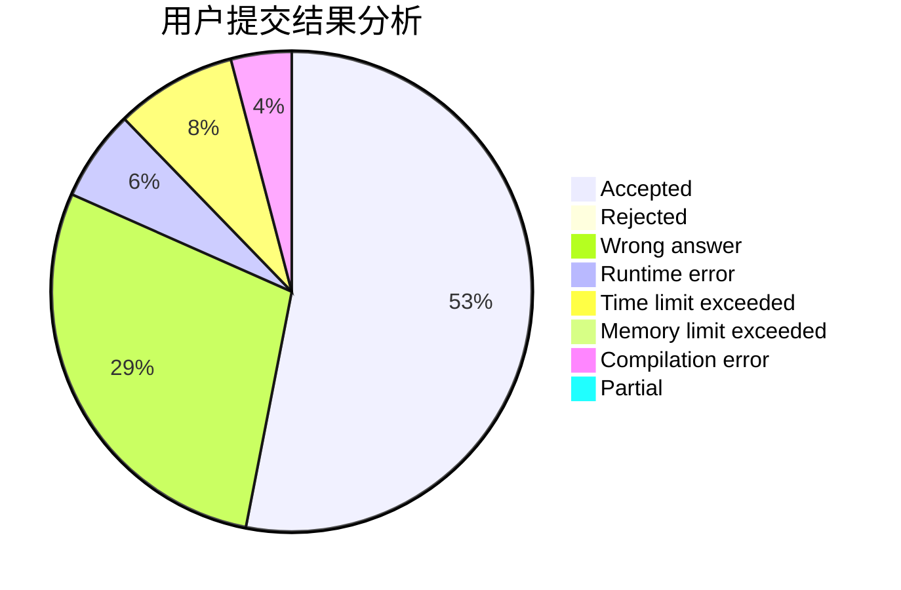
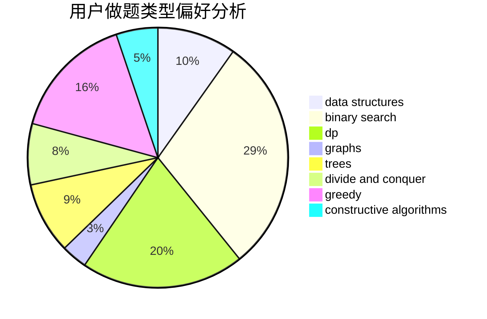
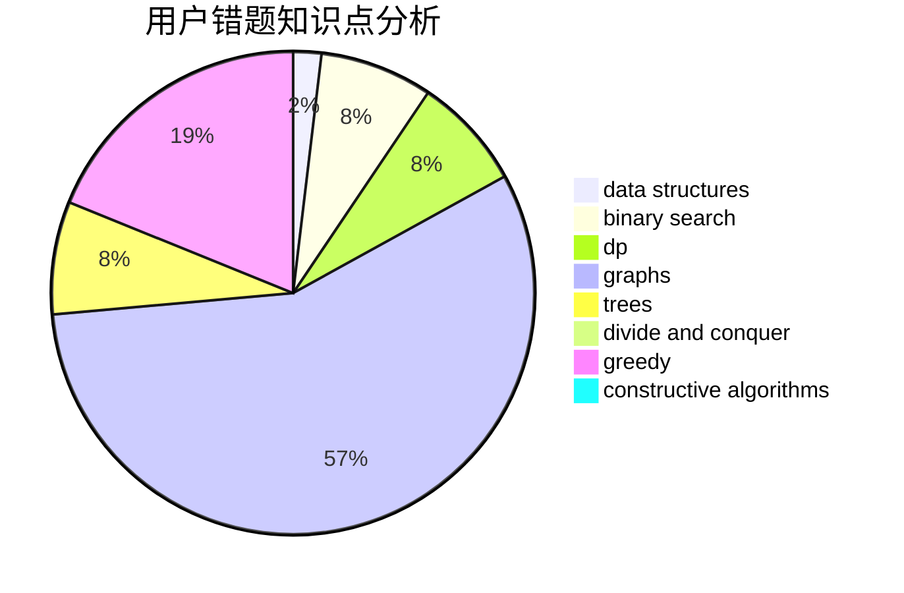

# 3fukin

<!-- tabs:start -->

#### **用户提交结果分析**

#### **用户做题类型偏好分析**

#### **用户错题知识点分析**

<!-- tabs:end -->
# 推荐题目
[1236B](https://codeforces.com/contest/1236/problem/B)		combinatorics,
                        math		  
[1243E](https://codeforces.com/contest/1243/problem/E)		dsu,graphs,sortings,trees		  
[1366F](https://codeforces.com/contest/1366/problem/F)		binary search,
                        dp,
                        geometry,
                        graphs		  
[1374D](https://codeforces.com/contest/1374/problem/D)		math,
                        sortings,
                        two pointers		  
[1374F](https://codeforces.com/contest/1374/problem/F)		brute force,
                        constructive algorithms,
                        implementation,
                        sortings		  
[11292](https://codeforces.com/contest/1129/problem/2)		dsu,graphs,sortings,trees		  
[1034D](https://codeforces.com/contest/1034/problem/D)		binary search,
                        data structures,
                        two pointers		  
[1372F](https://codeforces.com/contest/1372/problem/F)		binary search,
                        divide and conquer,
                        interactive		  
[1374C](https://codeforces.com/contest/1374/problem/C)		greedy,
                        strings		  
[1372C](https://codeforces.com/contest/1372/problem/C)		constructive algorithms,
                        math		  
