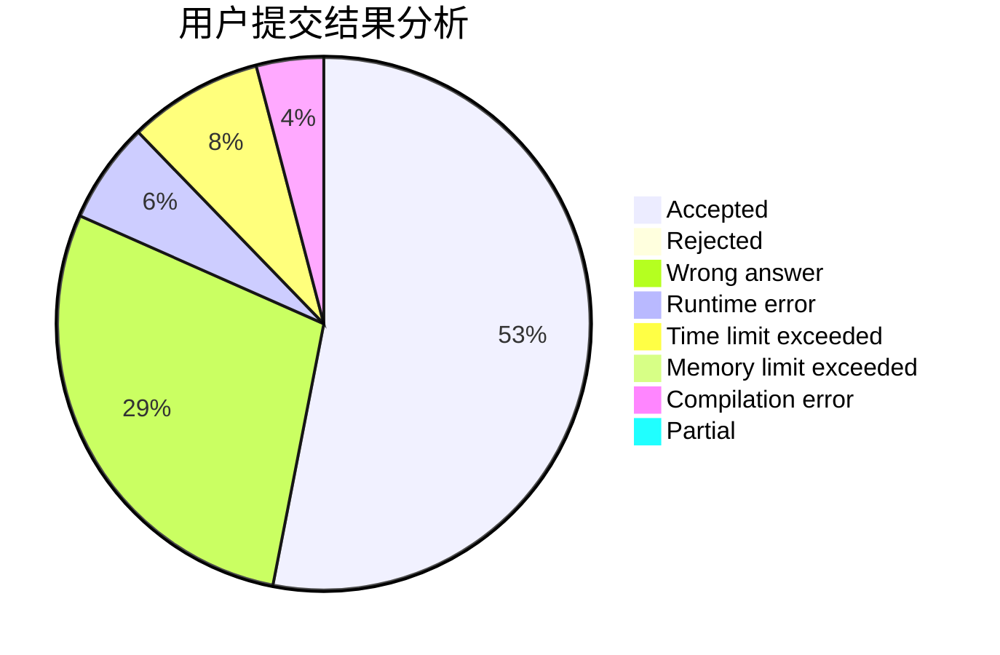
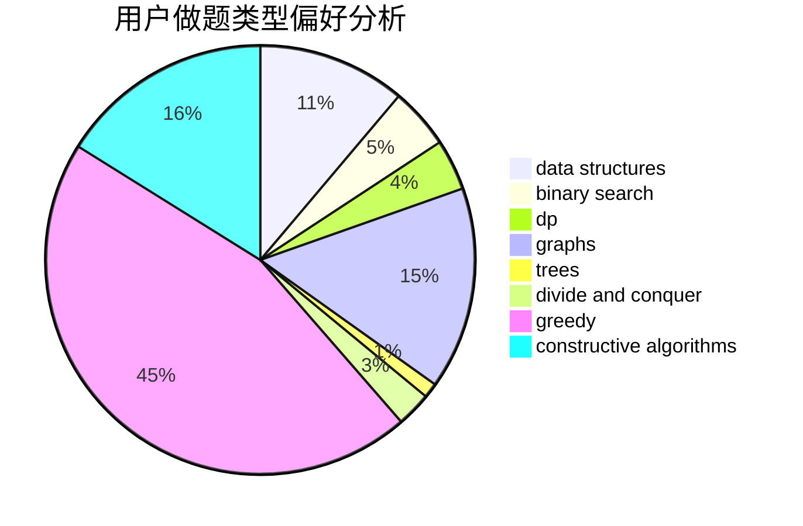
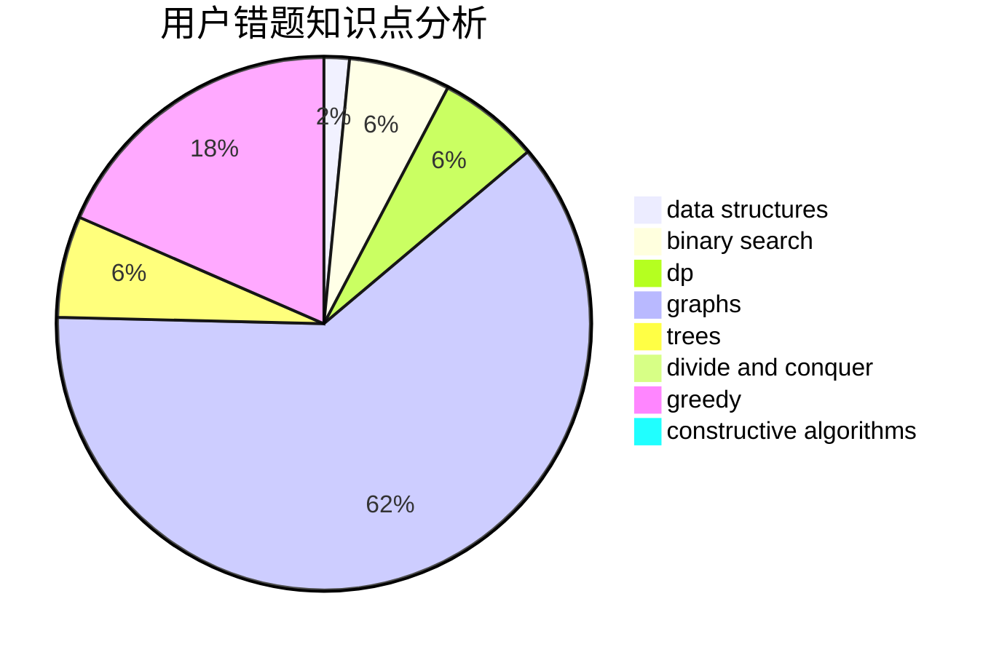

# 3fukin

<!-- tabs:start -->

#### **用户提交结果分析**

#### **用户做题类型偏好分析**

#### **用户错题知识点分析**

<!-- tabs:end -->
# 推荐题目
[1227D2](https://codeforces.com/contest/1227D/problem/2)		data structures,
                        greedy		  
[1238E](https://codeforces.com/contest/1238/problem/E)		bitmasks,
                        dp		  
[1358D](https://codeforces.com/contest/1358/problem/D)		binary search,
                        brute force,
                        greedy,
                        implementation,
                        two pointers		  
[1367F2](https://codeforces.com/contest/1367F/problem/2)		binary search,
                        data structures,
                        dp,
                        greedy,
                        sortings,
                        two pointers		  
[1368A](https://codeforces.com/contest/1368/problem/A)		brute force,
                        greedy,
                        implementation,
                        math		  
[1119E](https://codeforces.com/contest/1119/problem/E)		brute force,
                        dp,
                        fft,
                        greedy,
                        ternary search		  
[1034A](https://codeforces.com/contest/1034/problem/A)		number theory		  
[1366A](https://codeforces.com/contest/1366/problem/A)		binary search,
                        greedy,
                        math		  
[1367F1](https://codeforces.com/contest/1367F/problem/1)		dp,
                        greedy,
                        two pointers		  
[1365E](https://codeforces.com/contest/1365/problem/E)		brute force,
                        constructive algorithms		  
