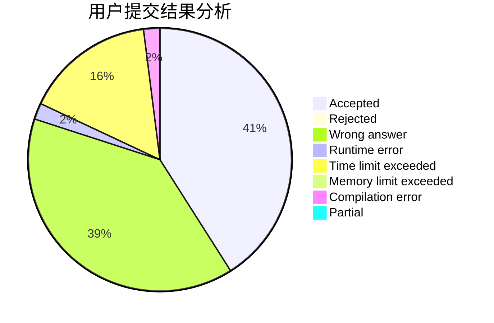
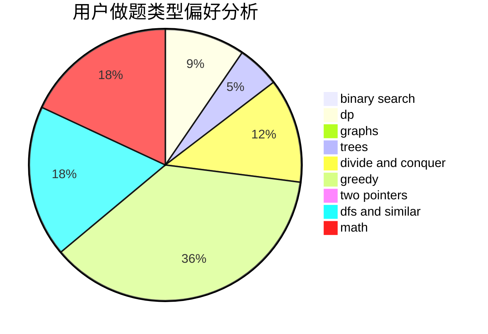

# Kerwin-

<!-- tabs:start -->

#### **用户提交结果分析**

#### **用户做题类型偏好分析**

<!-- tabs:end -->
# 推荐题目
[1420D](https://codeforces.com/contest/1420/problem/D)
[182D](https://codeforces.com/contest/182/problem/D)
[949E](https://codeforces.com/contest/949/problem/E)
[1328C](https://codeforces.com/contest/1328/problem/C)
[1393D](https://codeforces.com/contest/1393/problem/D)
[1104E](https://codeforces.com/contest/1104/problem/E)
[25C](https://codeforces.com/contest/25/problem/C)
[798A](https://codeforces.com/contest/798/problem/A)
[1197E](https://codeforces.com/contest/1197/problem/E)
[223E](https://codeforces.com/contest/223/problem/E)
