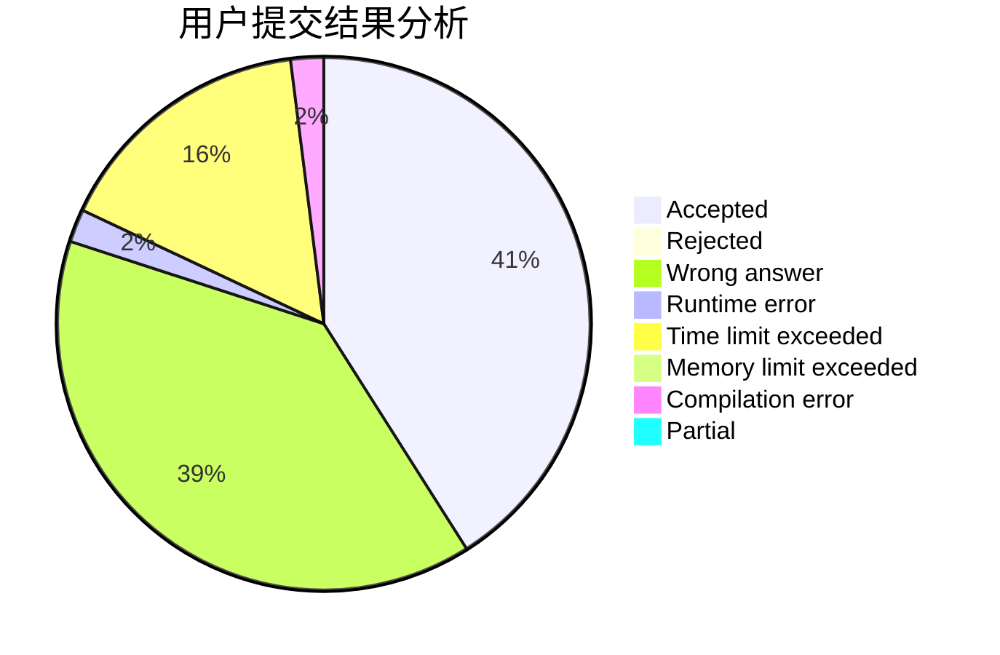
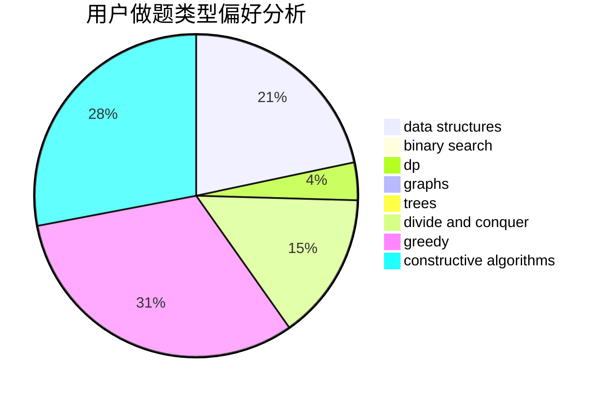
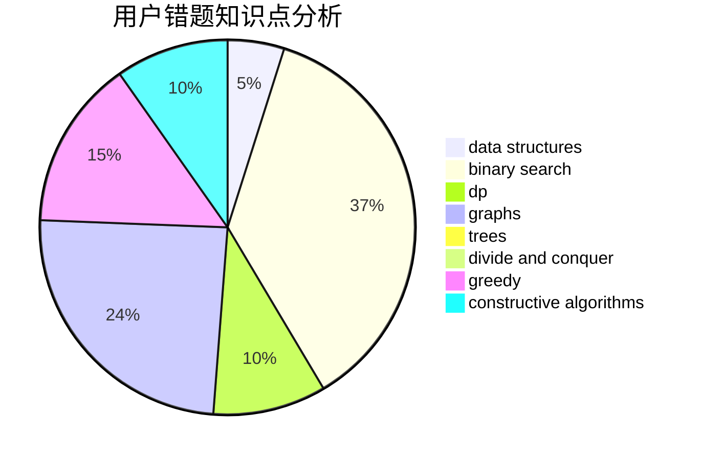

# Kerwin-

<!-- tabs:start -->

#### **用户提交结果分析**

#### **用户做题类型偏好分析**

#### **用户错题知识点分析**

<!-- tabs:end -->
# 推荐题目
[1420D](https://codeforces.com/contest/1420/problem/D)		combinatorics,
                        data structures,
                        sortings		  
[182D](https://codeforces.com/contest/182/problem/D)		brute force,
                        hashing,
                        implementation,
                        math,
                        strings		  
[949E](https://codeforces.com/contest/949/problem/E)		brute force		  
[1328C](https://codeforces.com/contest/1328/problem/C)		greedy,
                        implementation		  
[1393D](https://codeforces.com/contest/1393/problem/D)		dfs and similar,
                        dp,
                        implementation,
                        shortest paths		  
[1104E](https://codeforces.com/contest/1104/problem/E)		dsu,graphs,sortings,trees		  
[25C](https://codeforces.com/contest/25/problem/C)		graphs,
                        shortest paths		  
[798A](https://codeforces.com/contest/798/problem/A)		brute force,
                        constructive algorithms,
                        strings		  
[1197E](https://codeforces.com/contest/1197/problem/E)		binary search,
                        combinatorics,
                        data structures,
                        dp,
                        shortest paths,
                        sortings		  
[223E](https://codeforces.com/contest/223/problem/E)		flows,
                        geometry,
                        graphs		  
