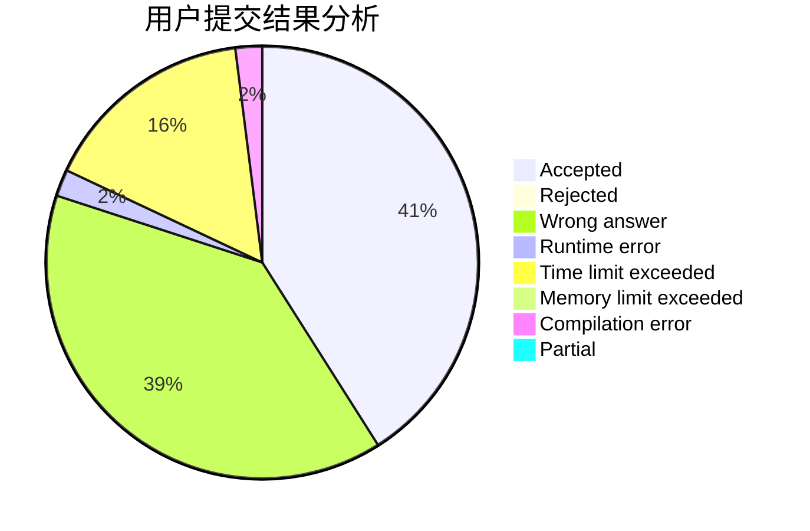
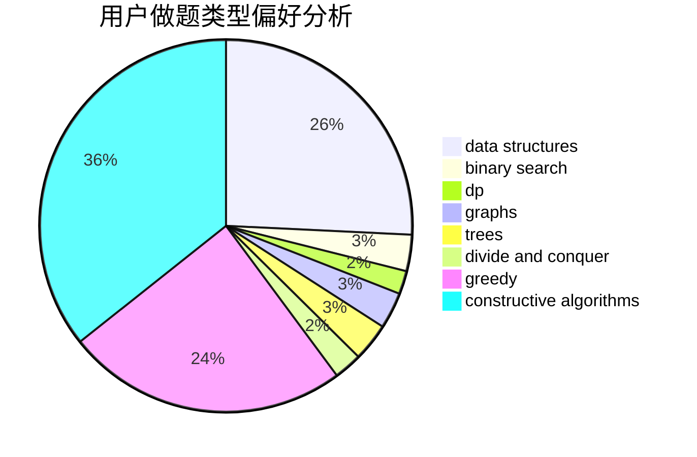
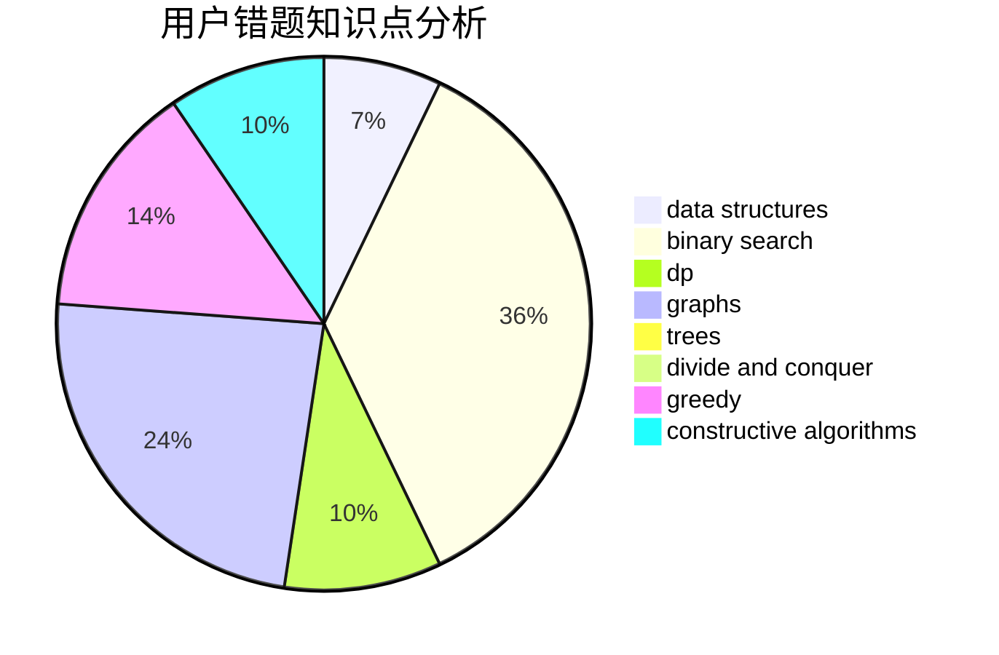

# Kerwin-

<!-- tabs:start -->

#### **用户提交结果分析**

#### **用户做题类型偏好分析**

#### **用户错题知识点分析**

<!-- tabs:end -->
# 推荐题目
[140B](https://codeforces.com/contest/140/problem/B)		brute force,
                        greedy,
                        implementation		  
[15C](https://codeforces.com/contest/15/problem/C)		games		  
[928B](https://codeforces.com/contest/928/problem/B)		*special problem,
                        dp		  
[1321D](https://codeforces.com/contest/1321/problem/D)		dsu,graphs,sortings,trees		  
[1384A](https://codeforces.com/contest/1384/problem/A)		constructive algorithms,
                        greedy,
                        strings		  
[1104B](https://codeforces.com/contest/1104/problem/B)		data structures,
                        implementation,
                        math		  
[237C](https://codeforces.com/contest/237/problem/C)		binary search,
                        number theory,
                        two pointers		  
[779E](https://codeforces.com/contest/779/problem/E)		dsu,graphs,sortings,trees		  
[1191F](https://codeforces.com/contest/1191/problem/F)		dsu,graphs,sortings,trees		  
[1A](https://codeforces.com/contest/1/problem/A)		math		  
