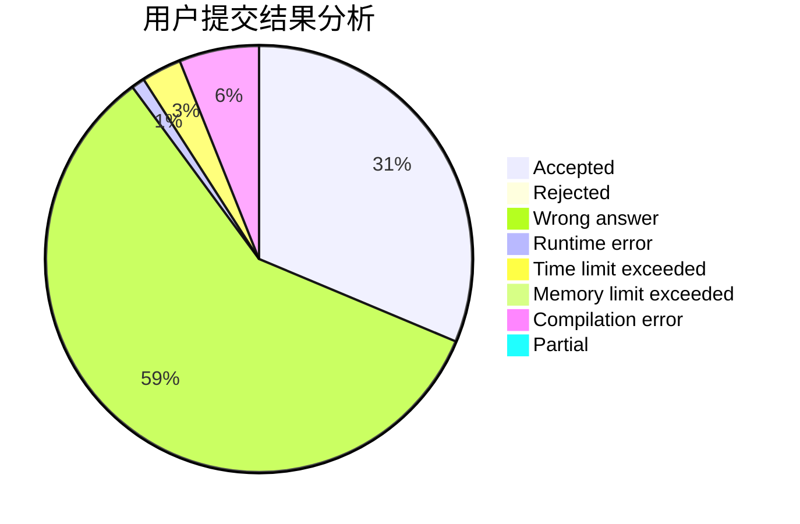
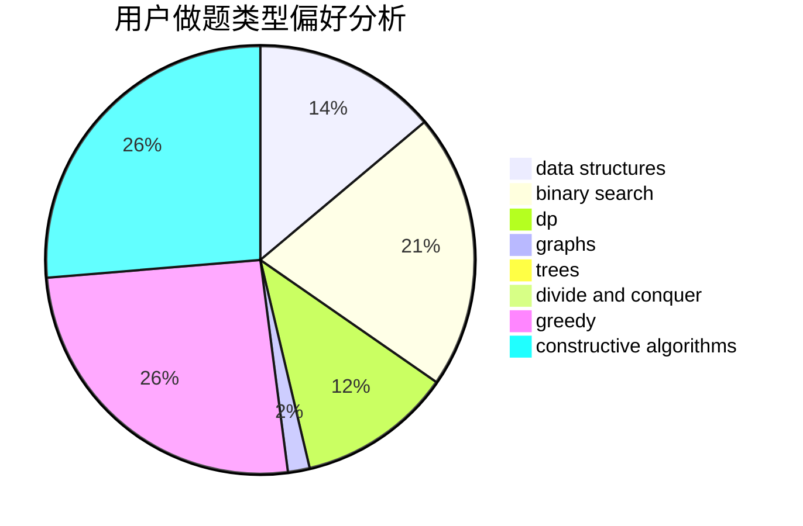

# Kestrel

<!-- tabs:start -->

#### **用户提交结果分析**

#### **用户做题类型偏好分析**

#### **用户错题知识点分析**

<!-- tabs:end -->
# 推荐题目
[85A](https://codeforces.com/contest/85/problem/A)		constructive algorithms,
                        implementation		  
[939C](https://codeforces.com/contest/939/problem/C)		binary search,
                        two pointers		  
[567B](https://codeforces.com/contest/567/problem/B)		implementation		  
[1210F2](https://codeforces.com/contest/1210F/problem/2)		brute force,
                        probabilities		  
[1257C](https://codeforces.com/contest/1257/problem/C)		greedy,
                        implementation,
                        sortings,
                        strings,
                        two pointers		  
[1227F1](https://codeforces.com/contest/1227F/problem/1)		dp		  
[455D](https://codeforces.com/contest/455/problem/D)		data structures		  
[1450A](https://codeforces.com/contest/1450/problem/A)		constructive algorithms,
                        sortings		  
[278C](https://codeforces.com/contest/278/problem/C)		dsu,graphs,sortings,trees		  
[860A](https://codeforces.com/contest/860/problem/A)		dsu,graphs,sortings,trees		  
