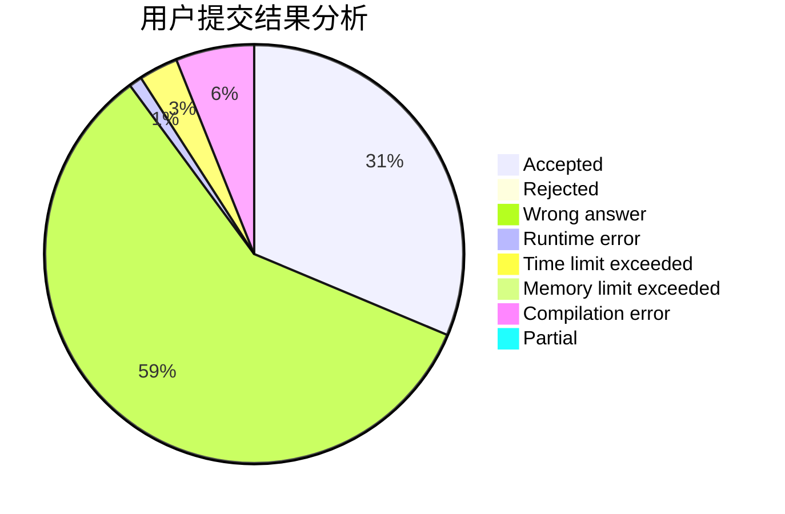
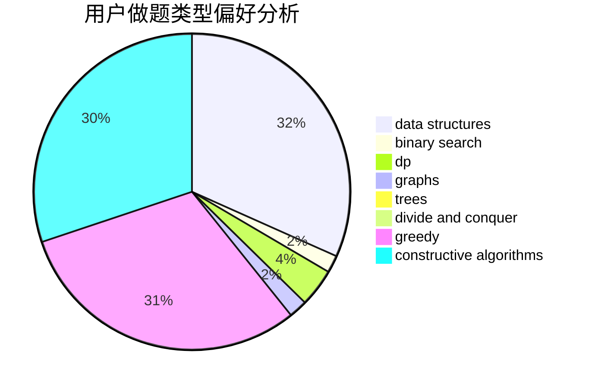

# Kestrel

<!-- tabs:start -->

#### **用户提交结果分析**

#### **用户做题类型偏好分析**

#### **用户错题知识点分析**

<!-- tabs:end -->
# 推荐题目
[877D](https://codeforces.com/contest/877/problem/D)		data structures,
                        dfs and similar,
                        graphs,
                        shortest paths		  
[960F](https://codeforces.com/contest/960/problem/F)		data structures,
                        dp,
                        graphs		  
[586F](https://codeforces.com/contest/586/problem/F)		dsu,graphs,sortings,trees		  
[1216F](https://codeforces.com/contest/1216/problem/F)		data structures,
                        dp,
                        greedy		  
[1264C](https://codeforces.com/contest/1264/problem/C)		data structures,
                        probabilities		  
[1236C](https://codeforces.com/contest/1236/problem/C)		constructive algorithms,
                        greedy,
                        implementation		  
[476E](https://codeforces.com/contest/476/problem/E)		dp,
                        strings		  
[1458C](https://codeforces.com/contest/1458/problem/C)		math,
                        matrices		  
[293C](https://codeforces.com/contest/293/problem/C)		brute force,
                        math,
                        number theory		  
[878A](https://codeforces.com/contest/878/problem/A)		bitmasks,
                        constructive algorithms		  
