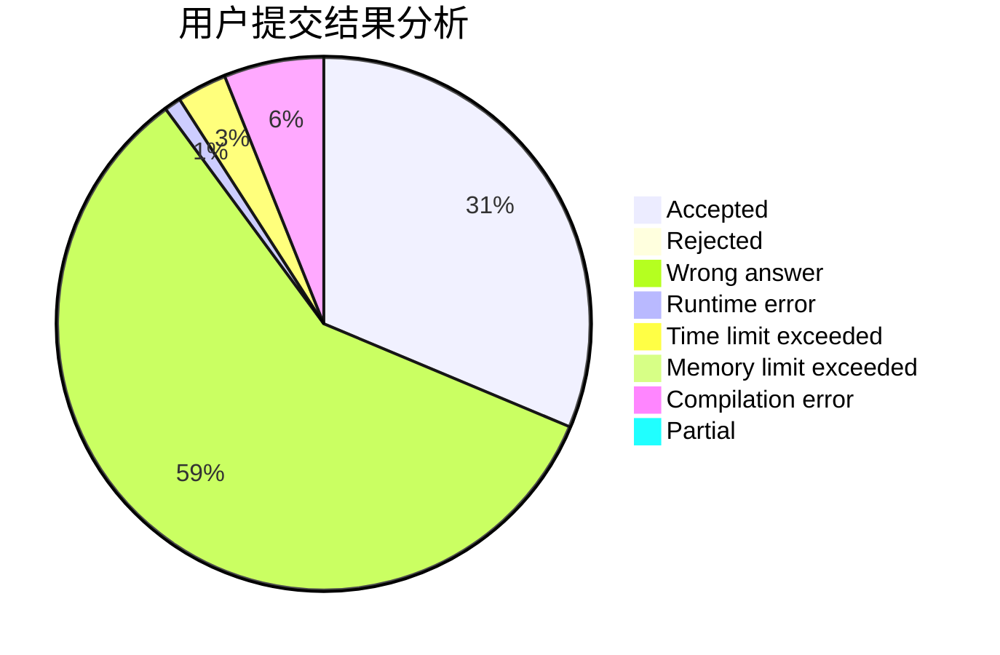
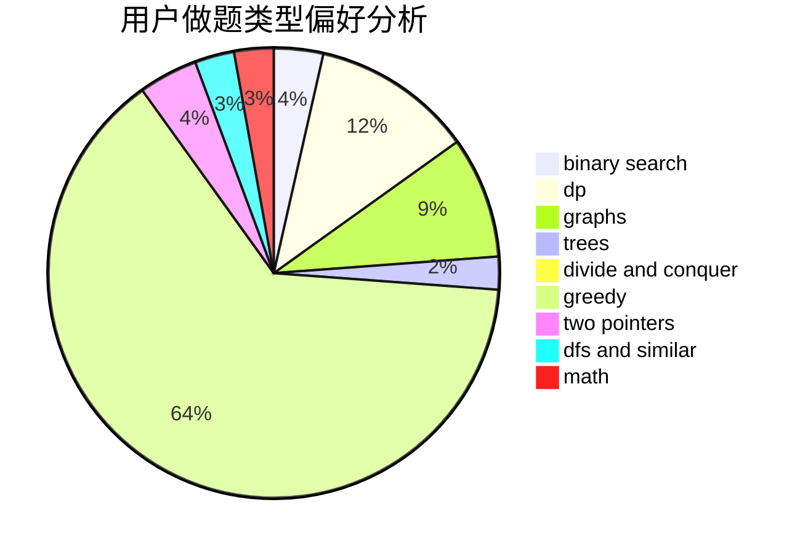

# Kestrel

<!-- tabs:start -->

#### **用户提交结果分析**

#### **用户做题类型偏好分析**

<!-- tabs:end -->
# 推荐题目
[877D](https://codeforces.com/contest/877/problem/D)
[960F](https://codeforces.com/contest/960/problem/F)
[586F](https://codeforces.com/contest/586/problem/F)
[1216F](https://codeforces.com/contest/1216/problem/F)
[1264C](https://codeforces.com/contest/1264/problem/C)
[1236C](https://codeforces.com/contest/1236/problem/C)
[476E](https://codeforces.com/contest/476/problem/E)
[1458C](https://codeforces.com/contest/1458/problem/C)
[293C](https://codeforces.com/contest/293/problem/C)
[878A](https://codeforces.com/contest/878/problem/A)
