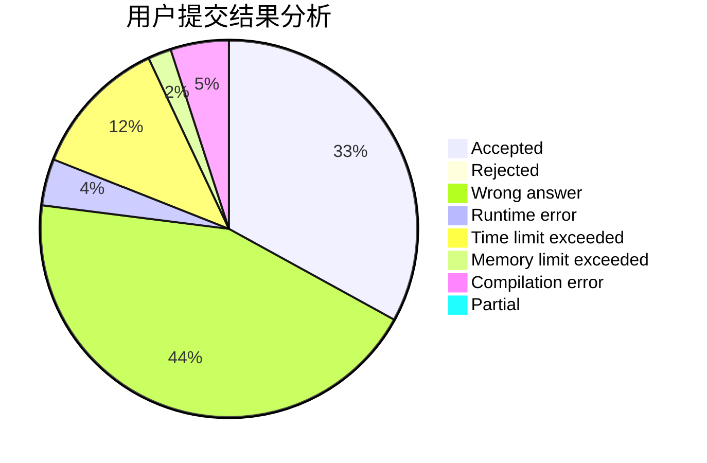
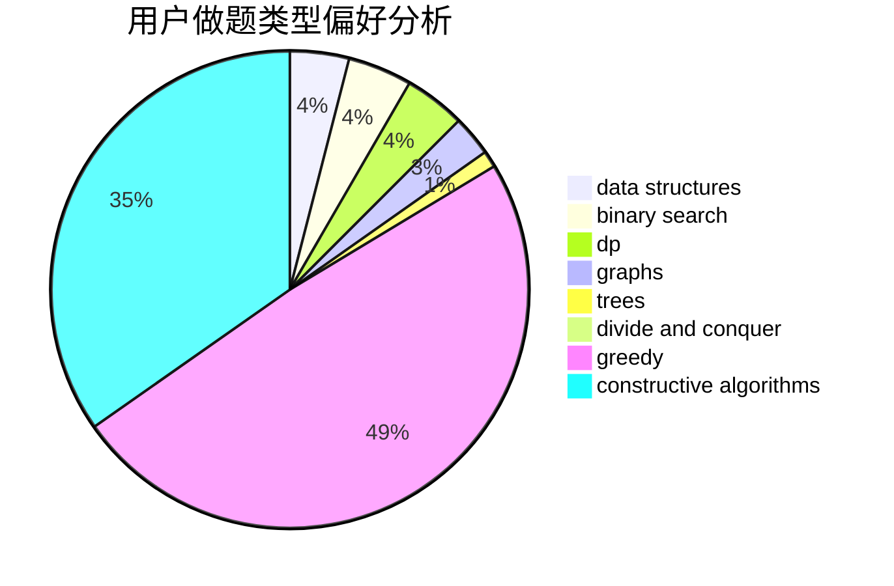
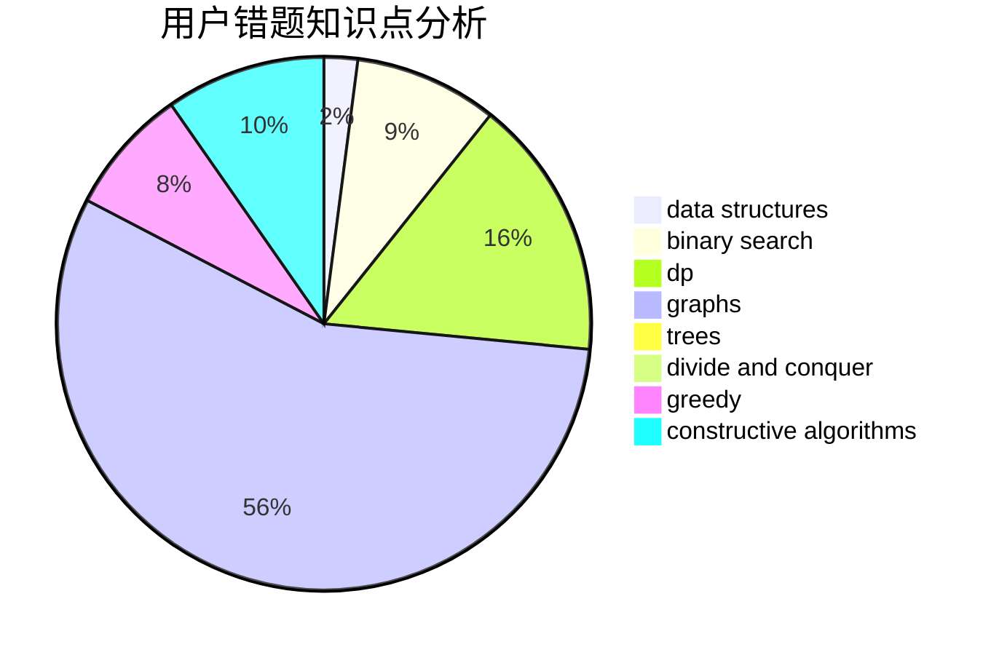

# Kevin090228

<!-- tabs:start -->

#### **用户提交结果分析**

#### **用户做题类型偏好分析**

#### **用户错题知识点分析**

<!-- tabs:end -->
# 推荐题目
[1270E](https://codeforces.com/contest/1270/problem/E)		constructive algorithms,
                        geometry,
                        math		  
[930A](https://codeforces.com/contest/930/problem/A)		dfs and similar,
                        graphs,
                        trees		  
[189B](https://codeforces.com/contest/189/problem/B)		brute force,
                        math		  
[1370A](https://codeforces.com/contest/1370/problem/A)		greedy,
                        implementation,
                        math,
                        number theory		  
[1310C](https://codeforces.com/contest/1310/problem/C)		binary search,
                        dp,
                        strings		  
[1117C](https://codeforces.com/contest/1117/problem/C)		binary search		  
[780H](https://codeforces.com/contest/780/problem/H)		binary search,
                        geometry,
                        implementation,
                        two pointers		  
[1391D](https://codeforces.com/contest/1391/problem/D)		bitmasks,
                        brute force,
                        constructive algorithms,
                        dp,
                        greedy,
                        implementation		  
[223B](https://codeforces.com/contest/223/problem/B)		data structures,
                        dp,
                        strings		  
[1009B](https://codeforces.com/contest/1009/problem/B)		greedy,
                        implementation		  
