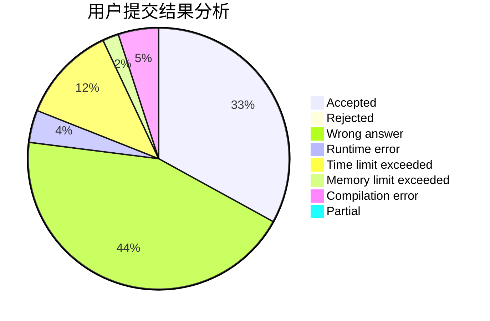
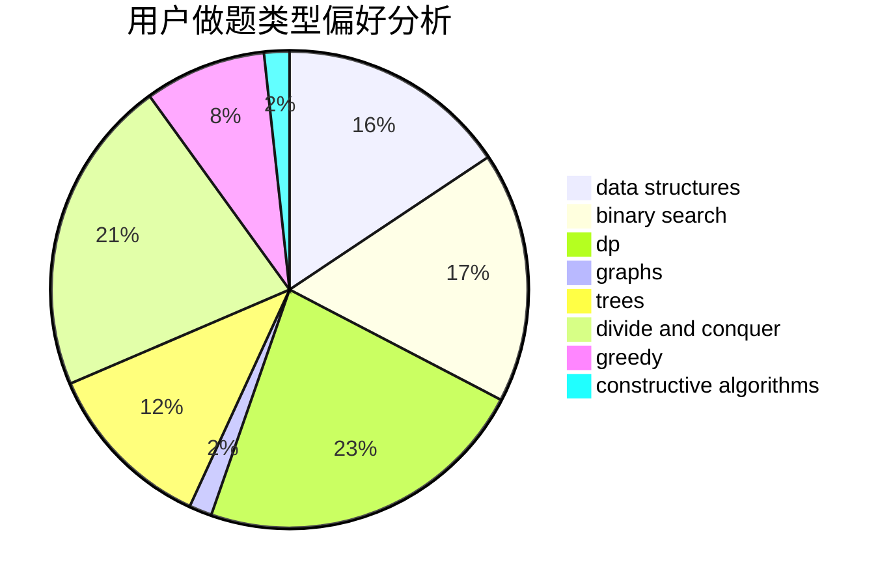
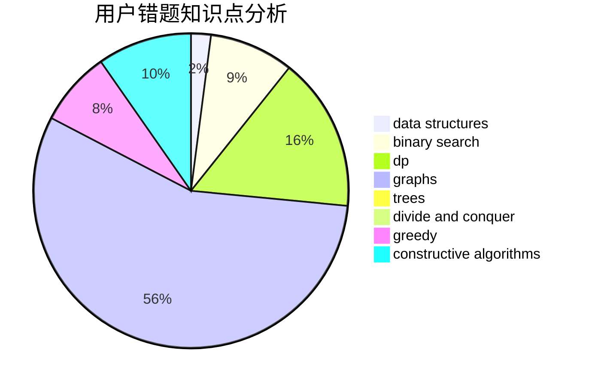

# Kevin090228

<!-- tabs:start -->

#### **用户提交结果分析**

#### **用户做题类型偏好分析**

#### **用户错题知识点分析**

<!-- tabs:end -->
# 推荐题目
[1279E](https://codeforces.com/contest/1279/problem/E)		combinatorics,
                        dp		  
[94C](https://codeforces.com/contest/94/problem/C)		dsu,graphs,sortings,trees		  
[213C](https://codeforces.com/contest/213/problem/C)		dp		  
[13783](https://codeforces.com/contest/1378/problem/3)		dsu,graphs,sortings,trees		  
[1316F](https://codeforces.com/contest/1316/problem/F)		data structures,
                        divide and conquer,
                        probabilities		  
[1119B](https://codeforces.com/contest/1119/problem/B)		binary search,
                        flows,
                        greedy,
                        sortings		  
[79D](https://codeforces.com/contest/79/problem/D)		bitmasks,
                        dp,
                        shortest paths		  
[13A](https://codeforces.com/contest/13/problem/A)		implementation,
                        math		  
[241D](https://codeforces.com/contest/241/problem/D)		nan		  
[1009E](https://codeforces.com/contest/1009/problem/E)		combinatorics,
                        math,
                        probabilities		  
