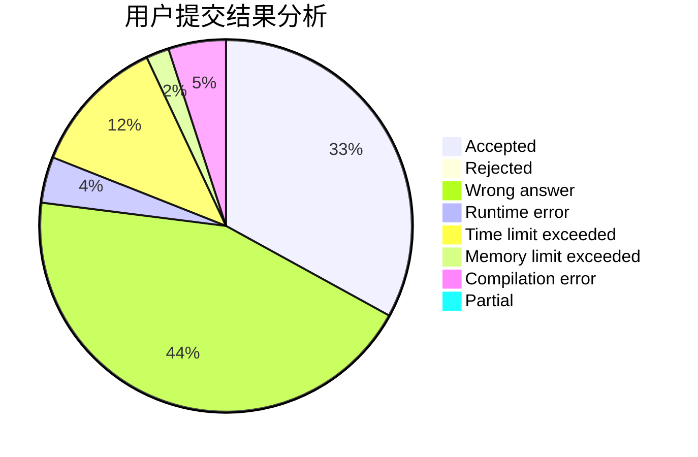
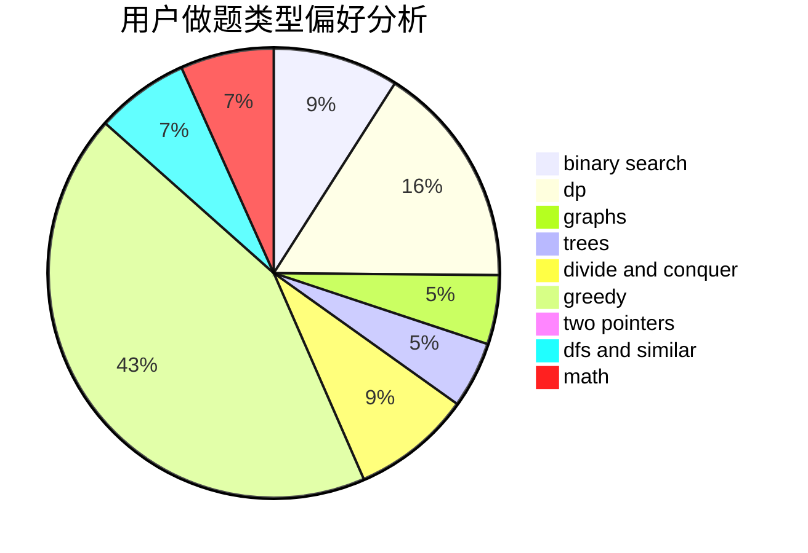

# Kevin090228

<!-- tabs:start -->

#### **用户提交结果分析**

#### **用户做题类型偏好分析**

<!-- tabs:end -->
# 推荐题目
[1279E](https://codeforces.com/contest/1279/problem/E)
[94C](https://codeforces.com/contest/94/problem/C)
[213C](https://codeforces.com/contest/213/problem/C)
[13783](https://codeforces.com/contest/1378/problem/3)
[1316F](https://codeforces.com/contest/1316/problem/F)
[1119B](https://codeforces.com/contest/1119/problem/B)
[79D](https://codeforces.com/contest/79/problem/D)
[13A](https://codeforces.com/contest/13/problem/A)
[241D](https://codeforces.com/contest/241/problem/D)
[1009E](https://codeforces.com/contest/1009/problem/E)
