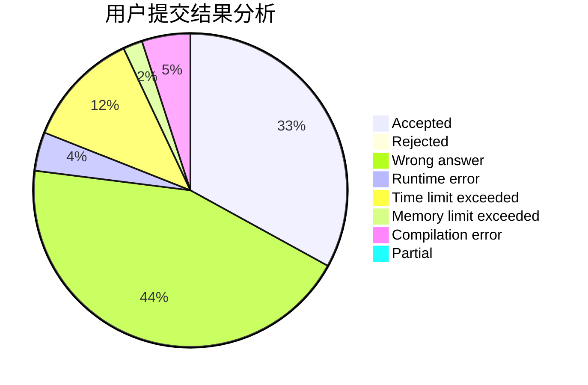
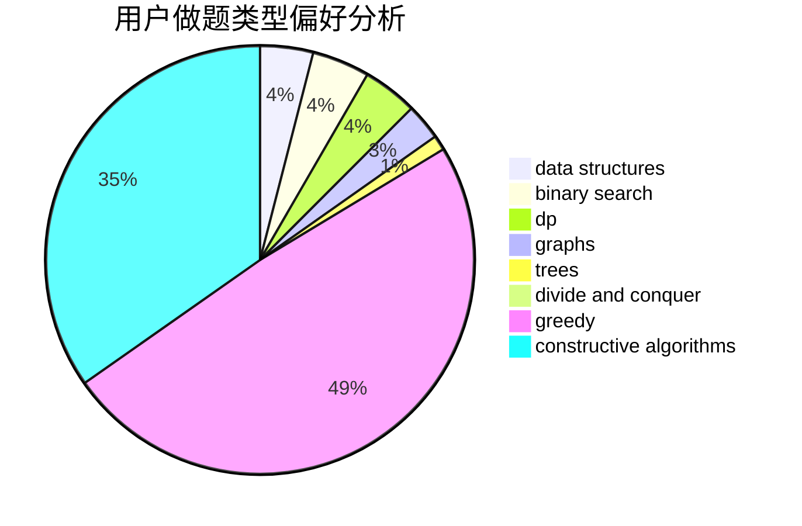
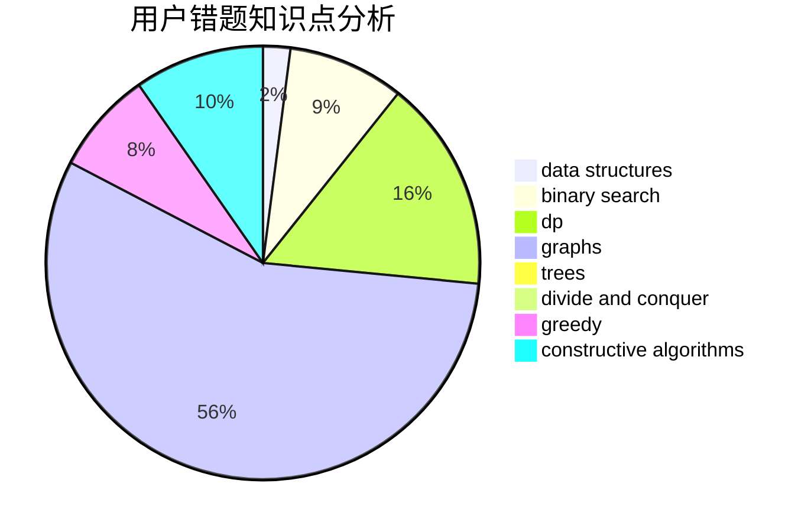

# Kevin090228
<!-- tabs:start -->
#### **用户提交结果分析**

#### **用户做题类型偏好分析**

#### **用户错题知识点分析**

<!-- tabs:end -->
# 推荐题目
[Kuroni and Simple Strings](http://codeforces.com/problemset/problem/1305/B)		constructive algorithms,
                        greedy,
                        strings,
                        two pointers		  
[String Modification](http://codeforces.com/problemset/problem/1316/B)		brute force,
                        constructive algorithms,
                        implementation,
                        sortings,
                        strings		  
[As Simple as One and Two](https://codeforces.com/contest/1277/problem/C)		dp,
                        greedy		  
[Divide Points](http://codeforces.com/problemset/problem/1270/E)		constructive algorithms,
                        geometry,
                        math		  
[Limericks](http://codeforces.com/problemset/problem/1331/B)		math,
                        number theory		  
[Peculiar apple-tree](http://codeforces.com/problemset/problem/930/A)		dfs and similar,
                        graphs,
                        trees		  
[Columns Swaps](http://codeforces.com/problemset/problem/1385/G)		2-sat,
                        dfs and similar,
                        dsu,
                        graphs,
                        implementation		  
[Intranet of Buses](http://codeforces.com/problemset/problem/780/H)		binary search,
                        geometry,
                        implementation,
                        two pointers		  
[Interview](http://codeforces.com/problemset/problem/631/A)		brute force,
                        implementation		  
[Counting Rhombi](http://codeforces.com/problemset/problem/189/B)		brute force,
                        math		  
<!-- tabs:start -->
#### **data structures**
[Kuroni and Simple Strings](http://codeforces.com/problemset/problem/144/D)		data structures,
                        dfs and similar,
                        graphs,
                        shortest paths		  
[String Modification](http://codeforces.com/problemset/problem/1336/F)		data structures,
                        divide and conquer,
                        graphs,
                        trees		  
[As Simple as One and Two](http://codeforces.com/problemset/problem/494/D)		data structures,
                        dfs and similar,
                        dp,
                        trees		  
[Divide Points](http://codeforces.com/problemset/problem/223/B)		data structures,
                        dp,
                        strings		  
[Limericks](http://codeforces.com/problemset/problem/1213/B)		data structures,
                        implementation		  
[Peculiar apple-tree](http://codeforces.com/problemset/problem/1439/C)		binary search,
                        data structures,
                        divide and conquer,
                        greedy,
                        implementation		  
[Columns Swaps](http://codeforces.com/problemset/problem/1492/C)		binary search,
                        data structures,
                        dp,
                        greedy,
                        two pointers		  
[Intranet of Buses](http://codeforces.com/problemset/problem/1490/G)		binary search,
                        data structures,
                        math		  
[Interview](http://codeforces.com/problemset/problem/1479/D)		binary search,
                        bitmasks,
                        brute force,
                        data structures,
                        probabilities,
                        trees		  
[Counting Rhombi](http://codeforces.com/problemset/problem/1497/A)		brute force,
                        data structures,
                        greedy,
                        sortings		  
#### **binary search**
[Kuroni and Simple Strings](http://codeforces.com/problemset/problem/780/H)		binary search,
                        geometry,
                        implementation,
                        two pointers		  
[String Modification](http://codeforces.com/problemset/problem/1310/C)		binary search,
                        dp,
                        strings		  
[As Simple as One and Two](http://codeforces.com/problemset/problem/309/A)		binary search,
                        math,
                        two pointers		  
[Divide Points](http://codeforces.com/problemset/problem/802/N)		binary search,
                        flows,
                        graphs		  
[Limericks](http://codeforces.com/problemset/problem/1117/C)		binary search		  
[Peculiar apple-tree](http://codeforces.com/problemset/problem/1132/D)		binary search,
                        greedy		  
[Columns Swaps](http://codeforces.com/problemset/problem/1439/C)		binary search,
                        data structures,
                        divide and conquer,
                        greedy,
                        implementation		  
[Intranet of Buses](http://codeforces.com/problemset/problem/1492/C)		binary search,
                        data structures,
                        dp,
                        greedy,
                        two pointers		  
[Interview](http://codeforces.com/problemset/problem/1463/D)		binary search,
                        constructive algorithms,
                        greedy,
                        two pointers		  
[Counting Rhombi](http://codeforces.com/problemset/problem/1490/G)		binary search,
                        data structures,
                        math		  
#### **dp**
[Kuroni and Simple Strings](https://codeforces.com/contest/1277/problem/C)		dp,
                        greedy		  
[String Modification](http://codeforces.com/problemset/problem/1310/C)		binary search,
                        dp,
                        strings		  
[As Simple as One and Two](http://codeforces.com/problemset/problem/494/D)		data structures,
                        dfs and similar,
                        dp,
                        trees		  
[Divide Points](https://codeforces.com/contest/1068/problem/D)		dp		  
[Limericks](http://codeforces.com/problemset/problem/398/B)		dp,
                        probabilities		  
[Peculiar apple-tree](http://codeforces.com/problemset/problem/1381/D)		dfs and similar,
                        dp,
                        greedy,
                        trees,
                        two pointers		  
[Columns Swaps](http://codeforces.com/problemset/problem/223/B)		data structures,
                        dp,
                        strings		  
[Intranet of Buses](http://codeforces.com/problemset/problem/1096/E)		combinatorics,
                        dp,
                        math,
                        probabilities		  
[Interview](http://codeforces.com/problemset/problem/773/D)		dp,
                        graphs,
                        shortest paths		  
[Counting Rhombi](http://codeforces.com/problemset/problem/353/D)		constructive algorithms,
                        dp		  
#### **graph**
[Kuroni and Simple Strings](http://codeforces.com/problemset/problem/930/A)		dfs and similar,
                        graphs,
                        trees		  
[String Modification](http://codeforces.com/problemset/problem/1385/G)		2-sat,
                        dfs and similar,
                        dsu,
                        graphs,
                        implementation		  
[As Simple as One and Two](http://codeforces.com/problemset/problem/144/D)		data structures,
                        dfs and similar,
                        graphs,
                        shortest paths		  
[Divide Points](http://codeforces.com/problemset/problem/1336/F)		data structures,
                        divide and conquer,
                        graphs,
                        trees		  
[Limericks](http://codeforces.com/problemset/problem/939/D)		dfs and similar,
                        dsu,
                        graphs,
                        greedy,
                        strings		  
[Peculiar apple-tree](http://codeforces.com/problemset/problem/1346/D)		*special problem,
                        graphs,
                        greedy		  
[Columns Swaps](http://codeforces.com/problemset/problem/802/N)		binary search,
                        flows,
                        graphs		  
[Intranet of Buses](http://codeforces.com/problemset/problem/773/D)		dp,
                        graphs,
                        shortest paths		  
[Interview](http://codeforces.com/problemset/problem/468/E)		dp,
                        graph matchings,
                        math,
                        meet-in-the-middle		  
[Counting Rhombi](http://codeforces.com/problemset/problem/1463/E)		constructive algorithms,
                        dfs and similar,
                        dsu,
                        graphs,
                        implementation,
                        sortings,
                        trees		  
#### **trees**
[Kuroni and Simple Strings](http://codeforces.com/problemset/problem/930/A)		dfs and similar,
                        graphs,
                        trees		  
[String Modification](http://codeforces.com/problemset/problem/1336/F)		data structures,
                        divide and conquer,
                        graphs,
                        trees		  
[As Simple as One and Two](http://codeforces.com/problemset/problem/494/D)		data structures,
                        dfs and similar,
                        dp,
                        trees		  
[Divide Points](http://codeforces.com/problemset/problem/1381/D)		dfs and similar,
                        dp,
                        greedy,
                        trees,
                        two pointers		  
[Limericks](http://codeforces.com/problemset/problem/1463/E)		constructive algorithms,
                        dfs and similar,
                        dsu,
                        graphs,
                        implementation,
                        sortings,
                        trees		  
[Peculiar apple-tree](http://codeforces.com/problemset/problem/1479/D)		binary search,
                        bitmasks,
                        brute force,
                        data structures,
                        probabilities,
                        trees		  
[Columns Swaps](http://codeforces.com/problemset/problem/1511/C)		brute force,
                        data structures,
                        implementation,
                        trees		  
[Intranet of Buses](http://codeforces.com/problemset/problem/1499/F)		combinatorics,
                        dfs and similar,
                        dp,
                        trees		  
[Interview](http://codeforces.com/problemset/problem/1491/E)		brute force,
                        dfs and similar,
                        divide and conquer,
                        number theory,
                        trees		  
[Counting Rhombi](http://codeforces.com/problemset/problem/1466/D)		data structures,
                        greedy,
                        sortings,
                        trees		  
#### **divide and conquer**
[Kuroni and Simple Strings](http://codeforces.com/problemset/problem/513/B2)		bitmasks,
                        divide and conquer,
                        math		  
[String Modification](http://codeforces.com/problemset/problem/1336/F)		data structures,
                        divide and conquer,
                        graphs,
                        trees		  
[As Simple as One and Two](http://codeforces.com/problemset/problem/1439/C)		binary search,
                        data structures,
                        divide and conquer,
                        greedy,
                        implementation		  
[Divide Points](http://codeforces.com/problemset/problem/1461/D)		binary search,
                        brute force,
                        data structures,
                        divide and conquer,
                        implementation,
                        sortings		  
[Limericks](http://codeforces.com/problemset/problem/1466/G)		combinatorics,
                        divide and conquer,
                        hashing,
                        math,
                        string suffix structures,
                        strings		  
[Peculiar apple-tree](http://codeforces.com/problemset/problem/1490/D)		dfs and similar,
                        divide and conquer,
                        implementation		  
[Columns Swaps](https://codeforces.com/contest/1483/problem/C)		data structures,
                        divide and conquer,
                        dp		  
[Intranet of Buses](http://codeforces.com/problemset/problem/1491/E)		brute force,
                        dfs and similar,
                        divide and conquer,
                        number theory,
                        trees		  
[Interview](http://codeforces.com/problemset/problem/1303/G)		data structures,
                        divide and conquer,
                        geometry,
                        trees		  
[Counting Rhombi](http://codeforces.com/problemset/problem/1494/D)		constructive algorithms,
                        data structures,
                        dfs and similar,
                        divide and conquer,
                        dsu,
                        greedy,
                        sortings,
                        trees		  
#### **greedy**
[Kuroni and Simple Strings](http://codeforces.com/problemset/problem/1305/B)		constructive algorithms,
                        greedy,
                        strings,
                        two pointers		  
[String Modification](https://codeforces.com/contest/1277/problem/C)		dp,
                        greedy		  
[As Simple as One and Two](http://codeforces.com/problemset/problem/939/D)		dfs and similar,
                        dsu,
                        graphs,
                        greedy,
                        strings		  
[Divide Points](http://codeforces.com/problemset/problem/1346/D)		*special problem,
                        graphs,
                        greedy		  
[Limericks](http://codeforces.com/problemset/problem/1009/B)		greedy,
                        implementation		  
[Peculiar apple-tree](http://codeforces.com/problemset/problem/1132/D)		binary search,
                        greedy		  
[Columns Swaps](http://codeforces.com/problemset/problem/1381/D)		dfs and similar,
                        dp,
                        greedy,
                        trees,
                        two pointers		  
[Intranet of Buses](http://codeforces.com/problemset/problem/1370/A)		greedy,
                        implementation,
                        math,
                        number theory		  
[Interview](https://codeforces.com/contest/483/problem/C)		constructive algorithms,
                        greedy		  
[Counting Rhombi](https://codeforces.com/contest/1330/problem/C)		constructive algorithms,
                        greedy,
                        implementation,
                        math		  
#### **constructive algorithms**
[Kuroni and Simple Strings](http://codeforces.com/problemset/problem/1305/B)		constructive algorithms,
                        greedy,
                        strings,
                        two pointers		  
[String Modification](http://codeforces.com/problemset/problem/1316/B)		brute force,
                        constructive algorithms,
                        implementation,
                        sortings,
                        strings		  
[As Simple as One and Two](http://codeforces.com/problemset/problem/1270/E)		constructive algorithms,
                        geometry,
                        math		  
[Divide Points](http://codeforces.com/problemset/problem/286/E)		constructive algorithms,
                        fft,
                        math		  
[Limericks](http://codeforces.com/problemset/problem/353/D)		constructive algorithms,
                        dp		  
[Peculiar apple-tree](https://codeforces.com/contest/483/problem/C)		constructive algorithms,
                        greedy		  
[Columns Swaps](https://codeforces.com/contest/1330/problem/C)		constructive algorithms,
                        greedy,
                        implementation,
                        math		  
[Intranet of Buses](http://codeforces.com/problemset/problem/1391/D)		bitmasks,
                        brute force,
                        constructive algorithms,
                        dp,
                        greedy,
                        implementation		  
[Interview](http://codeforces.com/problemset/problem/1463/E)		constructive algorithms,
                        dfs and similar,
                        dsu,
                        graphs,
                        implementation,
                        sortings,
                        trees		  
[Counting Rhombi](http://codeforces.com/problemset/problem/1467/A)		constructive algorithms,
                        greedy,
                        math		  
#### **sortings**
[Kuroni and Simple Strings](http://codeforces.com/problemset/problem/1316/B)		brute force,
                        constructive algorithms,
                        implementation,
                        sortings,
                        strings		  
[String Modification](http://codeforces.com/problemset/problem/811/B)		implementation,
                        sortings		  
[As Simple as One and Two](http://codeforces.com/problemset/problem/1463/E)		constructive algorithms,
                        dfs and similar,
                        dsu,
                        graphs,
                        implementation,
                        sortings,
                        trees		  
[Divide Points](https://codeforces.com/contest/1496/problem/C)		geometry,
                        greedy,
                        math,
                        sortings		  
[Limericks](http://codeforces.com/problemset/problem/1495/A)		geometry,
                        greedy,
                        math,
                        sortings		  
[Peculiar apple-tree](http://codeforces.com/problemset/problem/1497/A)		brute force,
                        data structures,
                        greedy,
                        sortings		  
[Columns Swaps](http://codeforces.com/problemset/problem/1427/A)		math,
                        sortings		  
[Intranet of Buses](http://codeforces.com/problemset/problem/1461/D)		binary search,
                        brute force,
                        data structures,
                        divide and conquer,
                        implementation,
                        sortings		  
[Interview](http://codeforces.com/problemset/problem/1437/C)		dp,
                        flows,
                        graph matchings,
                        greedy,
                        math,
                        sortings		  
[Counting Rhombi](http://codeforces.com/problemset/problem/1473/A)		greedy,
                        implementation,
                        math,
                        sortings		  
<!-- tabs:end -->
