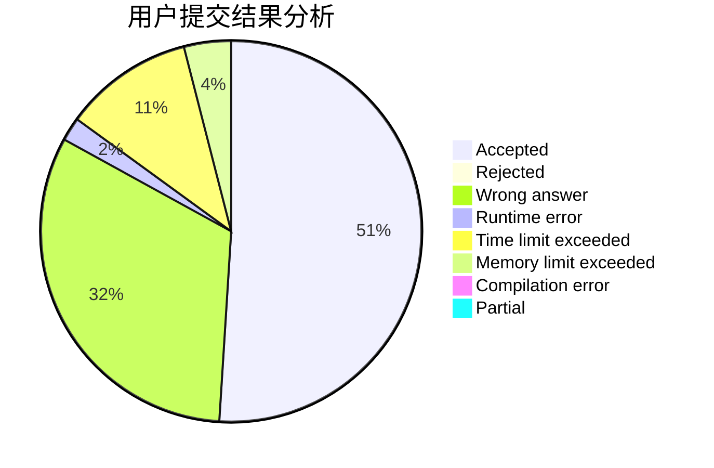
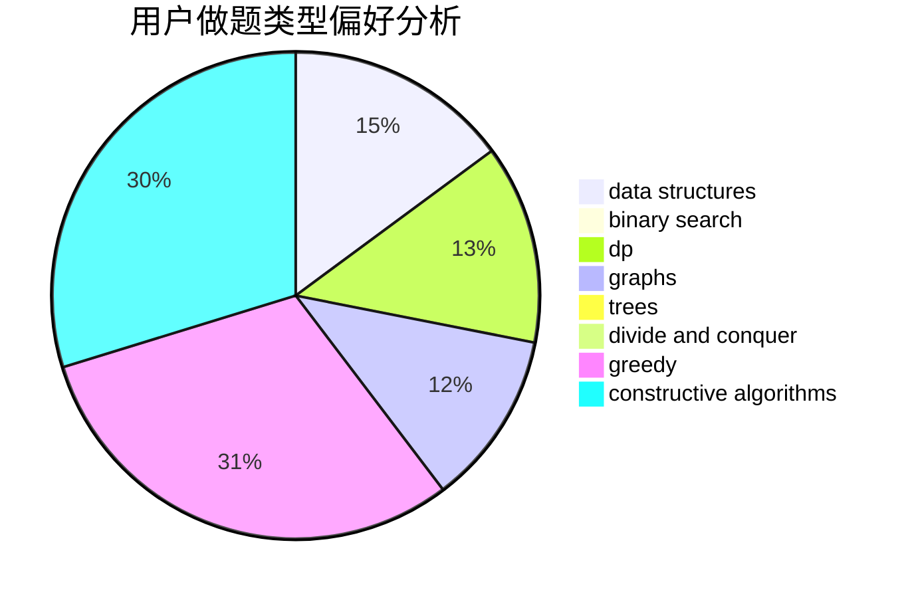
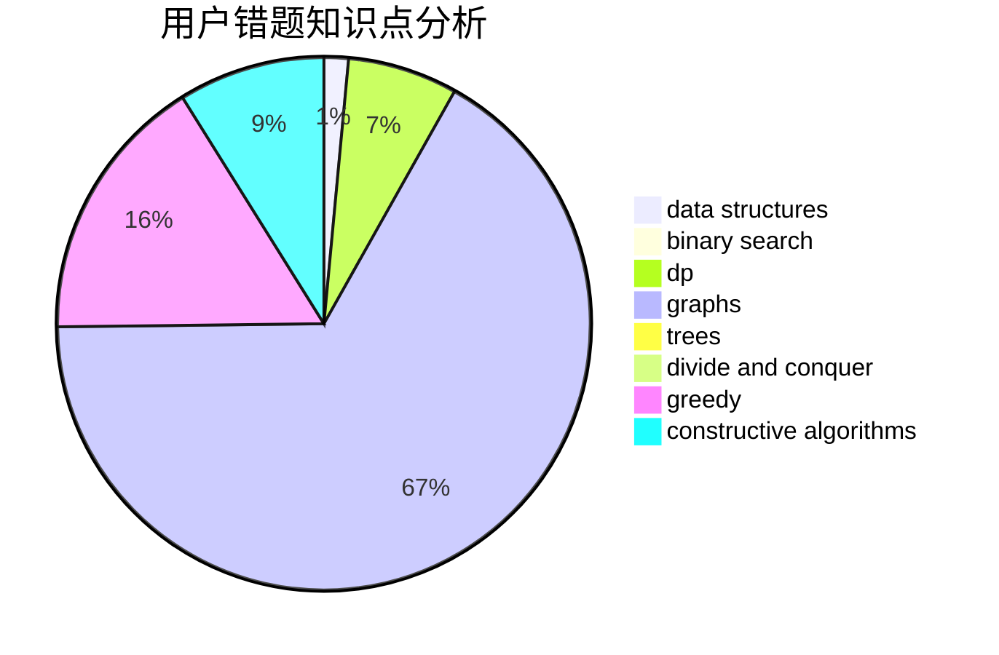

# Kevin7Zz

<!-- tabs:start -->

#### **用户提交结果分析**

#### **用户做题类型偏好分析**

#### **用户错题知识点分析**

<!-- tabs:end -->
# 推荐题目
[764A](https://codeforces.com/contest/764/problem/A)		brute force,
                        implementation,
                        math		  
[449C](https://codeforces.com/contest/449/problem/C)		constructive algorithms,
                        number theory		  
[1033E](https://codeforces.com/contest/1033/problem/E)		binary search,
                        constructive algorithms,
                        dfs and similar,
                        graphs,
                        interactive		  
[174B](https://codeforces.com/contest/174/problem/B)		dp,
                        greedy,
                        implementation		  
[1043D](https://codeforces.com/contest/1043/problem/D)		brute force,
                        combinatorics,
                        math,
                        meet-in-the-middle,
                        two pointers		  
[388E](https://codeforces.com/contest/388/problem/E)		geometry		  
[45D](https://codeforces.com/contest/45/problem/D)		greedy,
                        meet-in-the-middle,
                        sortings		  
[600A](https://codeforces.com/contest/600/problem/A)		implementation,
                        strings		  
[468D](https://codeforces.com/contest/468/problem/D)		graph matchings		  
[840C](https://codeforces.com/contest/840/problem/C)		combinatorics,
                        dp		  
