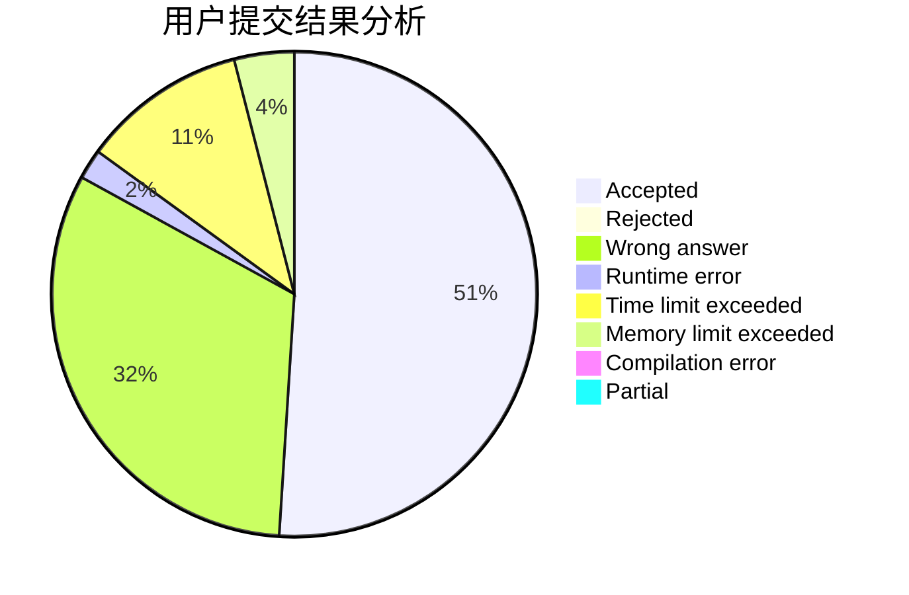
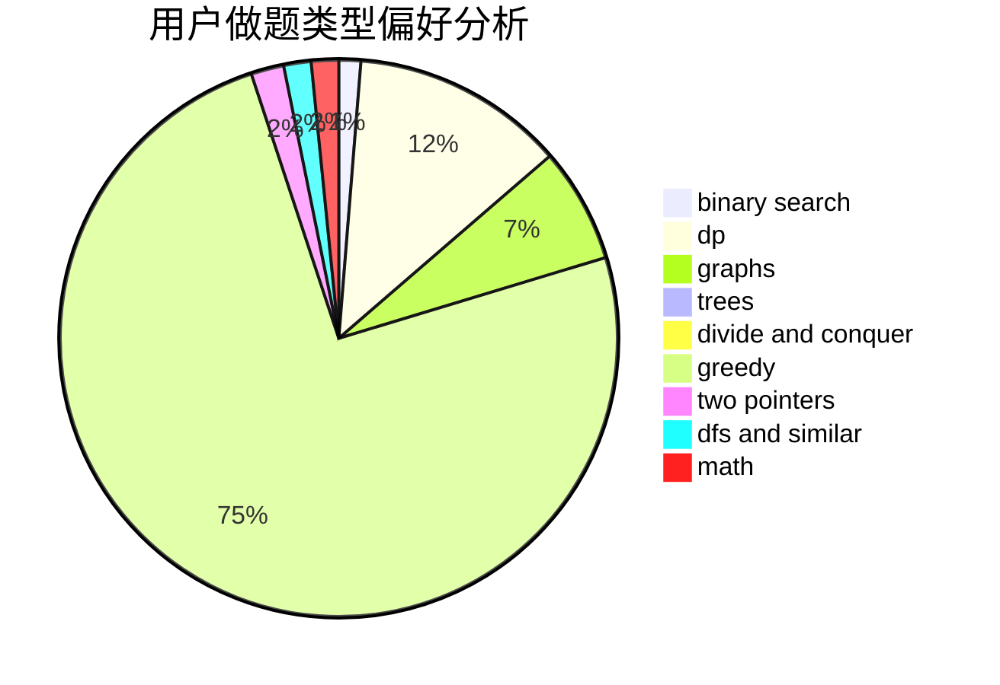

# Kevin7Zz

<!-- tabs:start -->

#### **用户提交结果分析**

#### **用户做题类型偏好分析**

<!-- tabs:end -->
# 推荐题目
[764A](https://codeforces.com/contest/764/problem/A)
[449C](https://codeforces.com/contest/449/problem/C)
[1033E](https://codeforces.com/contest/1033/problem/E)
[174B](https://codeforces.com/contest/174/problem/B)
[1043D](https://codeforces.com/contest/1043/problem/D)
[388E](https://codeforces.com/contest/388/problem/E)
[45D](https://codeforces.com/contest/45/problem/D)
[600A](https://codeforces.com/contest/600/problem/A)
[468D](https://codeforces.com/contest/468/problem/D)
[840C](https://codeforces.com/contest/840/problem/C)
