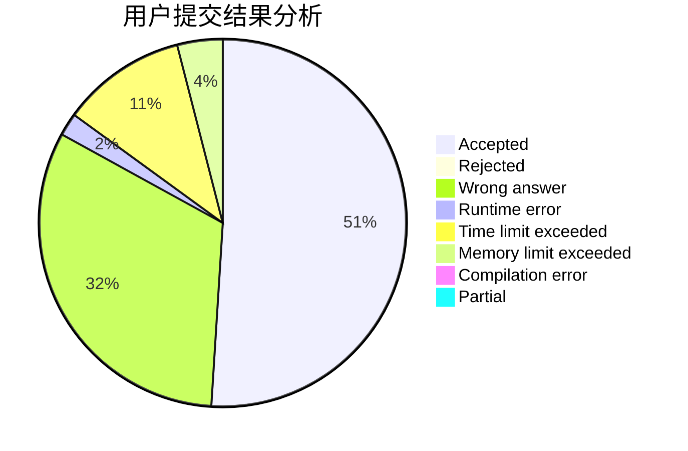
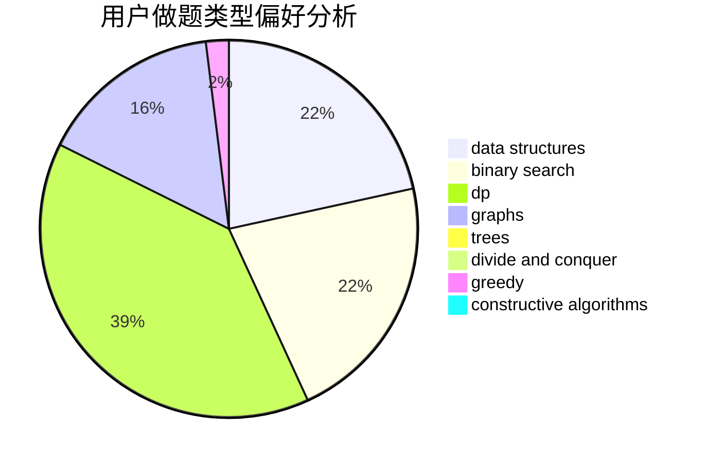
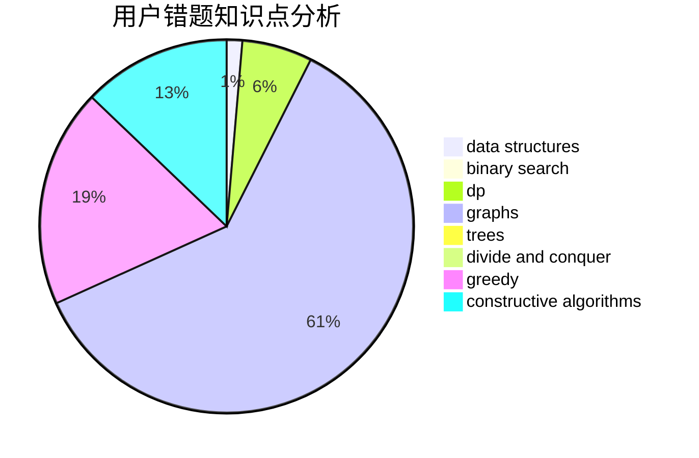

# Kevin7Zz

<!-- tabs:start -->

#### **用户提交结果分析**

#### **用户做题类型偏好分析**

#### **用户错题知识点分析**

<!-- tabs:end -->
# 推荐题目
[743E](https://codeforces.com/contest/743/problem/E)		binary search,
                        bitmasks,
                        brute force,
                        dp		  
[425E](https://codeforces.com/contest/425/problem/E)		dp		  
[1033B](https://codeforces.com/contest/1033/problem/B)		math,
                        number theory		  
[1513F](https://codeforces.com/contest/1513/problem/F)		brute force,
                        constructive algorithms,
                        data structures,
                        sortings		  
[1043A](https://codeforces.com/contest/1043/problem/A)		implementation,
                        math		  
[360D](https://codeforces.com/contest/360/problem/D)		number theory		  
[438A](https://codeforces.com/contest/438/problem/A)		dsu,graphs,sortings,trees		  
[57C](https://codeforces.com/contest/57/problem/C)		combinatorics,
                        math		  
[448D](https://codeforces.com/contest/448/problem/D)		binary search,
                        brute force		  
[820C](https://codeforces.com/contest/820/problem/C)		dsu,graphs,sortings,trees		  
