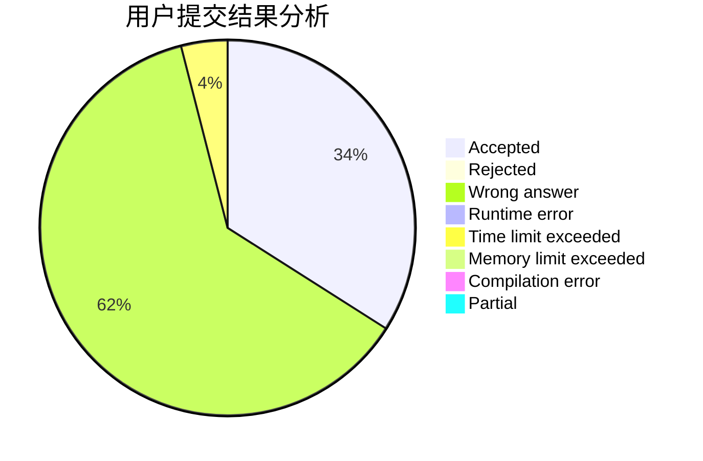
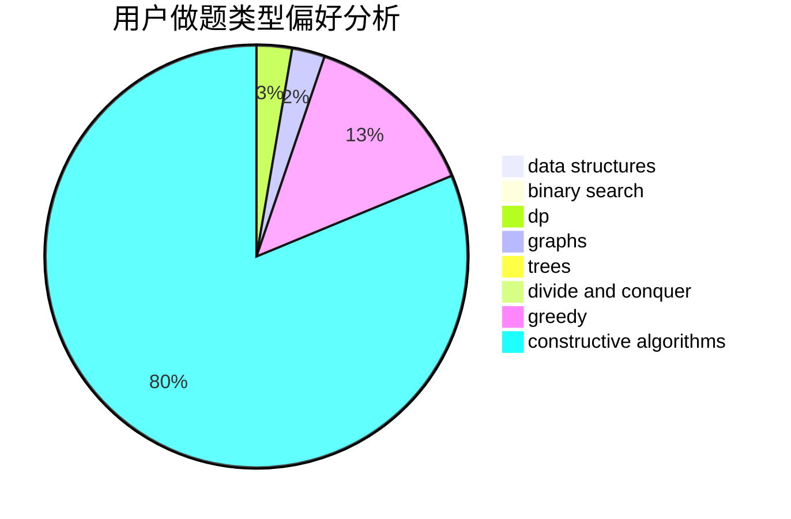
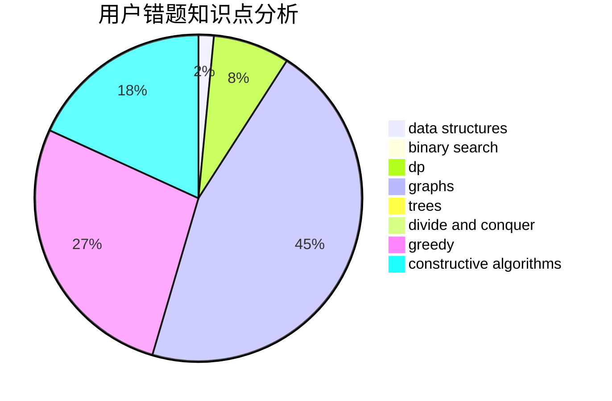

# KevinSo25

<!-- tabs:start -->

#### **用户提交结果分析**

#### **用户做题类型偏好分析**

#### **用户错题知识点分析**

<!-- tabs:end -->
# 推荐题目
[1488B](https://codeforces.com/contest/1488/problem/B)		*special problem,
                        greedy		  
[1391E](https://codeforces.com/contest/1391/problem/E)		constructive algorithms,
                        dfs and similar,
                        graphs,
                        greedy,
                        trees		  
[416C](https://codeforces.com/contest/416/problem/C)		binary search,
                        dp,
                        greedy,
                        implementation		  
[954C](https://codeforces.com/contest/954/problem/C)		implementation		  
[1288D](https://codeforces.com/contest/1288/problem/D)		binary search,
                        bitmasks,
                        dp		  
[1394E](https://codeforces.com/contest/1394/problem/E)		strings		  
[915C](https://codeforces.com/contest/915/problem/C)		dp,
                        greedy		  
[236D](https://codeforces.com/contest/236/problem/D)		dsu,graphs,sortings,trees		  
[739E](https://codeforces.com/contest/739/problem/E)		brute force,
                        data structures,
                        dp,
                        flows,
                        math,
                        probabilities,
                        sortings		  
[21C](https://codeforces.com/contest/21/problem/C)		binary search,
                        dp,
                        sortings		  
