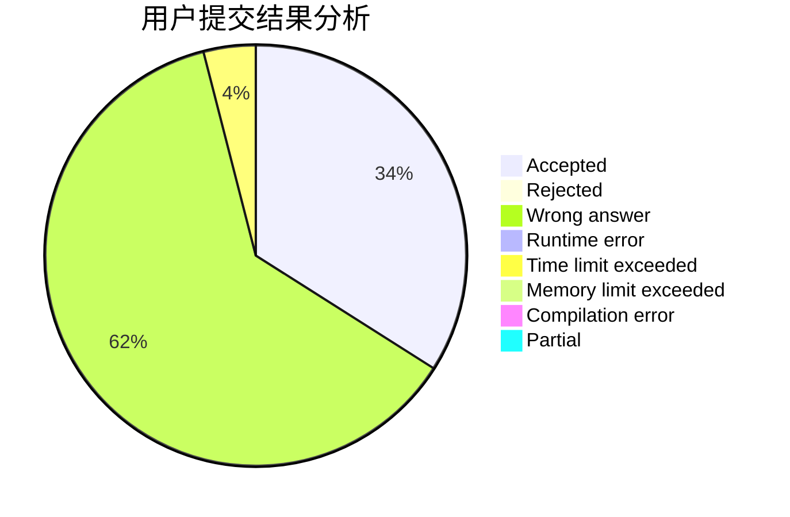
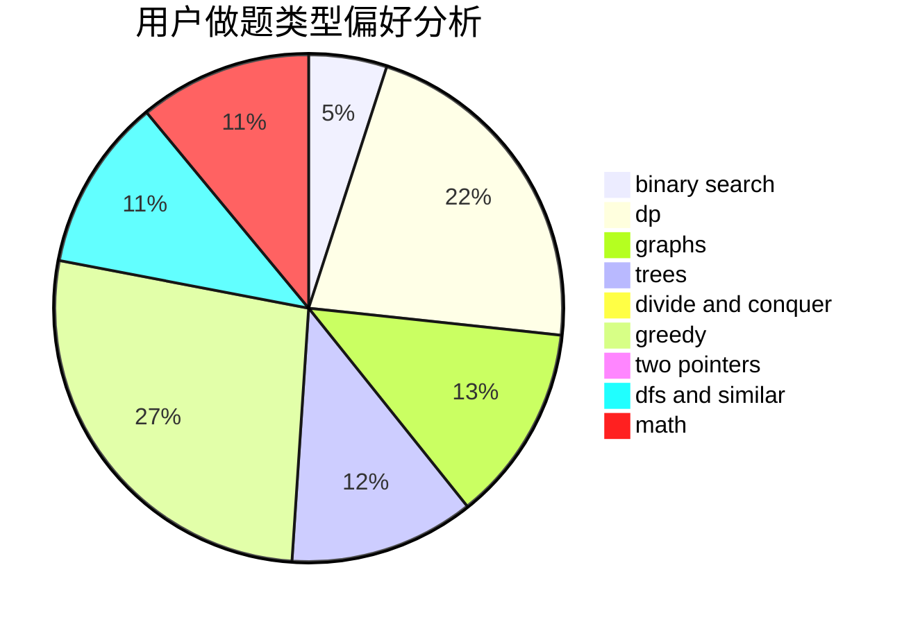

# KevinSo25

<!-- tabs:start -->

#### **用户提交结果分析**

#### **用户做题类型偏好分析**

<!-- tabs:end -->
# 推荐题目
[1488B](https://codeforces.com/contest/1488/problem/B)
[1391E](https://codeforces.com/contest/1391/problem/E)
[416C](https://codeforces.com/contest/416/problem/C)
[954C](https://codeforces.com/contest/954/problem/C)
[1288D](https://codeforces.com/contest/1288/problem/D)
[1394E](https://codeforces.com/contest/1394/problem/E)
[915C](https://codeforces.com/contest/915/problem/C)
[236D](https://codeforces.com/contest/236/problem/D)
[739E](https://codeforces.com/contest/739/problem/E)
[21C](https://codeforces.com/contest/21/problem/C)
