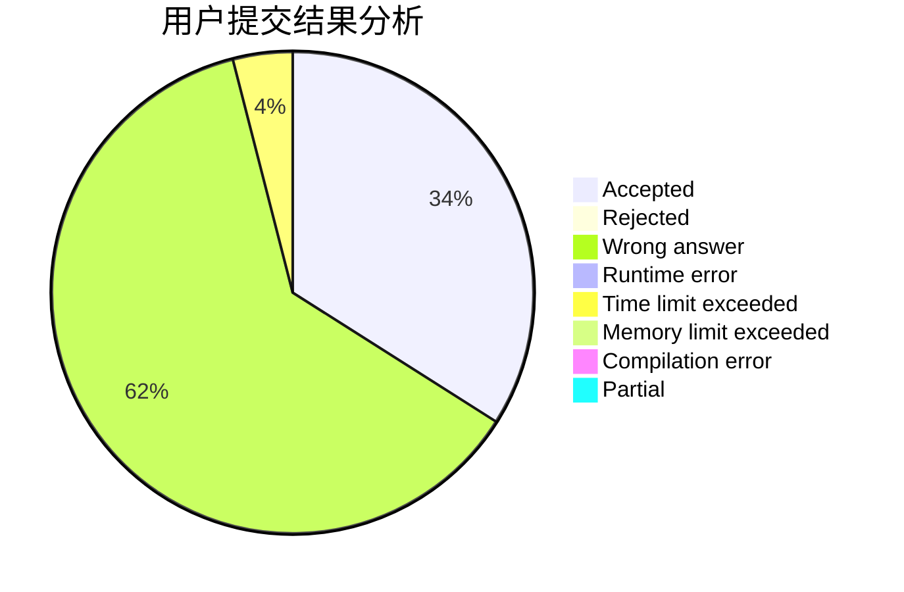
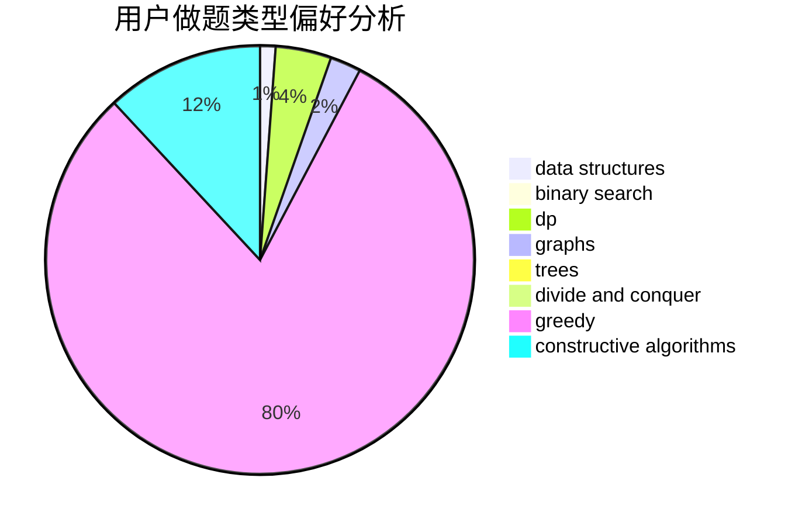
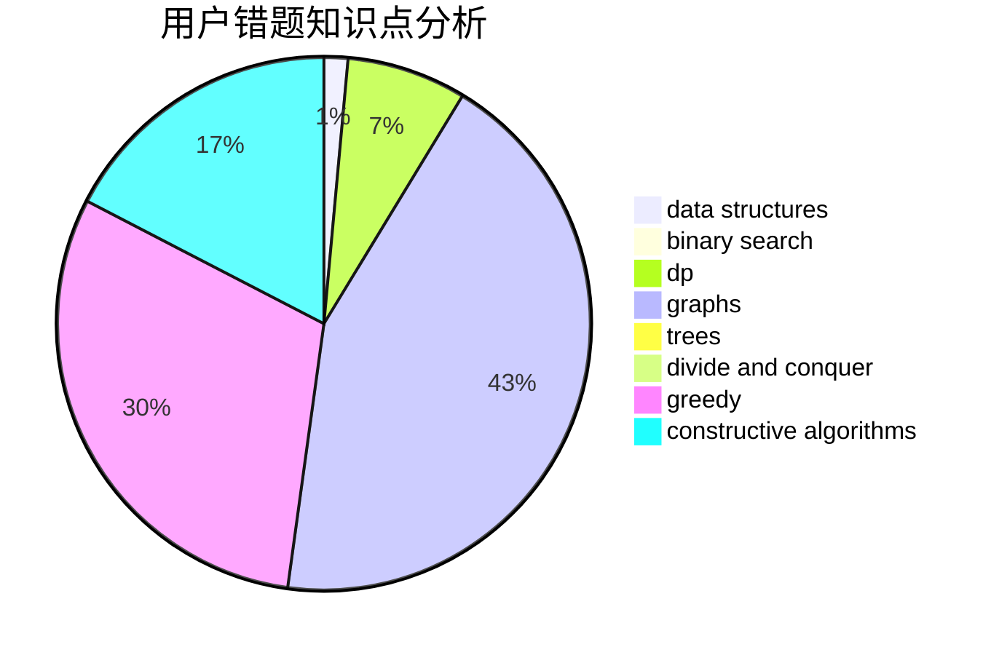

# KevinSo25

<!-- tabs:start -->

#### **用户提交结果分析**

#### **用户做题类型偏好分析**

#### **用户错题知识点分析**

<!-- tabs:end -->
# 推荐题目
[1479D](https://codeforces.com/contest/1479/problem/D)		binary search,
                        bitmasks,
                        brute force,
                        data structures,
                        probabilities,
                        trees		  
[1381C](https://codeforces.com/contest/1381/problem/C)		constructive algorithms,
                        graph matchings,
                        greedy,
                        implementation,
                        sortings,
                        two pointers		  
[386C](https://codeforces.com/contest/386/problem/C)		dp,
                        strings,
                        two pointers		  
[932C](https://codeforces.com/contest/932/problem/C)		brute force,
                        constructive algorithms		  
[1282B1](https://codeforces.com/contest/1282B/problem/1)		dp,
                        greedy,
                        sortings		  
[1384E](https://codeforces.com/contest/1384/problem/E)		dsu,graphs,sortings,trees		  
[899C](https://codeforces.com/contest/899/problem/C)		constructive algorithms,
                        graphs,
                        math		  
[218A](https://codeforces.com/contest/218/problem/A)		brute force,
                        constructive algorithms,
                        implementation		  
[722D](https://codeforces.com/contest/722/problem/D)		binary search,
                        data structures,
                        dfs and similar,
                        greedy,
                        strings,
                        trees		  
[198C](https://codeforces.com/contest/198/problem/C)		binary search,
                        geometry		  
