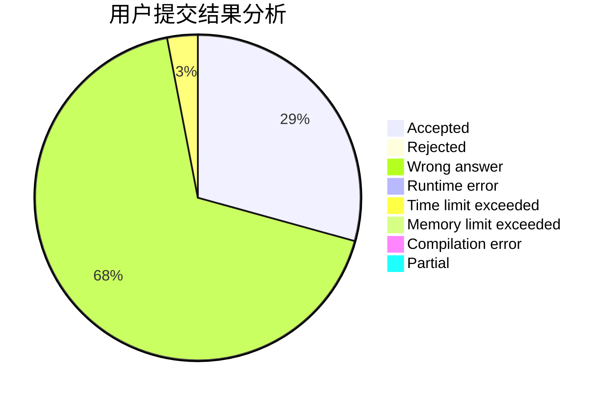
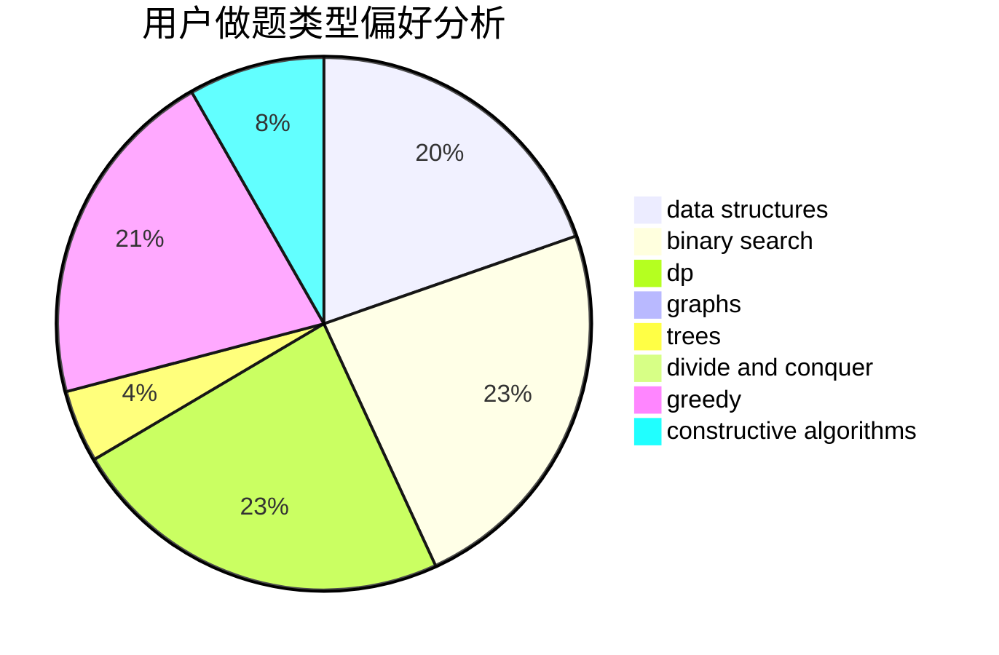
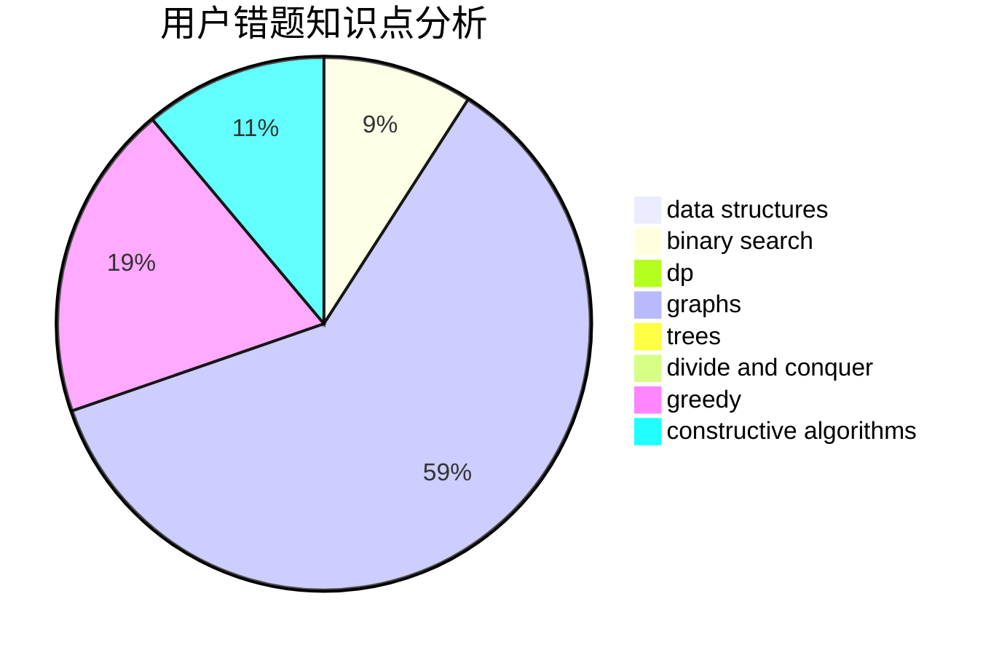

# Kevinyyj
<!-- tabs:start -->
#### **用户提交结果分析**

#### **用户做题类型偏好分析**

#### **用户错题知识点分析**

<!-- tabs:end -->
# 推荐题目
[Shifting Stacks](http://codeforces.com/problemset/problem/1486/A)		greedy,
                        implementation		  
[Cursor Distance](http://codeforces.com/problemset/problem/1246/F)		nan		  
[The Thorny Path](http://codeforces.com/problemset/problem/1411/F)		greedy,
                        math		  
[Multi-judge Solving](http://codeforces.com/problemset/problem/825/C)		greedy,
                        implementation		  
[Make It Equal](http://codeforces.com/problemset/problem/1065/C)		greedy		  
[Star](http://codeforces.com/problemset/problem/171/B)		*special problem,
                        combinatorics		  
[Buy Low Sell High](https://codeforces.com/contest/866/problem/D)		constructive algorithms,
                        data structures,
                        greedy		  
[MP3](https://codeforces.com/contest/1199/problem/C)		sortings,
                        two pointers		  
[Far Relative’s Birthday Cake](http://codeforces.com/problemset/problem/629/A)		brute force,
                        combinatorics,
                        constructive algorithms,
                        implementation		  
[Coprime Arrays](http://codeforces.com/problemset/problem/915/G)		math,
                        number theory		  
<!-- tabs:start -->
#### **data structures**
[Shifting Stacks](https://codeforces.com/contest/866/problem/D)		constructive algorithms,
                        data structures,
                        greedy		  
[Cursor Distance](https://codeforces.com/contest/1277/problem/F)		brute force,
                        combinatorics,
                        constructive algorithms,
                        data structures,
                        greedy,
                        math		  
[The Thorny Path](http://codeforces.com/problemset/problem/939/F)		data structures,
                        dp		  
[Multi-judge Solving](http://codeforces.com/problemset/problem/1253/E)		data structures,
                        dp,
                        greedy,
                        sortings		  
[Make It Equal](http://codeforces.com/problemset/problem/915/F)		data structures,
                        dsu,
                        graphs,
                        trees		  
[Star](http://codeforces.com/problemset/problem/1111/E)		data structures,
                        dfs and similar,
                        dp,
                        graphs,
                        trees		  
[Buy Low Sell High](http://codeforces.com/problemset/problem/1310/A)		data structures,
                        greedy,
                        sortings		  
[MP3](http://codeforces.com/problemset/problem/1442/B)		combinatorics,
                        data structures,
                        dsu,
                        greedy,
                        implementation		  
[Far Relative’s Birthday Cake](http://codeforces.com/problemset/problem/1492/C)		binary search,
                        data structures,
                        dp,
                        greedy,
                        two pointers		  
[Coprime Arrays](http://codeforces.com/problemset/problem/1490/G)		binary search,
                        data structures,
                        math		  
#### **binary search**
[Shifting Stacks](http://codeforces.com/problemset/problem/842/E)		binary search,
                        dfs and similar,
                        divide and conquer,
                        graphs,
                        trees		  
[Cursor Distance](http://codeforces.com/problemset/problem/1361/C)		binary search,
                        bitmasks,
                        constructive algorithms,
                        dfs and similar,
                        dsu,
                        graphs		  
[The Thorny Path](http://codeforces.com/problemset/problem/1492/C)		binary search,
                        data structures,
                        dp,
                        greedy,
                        two pointers		  
[Multi-judge Solving](http://codeforces.com/problemset/problem/1463/D)		binary search,
                        constructive algorithms,
                        greedy,
                        two pointers		  
[Make It Equal](http://codeforces.com/problemset/problem/1490/G)		binary search,
                        data structures,
                        math		  
[Star](http://codeforces.com/problemset/problem/1479/D)		binary search,
                        bitmasks,
                        brute force,
                        data structures,
                        probabilities,
                        trees		  
[Buy Low Sell High](http://codeforces.com/problemset/problem/1436/E)		binary search,
                        data structures,
                        two pointers		  
[MP3](http://codeforces.com/problemset/problem/1461/D)		binary search,
                        brute force,
                        data structures,
                        divide and conquer,
                        implementation,
                        sortings		  
[Far Relative’s Birthday Cake](http://codeforces.com/problemset/problem/1493/C)		binary search,
                        brute force,
                        constructive algorithms,
                        greedy,
                        strings		  
[Coprime Arrays](http://codeforces.com/problemset/problem/1487/D)		binary search,
                        brute force,
                        math,
                        number theory		  
#### **dp**
[Shifting Stacks](https://codeforces.com/contest/800/problem/C)		constructive algorithms,
                        dp,
                        graphs,
                        math,
                        number theory		  
[Cursor Distance](http://codeforces.com/problemset/problem/718/D)		dp,
                        hashing,
                        trees		  
[The Thorny Path](http://codeforces.com/problemset/problem/939/F)		data structures,
                        dp		  
[Multi-judge Solving](http://codeforces.com/problemset/problem/1253/E)		data structures,
                        dp,
                        greedy,
                        sortings		  
[Make It Equal](http://codeforces.com/problemset/problem/1111/E)		data structures,
                        dfs and similar,
                        dp,
                        graphs,
                        trees		  
[Star](http://codeforces.com/problemset/problem/1472/D)		dp,
                        games,
                        greedy,
                        sortings		  
[Buy Low Sell High](http://codeforces.com/problemset/problem/1492/C)		binary search,
                        data structures,
                        dp,
                        greedy,
                        two pointers		  
[MP3](https://codeforces.com/contest/1457/problem/C)		brute force,
                        dp,
                        implementation		  
[Far Relative’s Birthday Cake](http://codeforces.com/problemset/problem/1491/C)		brute force,
                        data structures,
                        dp,
                        greedy,
                        implementation		  
[Coprime Arrays](http://codeforces.com/problemset/problem/1437/C)		dp,
                        flows,
                        graph matchings,
                        greedy,
                        math,
                        sortings		  
#### **graph**
[Shifting Stacks](http://codeforces.com/problemset/problem/254/D)		brute force,
                        dfs and similar,
                        graphs,
                        implementation,
                        shortest paths		  
[Cursor Distance](https://codeforces.com/contest/800/problem/C)		constructive algorithms,
                        dp,
                        graphs,
                        math,
                        number theory		  
[The Thorny Path](http://codeforces.com/problemset/problem/842/E)		binary search,
                        dfs and similar,
                        divide and conquer,
                        graphs,
                        trees		  
[Multi-judge Solving](http://codeforces.com/problemset/problem/915/F)		data structures,
                        dsu,
                        graphs,
                        trees		  
[Make It Equal](http://codeforces.com/problemset/problem/1111/E)		data structures,
                        dfs and similar,
                        dp,
                        graphs,
                        trees		  
[Star](http://codeforces.com/problemset/problem/1361/C)		binary search,
                        bitmasks,
                        constructive algorithms,
                        dfs and similar,
                        dsu,
                        graphs		  
[Buy Low Sell High](https://codeforces.com/contest/1483/problem/D)		graphs,
                        shortest paths		  
[MP3](http://codeforces.com/problemset/problem/1487/C)		brute force,
                        constructive algorithms,
                        dfs and similar,
                        graphs,
                        greedy,
                        implementation,
                        math		  
[Far Relative’s Birthday Cake](http://codeforces.com/problemset/problem/1437/C)		dp,
                        flows,
                        graph matchings,
                        greedy,
                        math,
                        sortings		  
[Coprime Arrays](http://codeforces.com/problemset/problem/1470/D)		constructive algorithms,
                        dfs and similar,
                        graph matchings,
                        graphs,
                        greedy		  
#### **trees**
[Shifting Stacks](http://codeforces.com/problemset/problem/718/D)		dp,
                        hashing,
                        trees		  
[Cursor Distance](http://codeforces.com/problemset/problem/842/E)		binary search,
                        dfs and similar,
                        divide and conquer,
                        graphs,
                        trees		  
[The Thorny Path](http://codeforces.com/problemset/problem/915/F)		data structures,
                        dsu,
                        graphs,
                        trees		  
[Multi-judge Solving](http://codeforces.com/problemset/problem/1111/E)		data structures,
                        dfs and similar,
                        dp,
                        graphs,
                        trees		  
[Make It Equal](http://codeforces.com/problemset/problem/1479/D)		binary search,
                        bitmasks,
                        brute force,
                        data structures,
                        probabilities,
                        trees		  
[Star](http://codeforces.com/problemset/problem/1511/C)		brute force,
                        data structures,
                        implementation,
                        trees		  
[Buy Low Sell High](http://codeforces.com/problemset/problem/1499/F)		combinatorics,
                        dfs and similar,
                        dp,
                        trees		  
[MP3](http://codeforces.com/problemset/problem/1491/E)		brute force,
                        dfs and similar,
                        divide and conquer,
                        number theory,
                        trees		  
[Far Relative’s Birthday Cake](http://codeforces.com/problemset/problem/1466/D)		data structures,
                        greedy,
                        sortings,
                        trees		  
[Coprime Arrays](http://codeforces.com/problemset/problem/1495/D)		combinatorics,
                        dfs and similar,
                        graphs,
                        math,
                        shortest paths,
                        trees		  
#### **divide and conquer**
[Shifting Stacks](http://codeforces.com/problemset/problem/842/E)		binary search,
                        dfs and similar,
                        divide and conquer,
                        graphs,
                        trees		  
[Cursor Distance](http://codeforces.com/problemset/problem/1461/D)		binary search,
                        brute force,
                        data structures,
                        divide and conquer,
                        implementation,
                        sortings		  
[The Thorny Path](http://codeforces.com/problemset/problem/1466/G)		combinatorics,
                        divide and conquer,
                        hashing,
                        math,
                        string suffix structures,
                        strings		  
[Multi-judge Solving](http://codeforces.com/problemset/problem/1490/D)		dfs and similar,
                        divide and conquer,
                        implementation		  
[Make It Equal](https://codeforces.com/contest/1483/problem/C)		data structures,
                        divide and conquer,
                        dp		  
[Star](http://codeforces.com/problemset/problem/1491/E)		brute force,
                        dfs and similar,
                        divide and conquer,
                        number theory,
                        trees		  
[Buy Low Sell High](http://codeforces.com/problemset/problem/1303/G)		data structures,
                        divide and conquer,
                        geometry,
                        trees		  
[MP3](http://codeforces.com/problemset/problem/1494/D)		constructive algorithms,
                        data structures,
                        dfs and similar,
                        divide and conquer,
                        dsu,
                        greedy,
                        sortings,
                        trees		  
[Far Relative’s Birthday Cake](http://codeforces.com/problemset/problem/1482/E)		data structures,
                        divide and conquer,
                        dp		  
[Coprime Arrays](http://codeforces.com/problemset/problem/566/C)		dfs and similar,
                        divide and conquer,
                        trees		  
#### **greedy**
[Shifting Stacks](http://codeforces.com/problemset/problem/1486/A)		greedy,
                        implementation		  
[Cursor Distance](http://codeforces.com/problemset/problem/1411/F)		greedy,
                        math		  
[The Thorny Path](http://codeforces.com/problemset/problem/825/C)		greedy,
                        implementation		  
[Multi-judge Solving](http://codeforces.com/problemset/problem/1065/C)		greedy		  
[Make It Equal](https://codeforces.com/contest/866/problem/D)		constructive algorithms,
                        data structures,
                        greedy		  
[Star](http://codeforces.com/problemset/problem/609/A)		greedy,
                        implementation,
                        sortings		  
[Buy Low Sell High](http://codeforces.com/problemset/problem/16/B)		greedy,
                        implementation,
                        sortings		  
[MP3](https://codeforces.com/contest/1277/problem/F)		brute force,
                        combinatorics,
                        constructive algorithms,
                        data structures,
                        greedy,
                        math		  
[Far Relative’s Birthday Cake](http://codeforces.com/problemset/problem/1253/E)		data structures,
                        dp,
                        greedy,
                        sortings		  
[Coprime Arrays](http://codeforces.com/problemset/problem/1155/B)		games,
                        greedy,
                        implementation		  
#### **constructive algorithms**
[Shifting Stacks](https://codeforces.com/contest/866/problem/D)		constructive algorithms,
                        data structures,
                        greedy		  
[Cursor Distance](http://codeforces.com/problemset/problem/629/A)		brute force,
                        combinatorics,
                        constructive algorithms,
                        implementation		  
[The Thorny Path](https://codeforces.com/contest/312/problem/C)		constructive algorithms,
                        implementation		  
[Multi-judge Solving](https://codeforces.com/contest/800/problem/C)		constructive algorithms,
                        dp,
                        graphs,
                        math,
                        number theory		  
[Make It Equal](https://codeforces.com/contest/1277/problem/F)		brute force,
                        combinatorics,
                        constructive algorithms,
                        data structures,
                        greedy,
                        math		  
[Star](http://codeforces.com/problemset/problem/1450/F)		constructive algorithms,
                        greedy		  
[Buy Low Sell High](http://codeforces.com/problemset/problem/1361/C)		binary search,
                        bitmasks,
                        constructive algorithms,
                        dfs and similar,
                        dsu,
                        graphs		  
[MP3](http://codeforces.com/problemset/problem/1493/A)		constructive algorithms,
                        greedy		  
[Far Relative’s Birthday Cake](http://codeforces.com/problemset/problem/1463/D)		binary search,
                        constructive algorithms,
                        greedy,
                        two pointers		  
[Coprime Arrays](https://codeforces.com/contest/1456/problem/B)		bitmasks,
                        brute force,
                        constructive algorithms		  
#### **sortings**
[Shifting Stacks](https://codeforces.com/contest/1199/problem/C)		sortings,
                        two pointers		  
[Cursor Distance](http://codeforces.com/problemset/problem/558/A)		brute force,
                        implementation,
                        sortings		  
[The Thorny Path](http://codeforces.com/problemset/problem/609/A)		greedy,
                        implementation,
                        sortings		  
[Multi-judge Solving](http://codeforces.com/problemset/problem/16/B)		greedy,
                        implementation,
                        sortings		  
[Make It Equal](http://codeforces.com/problemset/problem/1253/E)		data structures,
                        dp,
                        greedy,
                        sortings		  
[Star](http://codeforces.com/problemset/problem/1310/A)		data structures,
                        greedy,
                        sortings		  
[Buy Low Sell High](http://codeforces.com/problemset/problem/1427/B)		greedy,
                        implementation,
                        sortings		  
[MP3](http://codeforces.com/problemset/problem/1472/D)		dp,
                        games,
                        greedy,
                        sortings		  
[Far Relative’s Birthday Cake](https://codeforces.com/contest/1496/problem/C)		geometry,
                        greedy,
                        math,
                        sortings		  
[Coprime Arrays](http://codeforces.com/problemset/problem/1495/A)		geometry,
                        greedy,
                        math,
                        sortings		  
<!-- tabs:end -->
