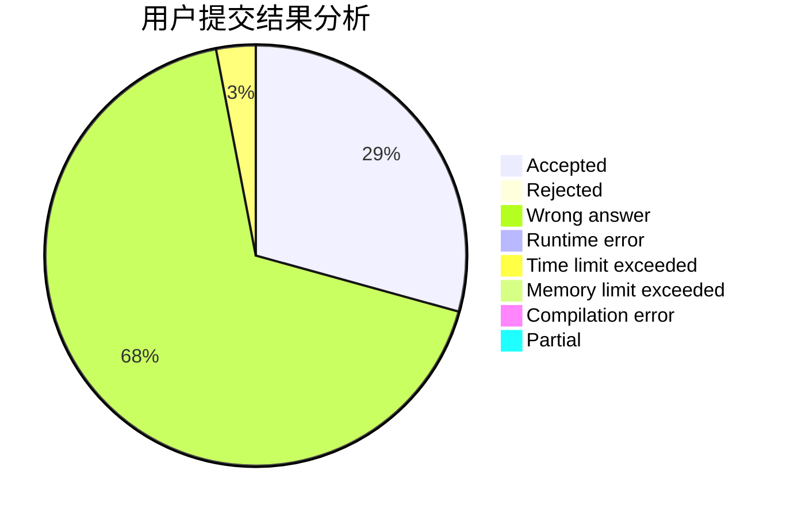
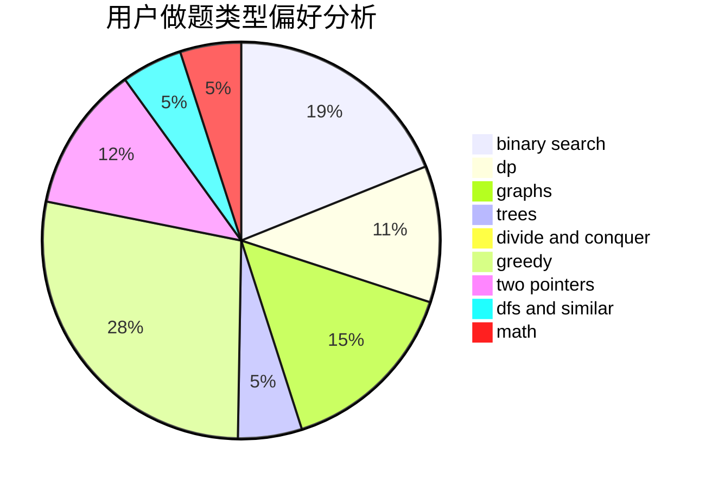

# Kevinyyj

<!-- tabs:start -->

#### **用户提交结果分析**

#### **用户做题类型偏好分析**

<!-- tabs:end -->
# 推荐题目
[1493C](https://codeforces.com/contest/1493/problem/C)
[1422A](https://codeforces.com/contest/1422/problem/A)
[1129D](https://codeforces.com/contest/1129/problem/D)
[1065G](https://codeforces.com/contest/1065/problem/G)
[862A](https://codeforces.com/contest/862/problem/A)
[198B](https://codeforces.com/contest/198/problem/B)
[659A](https://codeforces.com/contest/659/problem/A)
[935F](https://codeforces.com/contest/935/problem/F)
[886F](https://codeforces.com/contest/886/problem/F)
[843D](https://codeforces.com/contest/843/problem/D)
