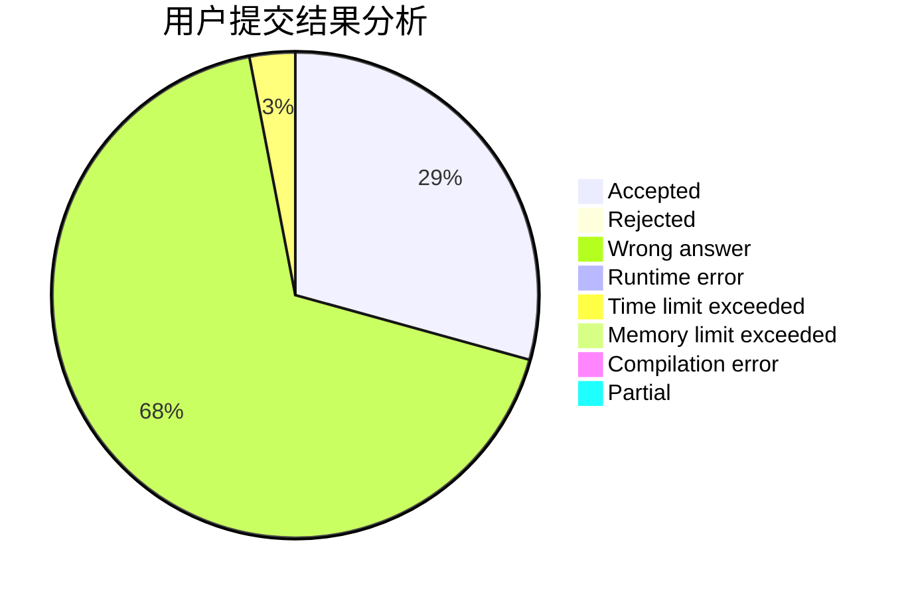
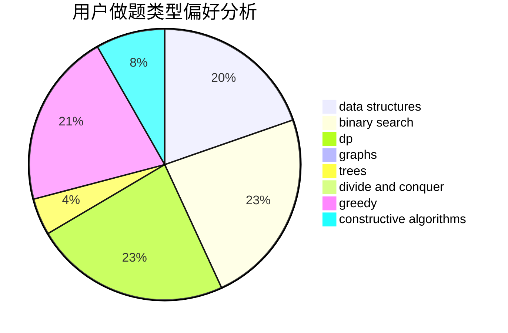
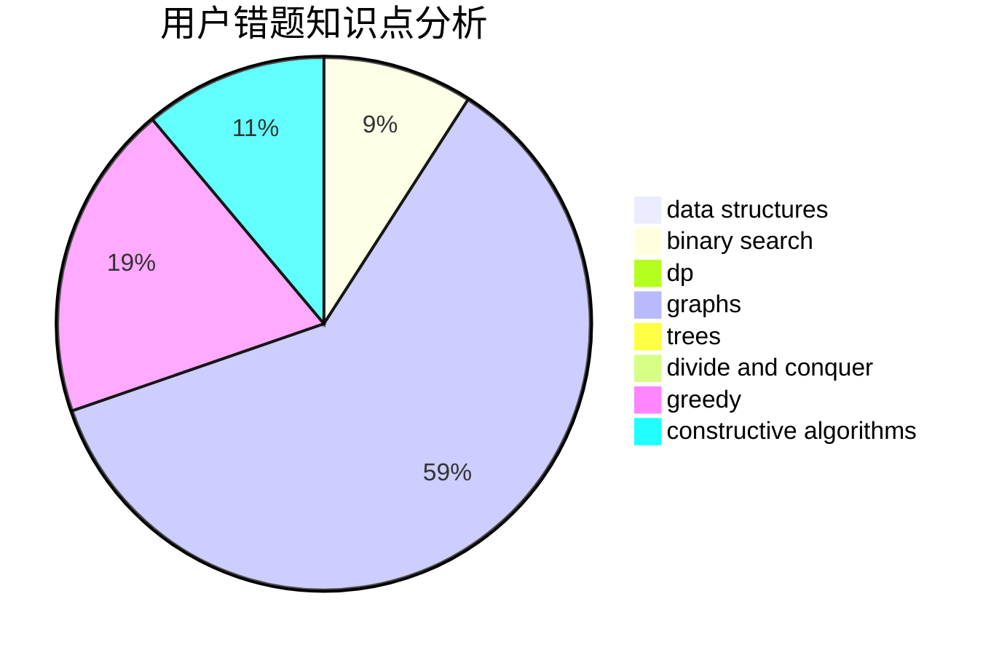

# Kevinyyj

<!-- tabs:start -->

#### **用户提交结果分析**

#### **用户做题类型偏好分析**

#### **用户错题知识点分析**

<!-- tabs:end -->
# 推荐题目
[1486A](https://codeforces.com/contest/1486/problem/A)		greedy,
                        implementation		  
[1411F](https://codeforces.com/contest/1411/problem/F)		greedy,
                        math		  
[1119H](https://codeforces.com/contest/1119/problem/H)		fft,
                        math		  
[1065C](https://codeforces.com/contest/1065/problem/C)		greedy		  
[842E](https://codeforces.com/contest/842/problem/E)		binary search,
                        dfs and similar,
                        divide and conquer,
                        graphs,
                        trees		  
[171B](https://codeforces.com/contest/171/problem/B)		*special problem,
                        combinatorics		  
[629A](https://codeforces.com/contest/629/problem/A)		brute force,
                        combinatorics,
                        constructive algorithms,
                        implementation		  
[915G](https://codeforces.com/contest/915/problem/G)		math,
                        number theory		  
[866D](https://codeforces.com/contest/866/problem/D)		dsu,graphs,sortings,trees		  
[825C](https://codeforces.com/contest/825/problem/C)		greedy,
                        implementation		  
