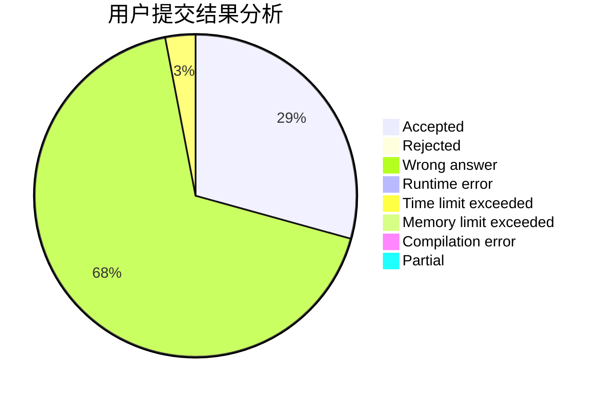
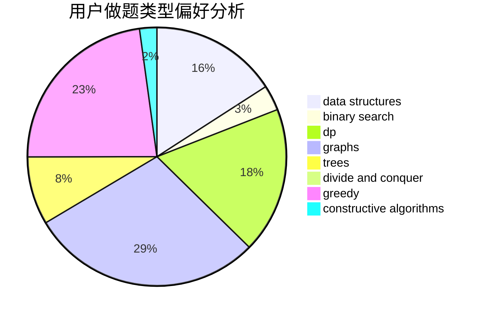
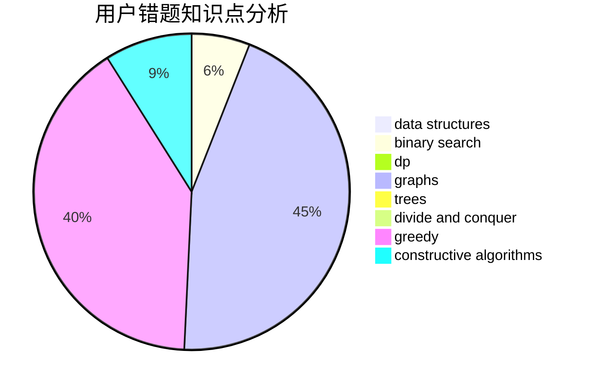

# Kevinyyj

<!-- tabs:start -->

#### **用户提交结果分析**

#### **用户做题类型偏好分析**

#### **用户错题知识点分析**

<!-- tabs:end -->
# 推荐题目
[1493C](https://codeforces.com/contest/1493/problem/C)		binary search,
                        brute force,
                        constructive algorithms,
                        greedy,
                        strings		  
[1422A](https://codeforces.com/contest/1422/problem/A)		geometry,
                        math		  
[1129D](https://codeforces.com/contest/1129/problem/D)		data structures,
                        dp		  
[1065G](https://codeforces.com/contest/1065/problem/G)		strings		  
[862A](https://codeforces.com/contest/862/problem/A)		greedy,
                        implementation		  
[198B](https://codeforces.com/contest/198/problem/B)		shortest paths		  
[659A](https://codeforces.com/contest/659/problem/A)		implementation,
                        math		  
[935F](https://codeforces.com/contest/935/problem/F)		data structures,
                        greedy		  
[886F](https://codeforces.com/contest/886/problem/F)		geometry		  
[843D](https://codeforces.com/contest/843/problem/D)		graphs,
                        shortest paths		  
