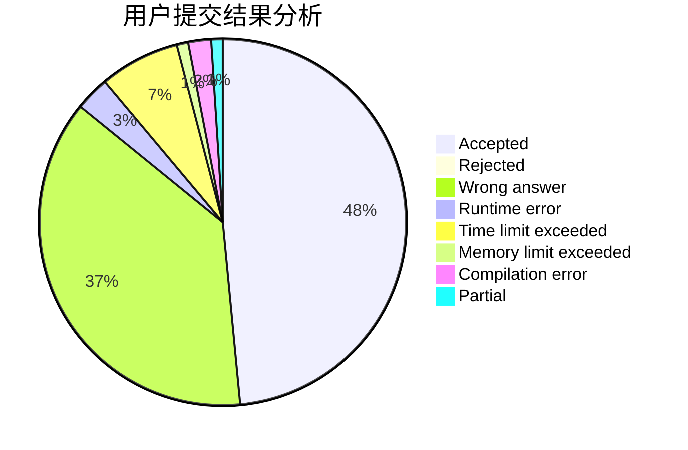
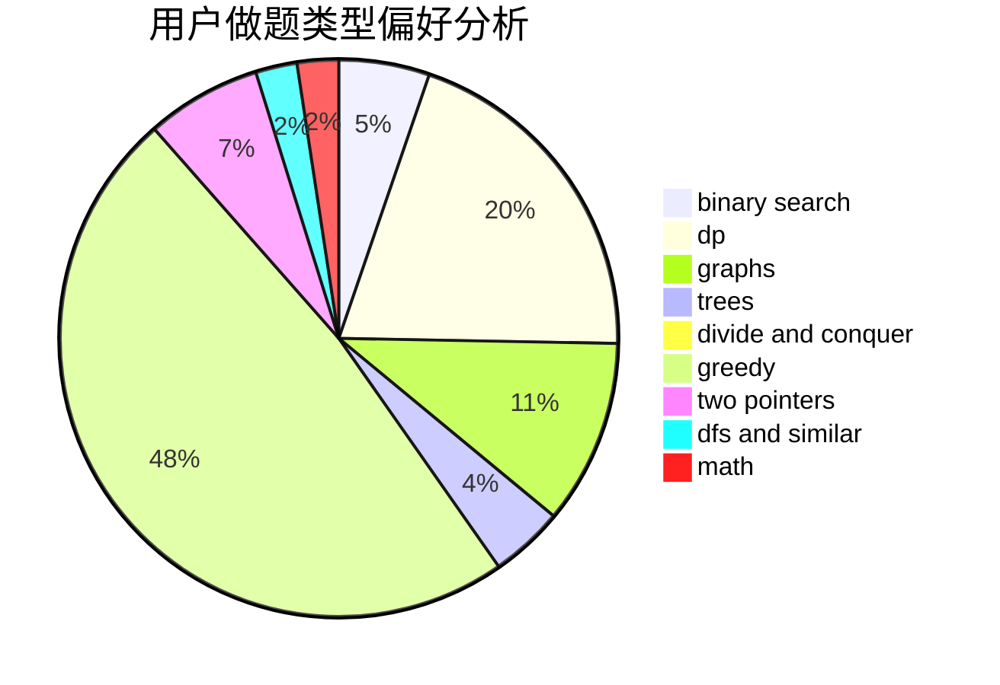

# Kewth

<!-- tabs:start -->

#### **用户提交结果分析**

#### **用户做题类型偏好分析**

<!-- tabs:end -->
# 推荐题目
[1445A](https://codeforces.com/contest/1445/problem/A)
[1298D](https://codeforces.com/contest/1298/problem/D)
[788B](https://codeforces.com/contest/788/problem/B)
[659F](https://codeforces.com/contest/659/problem/F)
[1368C](https://codeforces.com/contest/1368/problem/C)
[546D](https://codeforces.com/contest/546/problem/D)
[1017G](https://codeforces.com/contest/1017/problem/G)
[5132](https://codeforces.com/contest/513/problem/2)
[618A](https://codeforces.com/contest/618/problem/A)
[961C](https://codeforces.com/contest/961/problem/C)
