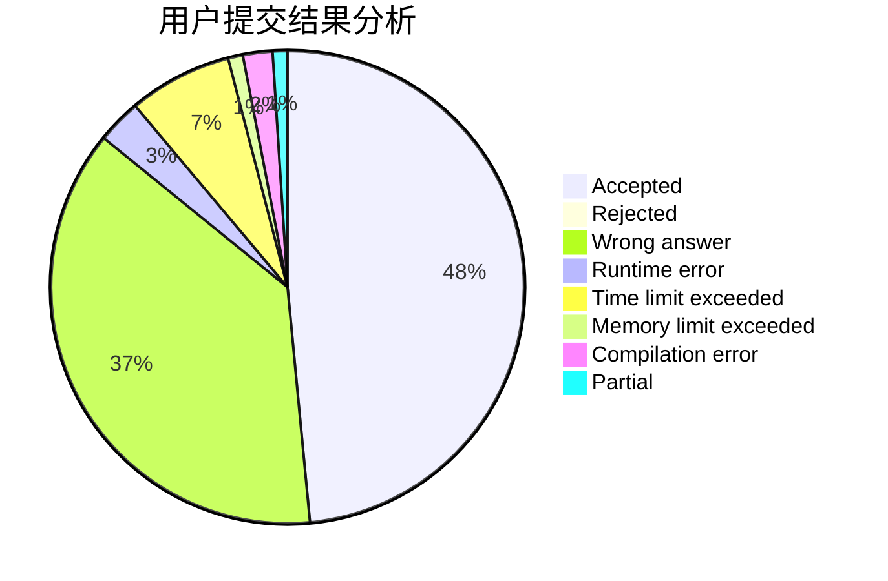
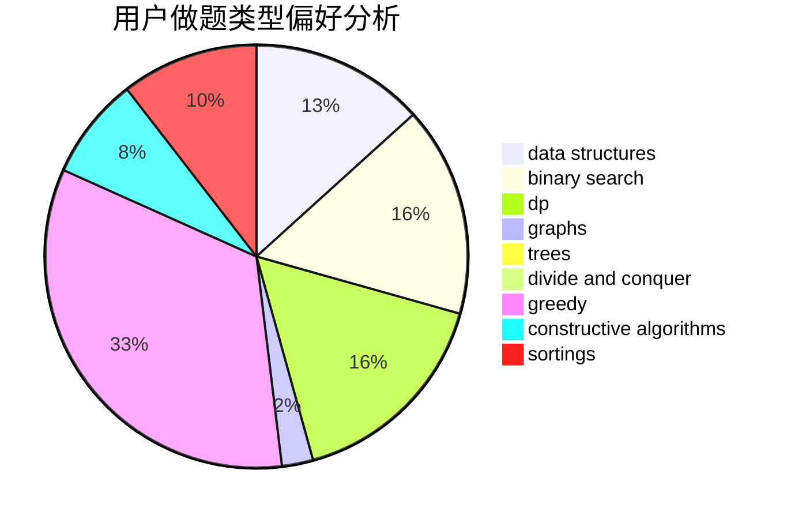
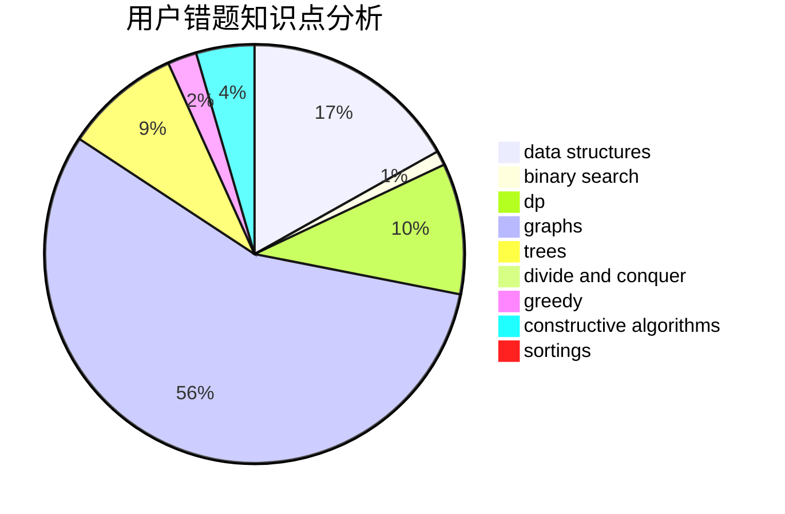

# Kewth
<!-- tabs:start -->
#### **用户提交结果分析**

#### **用户做题类型偏好分析**

#### **用户错题知识点分析**

<!-- tabs:end -->
# 推荐题目
[1464E](https://codeforces.com/contest/1464/problem/E)		bitmasks,
                        games,
                        math,
                        matrices		  
[1291E](https://codeforces.com/contest/1291/problem/E)		dfs and similar,
                        dsu,
                        graphs		  
[1132G](http://codeforces.com/problemset/problem/1132/G)		data structures,
                        dp,
                        trees		  
[800D](https://codeforces.com/contest/800/problem/D)		bitmasks,
                        dp		  
[1360D](http://codeforces.com/problemset/problem/1360/D)		math,
                        number theory		  
[93C](http://codeforces.com/problemset/problem/93/C)		brute force,
                        implementation		  
[599E](http://codeforces.com/problemset/problem/599/E)		bitmasks,
                        dp,
                        trees		  
[768C](http://codeforces.com/problemset/problem/768/C)		brute force,
                        dp,
                        implementation,
                        sortings		  
[841A](http://codeforces.com/problemset/problem/841/A)		brute force,
                        implementation		  
[196E](http://codeforces.com/problemset/problem/196/E)		dsu,
                        graphs,
                        shortest paths		  
<!-- tabs:start -->
#### **data structures**
[1132G](http://codeforces.com/problemset/problem/1132/G)		data structures,
                        dp,
                        trees		  
[1179A](http://codeforces.com/problemset/problem/1179/A)		data structures,
                        implementation		  
[869E](http://codeforces.com/problemset/problem/869/E)		data structures,
                        hashing		  
[1017D](http://codeforces.com/problemset/problem/1017/D)		bitmasks,
                        brute force,
                        data structures		  
[1223F](http://codeforces.com/problemset/problem/1223/F)		data structures,
                        divide and conquer,
                        dp,
                        hashing		  
[739C](http://codeforces.com/problemset/problem/739/C)		data structures		  
[444C](http://codeforces.com/problemset/problem/444/C)		data structures		  
[709E](https://codeforces.com/contest/709/problem/E)		data structures,
                        dfs and similar,
                        dp,
                        graphs,
                        greedy,
                        trees		  
[1447F2](https://codeforces.com/contest/1447/problem/F2)		data structures,
                        greedy,
                        two pointers		  
[1500D](http://codeforces.com/problemset/problem/1500/D)		data structures,
                        sortings,
                        two pointers		  
#### **binary search**
[1489F](https://codeforces.com/contest/1489/problem/F)		binary search,
                        implementation		  
[1485C](http://codeforces.com/problemset/problem/1485/C)		binary search,
                        brute force,
                        math,
                        number theory		  
[1492C](http://codeforces.com/problemset/problem/1492/C)		binary search,
                        data structures,
                        dp,
                        greedy,
                        two pointers		  
[1463D](http://codeforces.com/problemset/problem/1463/D)		binary search,
                        constructive algorithms,
                        greedy,
                        two pointers		  
[1490G](http://codeforces.com/problemset/problem/1490/G)		binary search,
                        data structures,
                        math		  
[1479D](http://codeforces.com/problemset/problem/1479/D)		binary search,
                        bitmasks,
                        brute force,
                        data structures,
                        probabilities,
                        trees		  
[1436E](http://codeforces.com/problemset/problem/1436/E)		binary search,
                        data structures,
                        two pointers		  
[1461D](http://codeforces.com/problemset/problem/1461/D)		binary search,
                        brute force,
                        data structures,
                        divide and conquer,
                        implementation,
                        sortings		  
[1493C](http://codeforces.com/problemset/problem/1493/C)		binary search,
                        brute force,
                        constructive algorithms,
                        greedy,
                        strings		  
[1487D](http://codeforces.com/problemset/problem/1487/D)		binary search,
                        brute force,
                        math,
                        number theory		  
#### **dp**
[1132G](http://codeforces.com/problemset/problem/1132/G)		data structures,
                        dp,
                        trees		  
[800D](https://codeforces.com/contest/800/problem/D)		bitmasks,
                        dp		  
[599E](http://codeforces.com/problemset/problem/599/E)		bitmasks,
                        dp,
                        trees		  
[768C](http://codeforces.com/problemset/problem/768/C)		brute force,
                        dp,
                        implementation,
                        sortings		  
[703E](http://codeforces.com/problemset/problem/703/E)		dp,
                        number theory		  
[520E](http://codeforces.com/problemset/problem/520/E)		combinatorics,
                        dp,
                        math,
                        number theory		  
[1082F](http://codeforces.com/problemset/problem/1082/F)		dp,
                        strings,
                        trees		  
[269B](http://codeforces.com/problemset/problem/269/B)		dp		  
[331C1](http://codeforces.com/problemset/problem/331/C1)		dp		  
[1223F](http://codeforces.com/problemset/problem/1223/F)		data structures,
                        divide and conquer,
                        dp,
                        hashing		  
#### **graph**
[1291E](https://codeforces.com/contest/1291/problem/E)		dfs and similar,
                        dsu,
                        graphs		  
[196E](http://codeforces.com/problemset/problem/196/E)		dsu,
                        graphs,
                        shortest paths		  
[709E](https://codeforces.com/contest/709/problem/E)		data structures,
                        dfs and similar,
                        dp,
                        graphs,
                        greedy,
                        trees		  
[1263D](http://codeforces.com/problemset/problem/1263/D)		dfs and similar,
                        dsu,
                        graphs		  
[700B](http://codeforces.com/problemset/problem/700/B)		dfs and similar,
                        dp,
                        graphs,
                        trees		  
[1487C](http://codeforces.com/problemset/problem/1487/C)		brute force,
                        constructive algorithms,
                        dfs and similar,
                        graphs,
                        greedy,
                        implementation,
                        math		  
[1437C](http://codeforces.com/problemset/problem/1437/C)		dp,
                        flows,
                        graph matchings,
                        greedy,
                        math,
                        sortings		  
[1470D](http://codeforces.com/problemset/problem/1470/D)		constructive algorithms,
                        dfs and similar,
                        graph matchings,
                        graphs,
                        greedy		  
[1476C](http://codeforces.com/problemset/problem/1476/C)		dp,
                        graphs,
                        greedy		  
[1304D](http://codeforces.com/problemset/problem/1304/D)		constructive algorithms,
                        graphs,
                        greedy,
                        two pointers		  
#### **trees**
[1132G](http://codeforces.com/problemset/problem/1132/G)		data structures,
                        dp,
                        trees		  
[599E](http://codeforces.com/problemset/problem/599/E)		bitmasks,
                        dp,
                        trees		  
[1082F](http://codeforces.com/problemset/problem/1082/F)		dp,
                        strings,
                        trees		  
[1338D](http://codeforces.com/problemset/problem/1338/D)		constructive algorithms,
                        dfs and similar,
                        dp,
                        math,
                        trees		  
[1404B](http://codeforces.com/problemset/problem/1404/B)		dfs and similar,
                        dp,
                        games,
                        trees		  
[1118F1](http://codeforces.com/problemset/problem/1118/F1)		dfs and similar,
                        trees		  
[709E](https://codeforces.com/contest/709/problem/E)		data structures,
                        dfs and similar,
                        dp,
                        graphs,
                        greedy,
                        trees		  
[700B](http://codeforces.com/problemset/problem/700/B)		dfs and similar,
                        dp,
                        graphs,
                        trees		  
[86C](http://codeforces.com/problemset/problem/86/C)		dp,
                        string suffix structures,
                        trees		  
[1479D](http://codeforces.com/problemset/problem/1479/D)		binary search,
                        bitmasks,
                        brute force,
                        data structures,
                        probabilities,
                        trees		  
#### **divide and conquer**
[1223F](http://codeforces.com/problemset/problem/1223/F)		data structures,
                        divide and conquer,
                        dp,
                        hashing		  
[1461D](http://codeforces.com/problemset/problem/1461/D)		binary search,
                        brute force,
                        data structures,
                        divide and conquer,
                        implementation,
                        sortings		  
[1466G](http://codeforces.com/problemset/problem/1466/G)		combinatorics,
                        divide and conquer,
                        hashing,
                        math,
                        string suffix structures,
                        strings		  
[1490D](http://codeforces.com/problemset/problem/1490/D)		dfs and similar,
                        divide and conquer,
                        implementation		  
[1483C](https://codeforces.com/contest/1483/problem/C)		data structures,
                        divide and conquer,
                        dp		  
[1491E](http://codeforces.com/problemset/problem/1491/E)		brute force,
                        dfs and similar,
                        divide and conquer,
                        number theory,
                        trees		  
[1303G](http://codeforces.com/problemset/problem/1303/G)		data structures,
                        divide and conquer,
                        geometry,
                        trees		  
[1494D](http://codeforces.com/problemset/problem/1494/D)		constructive algorithms,
                        data structures,
                        dfs and similar,
                        divide and conquer,
                        dsu,
                        greedy,
                        sortings,
                        trees		  
[1482E](http://codeforces.com/problemset/problem/1482/E)		data structures,
                        divide and conquer,
                        dp		  
[566C](http://codeforces.com/problemset/problem/566/C)		dfs and similar,
                        divide and conquer,
                        trees		  
#### **greedy**
[1113A](http://codeforces.com/problemset/problem/1113/A)		dp,
                        greedy,
                        math		  
[1130D1](https://codeforces.com/contest/1130/problem/D1)		brute force,
                        greedy		  
[1252E](http://codeforces.com/problemset/problem/1252/E)		greedy,
                        two pointers		  
[62A](http://codeforces.com/problemset/problem/62/A)		greedy,
                        math		  
[709E](https://codeforces.com/contest/709/problem/E)		data structures,
                        dfs and similar,
                        dp,
                        graphs,
                        greedy,
                        trees		  
[1447F2](https://codeforces.com/contest/1447/problem/F2)		data structures,
                        greedy,
                        two pointers		  
[351E](http://codeforces.com/problemset/problem/351/E)		greedy		  
[1185C1](http://codeforces.com/problemset/problem/1185/C1)		greedy,
                        sortings		  
[1495B](http://codeforces.com/problemset/problem/1495/B)		games,
                        greedy		  
[1421D](http://codeforces.com/problemset/problem/1421/D)		brute force,
                        constructive algorithms,
                        greedy,
                        implementation,
                        math,
                        shortest paths		  
#### **constructive algorithms**
[746C](http://codeforces.com/problemset/problem/746/C)		constructive algorithms,
                        implementation,
                        math		  
[854A](http://codeforces.com/problemset/problem/854/A)		brute force,
                        constructive algorithms,
                        math		  
[1435A](https://codeforces.com/contest/1435/problem/A)		constructive algorithms,
                        math		  
[1338D](http://codeforces.com/problemset/problem/1338/D)		constructive algorithms,
                        dfs and similar,
                        dp,
                        math,
                        trees		  
[1438D](http://codeforces.com/problemset/problem/1438/D)		bitmasks,
                        constructive algorithms,
                        math		  
[1513E](http://codeforces.com/problemset/problem/1513/E)		combinatorics,
                        constructive algorithms,
                        math,
                        sortings		  
[1421D](http://codeforces.com/problemset/problem/1421/D)		brute force,
                        constructive algorithms,
                        greedy,
                        implementation,
                        math,
                        shortest paths		  
[1493A](http://codeforces.com/problemset/problem/1493/A)		constructive algorithms,
                        greedy		  
[1463D](http://codeforces.com/problemset/problem/1463/D)		binary search,
                        constructive algorithms,
                        greedy,
                        two pointers		  
[1456B](https://codeforces.com/contest/1456/problem/B)		bitmasks,
                        brute force,
                        constructive algorithms		  
#### **sortings**
[768C](http://codeforces.com/problemset/problem/768/C)		brute force,
                        dp,
                        implementation,
                        sortings		  
[809A](http://codeforces.com/problemset/problem/809/A)		implementation,
                        math,
                        sortings		  
[1176F](http://codeforces.com/problemset/problem/1176/F)		dp,
                        implementation,
                        sortings		  
[1500D](http://codeforces.com/problemset/problem/1500/D)		data structures,
                        sortings,
                        two pointers		  
[1185C1](http://codeforces.com/problemset/problem/1185/C1)		greedy,
                        sortings		  
[1513E](http://codeforces.com/problemset/problem/1513/E)		combinatorics,
                        constructive algorithms,
                        math,
                        sortings		  
[1496C](https://codeforces.com/contest/1496/problem/C)		geometry,
                        greedy,
                        math,
                        sortings		  
[1495A](http://codeforces.com/problemset/problem/1495/A)		geometry,
                        greedy,
                        math,
                        sortings		  
[1497A](http://codeforces.com/problemset/problem/1497/A)		brute force,
                        data structures,
                        greedy,
                        sortings		  
[1427A](http://codeforces.com/problemset/problem/1427/A)		math,
                        sortings		  
<!-- tabs:end -->
