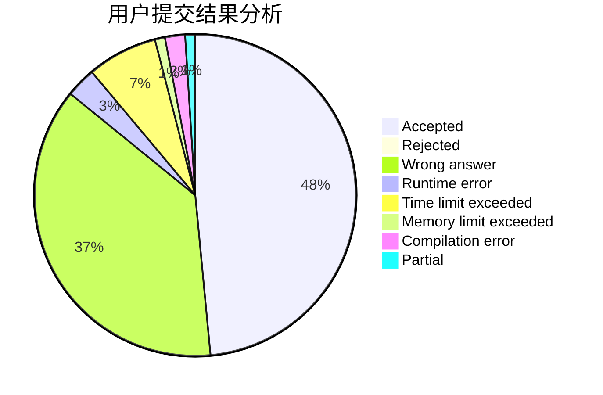
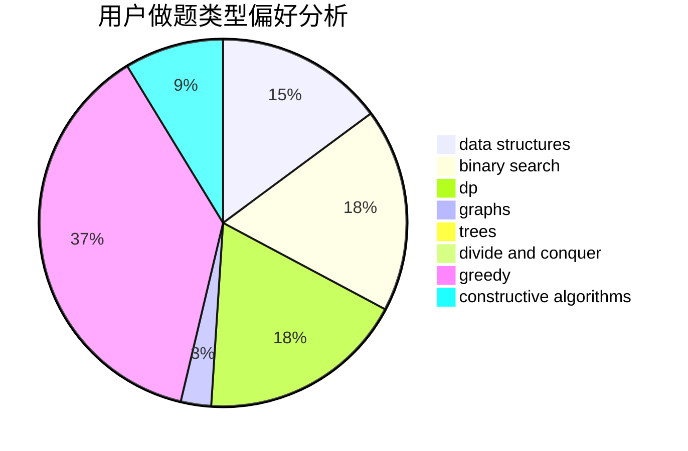
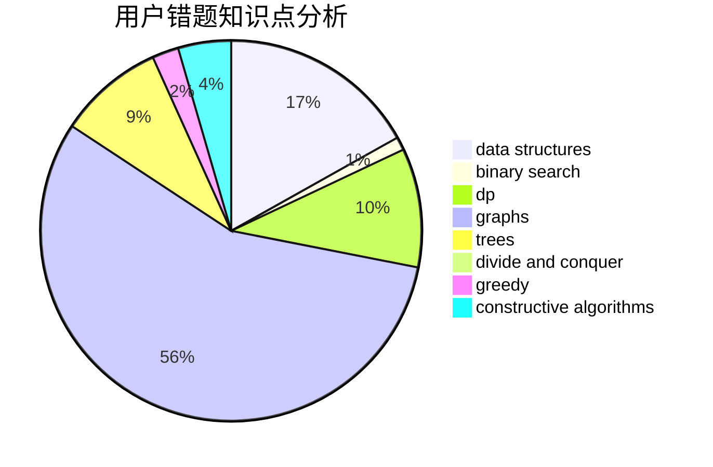

# Kewth

<!-- tabs:start -->

#### **用户提交结果分析**

#### **用户做题类型偏好分析**

#### **用户错题知识点分析**

<!-- tabs:end -->
# 推荐题目
[1435A](https://codeforces.com/contest/1435/problem/A)		dsu,graphs,sortings,trees		  
[1291E](https://codeforces.com/contest/1291/problem/E)		dsu,graphs,sortings,trees		  
[768C](https://codeforces.com/contest/768/problem/C)		brute force,
                        dp,
                        implementation,
                        sortings		  
[62A](https://codeforces.com/contest/62/problem/A)		greedy,
                        math		  
[1360D](https://codeforces.com/contest/1360/problem/D)		math,
                        number theory		  
[520E](https://codeforces.com/contest/520/problem/E)		combinatorics,
                        dp,
                        math,
                        number theory		  
[1017D](https://codeforces.com/contest/1017/problem/D)		bitmasks,
                        brute force,
                        data structures		  
[492E](https://codeforces.com/contest/492/problem/E)		math		  
[599E](https://codeforces.com/contest/599/problem/E)		bitmasks,
                        dp,
                        trees		  
[93C](https://codeforces.com/contest/93/problem/C)		brute force,
                        implementation		  
