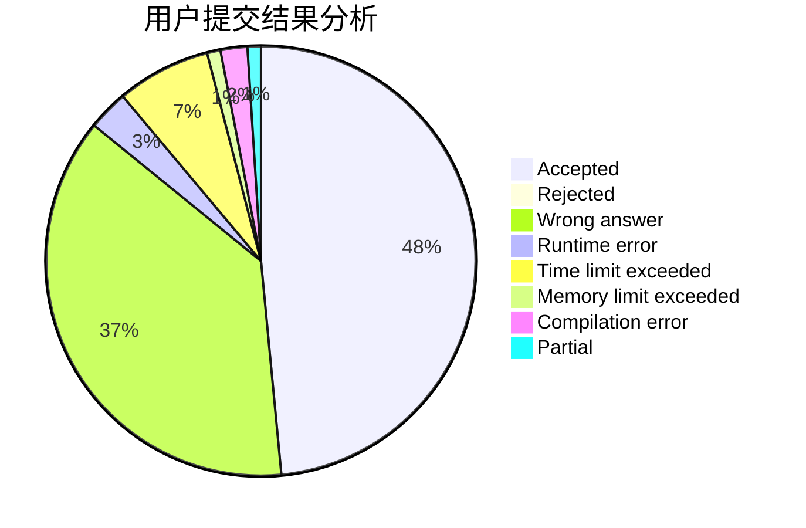
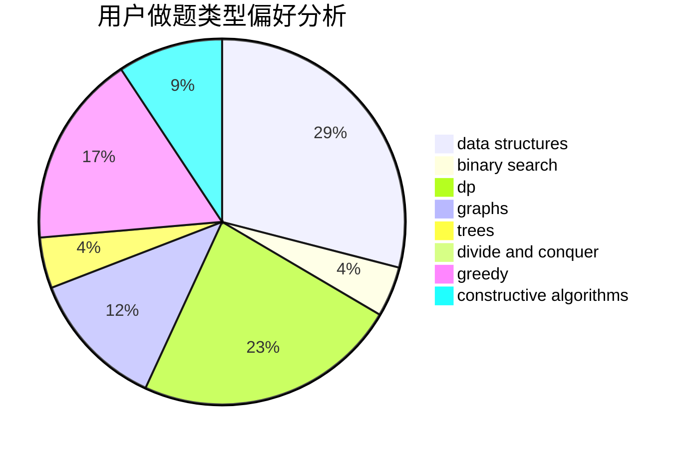
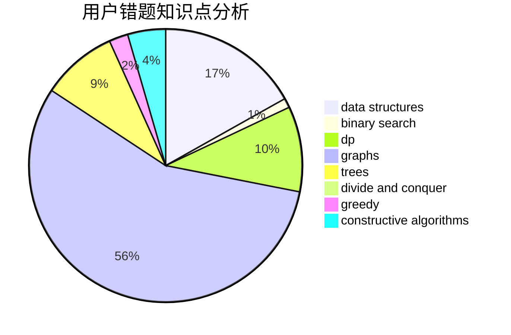

# Kewth

<!-- tabs:start -->

#### **用户提交结果分析**

#### **用户做题类型偏好分析**

#### **用户错题知识点分析**

<!-- tabs:end -->
# 推荐题目
[1445A](https://codeforces.com/contest/1445/problem/A)		greedy,
                        sortings		  
[1298D](https://codeforces.com/contest/1298/problem/D)		dsu,graphs,sortings,trees		  
[788B](https://codeforces.com/contest/788/problem/B)		combinatorics,
                        constructive algorithms,
                        dfs and similar,
                        dsu,
                        graphs		  
[659F](https://codeforces.com/contest/659/problem/F)		dfs and similar,
                        dsu,
                        graphs,
                        greedy,
                        sortings		  
[1368C](https://codeforces.com/contest/1368/problem/C)		constructive algorithms		  
[546D](https://codeforces.com/contest/546/problem/D)		constructive algorithms,
                        dp,
                        math,
                        number theory		  
[1017G](https://codeforces.com/contest/1017/problem/G)		data structures		  
[5132](https://codeforces.com/contest/513/problem/2)		dsu,graphs,sortings,trees		  
[618A](https://codeforces.com/contest/618/problem/A)		implementation		  
[961C](https://codeforces.com/contest/961/problem/C)		bitmasks,
                        brute force,
                        implementation		  
