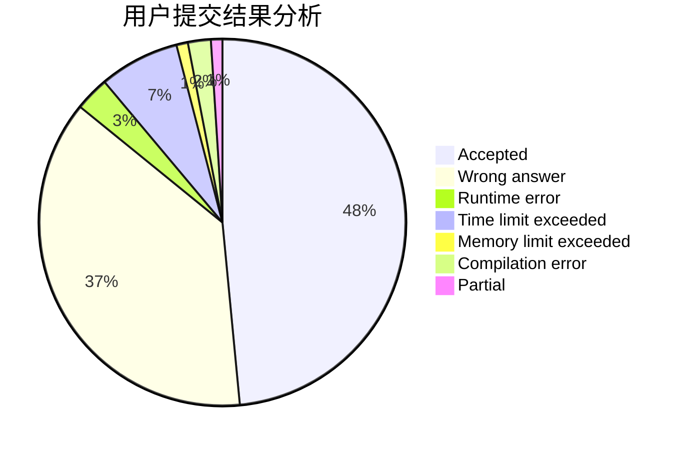
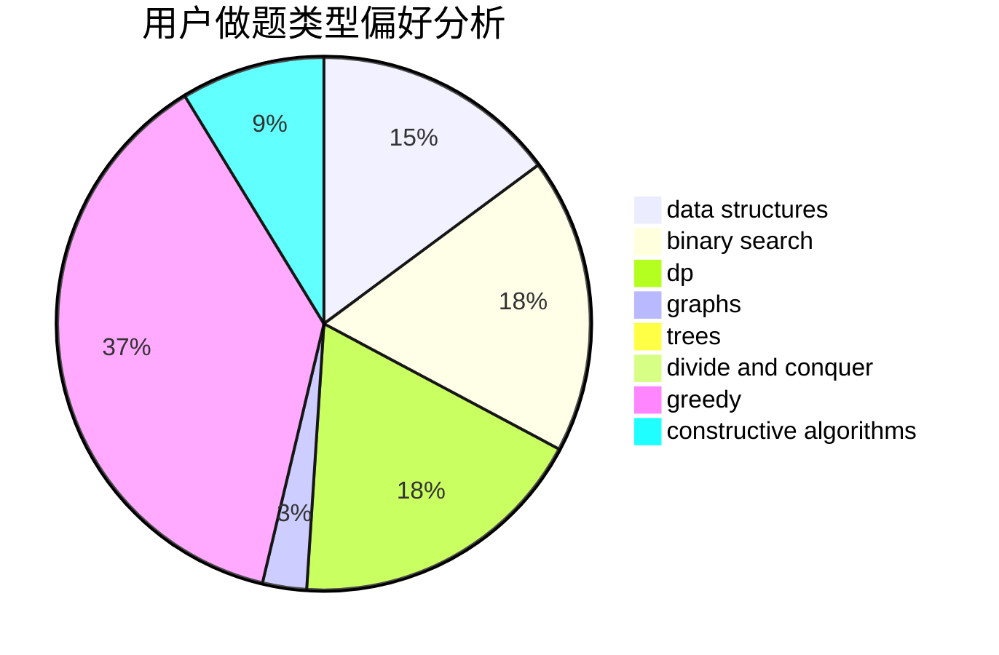
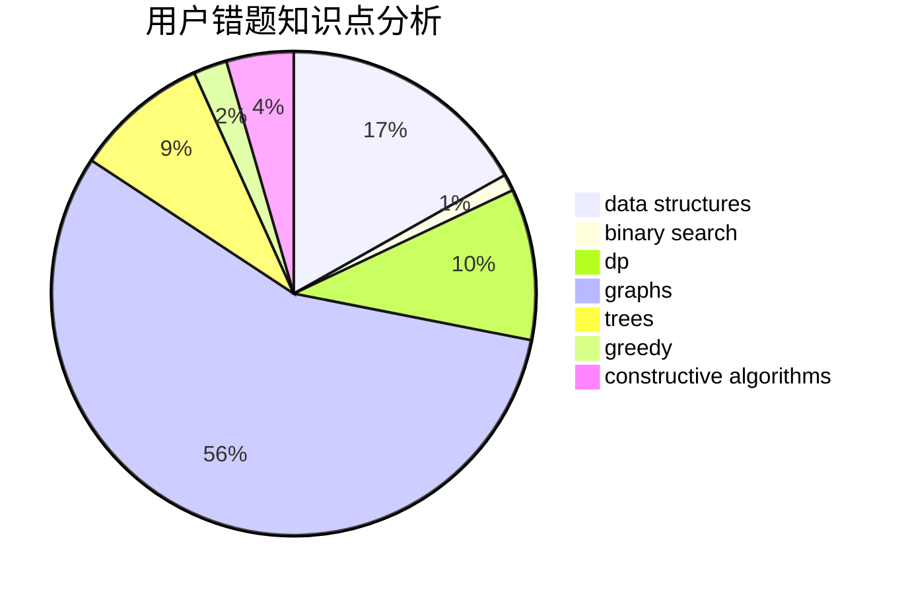

# Kewth
<!-- tabs:start -->
#### **用户提交结果分析**

#### **用户做题类型偏好分析**

#### **用户错题知识点分析**

<!-- tabs:end -->
# 推荐题目
[No Game No Life](https://codeforces.com/contest/1464/problem/E)		bitmasks,
                        games,
                        math,
                        matrices		  
[Prefix Enlightenment](https://codeforces.com/contest/1291/problem/E)		dfs and similar,
                        dsu,
                        graphs		  
[Greedy Subsequences](http://codeforces.com/problemset/problem/1132/G)		data structures,
                        dp,
                        trees		  
[Varying Kibibits](https://codeforces.com/contest/800/problem/D)		bitmasks,
                        dp		  
[Buying Shovels](http://codeforces.com/problemset/problem/1360/D)		math,
                        number theory		  
[Azembler](http://codeforces.com/problemset/problem/93/C)		brute force,
                        implementation		  
[Sandy and Nuts](http://codeforces.com/problemset/problem/599/E)		bitmasks,
                        dp,
                        trees		  
[Jon Snow and his Favourite Number](http://codeforces.com/problemset/problem/768/C)		brute force,
                        dp,
                        implementation,
                        sortings		  
[Generous Kefa](http://codeforces.com/problemset/problem/841/A)		brute force,
                        implementation		  
[Opening Portals](http://codeforces.com/problemset/problem/196/E)		dsu,
                        graphs,
                        shortest paths		  
<!-- tabs:start -->
#### **data structures**
[Greedy Subsequences](http://codeforces.com/problemset/problem/1132/G)		data structures,
                        dp,
                        trees		  
[Valeriy and Deque](http://codeforces.com/problemset/problem/1179/A)		data structures,
                        implementation		  
[The Untended Antiquity](http://codeforces.com/problemset/problem/869/E)		data structures,
                        hashing		  
[The Wu](http://codeforces.com/problemset/problem/1017/D)		bitmasks,
                        brute force,
                        data structures		  
[Stack Exterminable Arrays](http://codeforces.com/problemset/problem/1223/F)		data structures,
                        divide and conquer,
                        dp,
                        hashing		  
[Alyona and towers](http://codeforces.com/problemset/problem/739/C)		data structures		  
[DZY Loves Colors](http://codeforces.com/problemset/problem/444/C)		data structures		  
[Centroids](https://codeforces.com/contest/709/problem/E)		data structures,
                        dfs and similar,
                        dp,
                        graphs,
                        greedy,
                        trees		  
[Frequency Problem (Hard Version)](https://codeforces.com/contest/1447/problem/F2)		data structures,
                        greedy,
                        two pointers		  
[Tiles for Bathroom](http://codeforces.com/problemset/problem/1500/D)		data structures,
                        sortings,
                        two pointers		  
#### **binary search**
[Boxes Packing](https://codeforces.com/contest/1489/problem/F)		binary search,
                        implementation		  
[Floor and Mod](http://codeforces.com/problemset/problem/1485/C)		binary search,
                        brute force,
                        math,
                        number theory		  
[Maximum width](http://codeforces.com/problemset/problem/1492/C)		binary search,
                        data structures,
                        dp,
                        greedy,
                        two pointers		  
[Pairs](http://codeforces.com/problemset/problem/1463/D)		binary search,
                        constructive algorithms,
                        greedy,
                        two pointers		  
[Old Floppy Drive](http://codeforces.com/problemset/problem/1490/G)		binary search,
                        data structures,
                        math		  
[Odd Mineral Resource](http://codeforces.com/problemset/problem/1479/D)		binary search,
                        bitmasks,
                        brute force,
                        data structures,
                        probabilities,
                        trees		  
[Complicated Computations](http://codeforces.com/problemset/problem/1436/E)		binary search,
                        data structures,
                        two pointers		  
[Divide and Summarize](http://codeforces.com/problemset/problem/1461/D)		binary search,
                        brute force,
                        data structures,
                        divide and conquer,
                        implementation,
                        sortings		  
[K-beautiful Strings](http://codeforces.com/problemset/problem/1493/C)		binary search,
                        brute force,
                        constructive algorithms,
                        greedy,
                        strings		  
[Pythagorean Triples](http://codeforces.com/problemset/problem/1487/D)		binary search,
                        brute force,
                        math,
                        number theory		  
#### **dp**
[Greedy Subsequences](http://codeforces.com/problemset/problem/1132/G)		data structures,
                        dp,
                        trees		  
[Varying Kibibits](https://codeforces.com/contest/800/problem/D)		bitmasks,
                        dp		  
[Sandy and Nuts](http://codeforces.com/problemset/problem/599/E)		bitmasks,
                        dp,
                        trees		  
[Jon Snow and his Favourite Number](http://codeforces.com/problemset/problem/768/C)		brute force,
                        dp,
                        implementation,
                        sortings		  
[Mishka and Divisors](http://codeforces.com/problemset/problem/703/E)		dp,
                        number theory		  
[Pluses everywhere](http://codeforces.com/problemset/problem/520/E)		combinatorics,
                        dp,
                        math,
                        number theory		  
[Speed Dial](http://codeforces.com/problemset/problem/1082/F)		dp,
                        strings,
                        trees		  
[Greenhouse Effect](http://codeforces.com/problemset/problem/269/B)		dp		  
[The Great Julya Calendar](http://codeforces.com/problemset/problem/331/C1)		dp		  
[Stack Exterminable Arrays](http://codeforces.com/problemset/problem/1223/F)		data structures,
                        divide and conquer,
                        dp,
                        hashing		  
#### **graph**
[Prefix Enlightenment](https://codeforces.com/contest/1291/problem/E)		dfs and similar,
                        dsu,
                        graphs		  
[Opening Portals](http://codeforces.com/problemset/problem/196/E)		dsu,
                        graphs,
                        shortest paths		  
[Centroids](https://codeforces.com/contest/709/problem/E)		data structures,
                        dfs and similar,
                        dp,
                        graphs,
                        greedy,
                        trees		  
[Secret Passwords](http://codeforces.com/problemset/problem/1263/D)		dfs and similar,
                        dsu,
                        graphs		  
[Connecting Universities](http://codeforces.com/problemset/problem/700/B)		dfs and similar,
                        dp,
                        graphs,
                        trees		  
[Minimum Ties](http://codeforces.com/problemset/problem/1487/C)		brute force,
                        constructive algorithms,
                        dfs and similar,
                        graphs,
                        greedy,
                        implementation,
                        math		  
[Chef Monocarp](http://codeforces.com/problemset/problem/1437/C)		dp,
                        flows,
                        graph matchings,
                        greedy,
                        math,
                        sortings		  
[Strange Housing](http://codeforces.com/problemset/problem/1470/D)		constructive algorithms,
                        dfs and similar,
                        graph matchings,
                        graphs,
                        greedy		  
[Longest Simple Cycle](http://codeforces.com/problemset/problem/1476/C)		dp,
                        graphs,
                        greedy		  
[Shortest and Longest LIS](http://codeforces.com/problemset/problem/1304/D)		constructive algorithms,
                        graphs,
                        greedy,
                        two pointers		  
#### **trees**
[Greedy Subsequences](http://codeforces.com/problemset/problem/1132/G)		data structures,
                        dp,
                        trees		  
[Sandy and Nuts](http://codeforces.com/problemset/problem/599/E)		bitmasks,
                        dp,
                        trees		  
[Speed Dial](http://codeforces.com/problemset/problem/1082/F)		dp,
                        strings,
                        trees		  
[Nested Rubber Bands](http://codeforces.com/problemset/problem/1338/D)		constructive algorithms,
                        dfs and similar,
                        dp,
                        math,
                        trees		  
[Tree Tag](http://codeforces.com/problemset/problem/1404/B)		dfs and similar,
                        dp,
                        games,
                        trees		  
[Tree Cutting (Easy Version)](http://codeforces.com/problemset/problem/1118/F1)		dfs and similar,
                        trees		  
[Centroids](https://codeforces.com/contest/709/problem/E)		data structures,
                        dfs and similar,
                        dp,
                        graphs,
                        greedy,
                        trees		  
[Connecting Universities](http://codeforces.com/problemset/problem/700/B)		dfs and similar,
                        dp,
                        graphs,
                        trees		  
[Genetic engineering](http://codeforces.com/problemset/problem/86/C)		dp,
                        string suffix structures,
                        trees		  
[Odd Mineral Resource](http://codeforces.com/problemset/problem/1479/D)		binary search,
                        bitmasks,
                        brute force,
                        data structures,
                        probabilities,
                        trees		  
#### **divide and conquer**
[Stack Exterminable Arrays](http://codeforces.com/problemset/problem/1223/F)		data structures,
                        divide and conquer,
                        dp,
                        hashing		  
[Divide and Summarize](http://codeforces.com/problemset/problem/1461/D)		binary search,
                        brute force,
                        data structures,
                        divide and conquer,
                        implementation,
                        sortings		  
[Song of the Sirens](http://codeforces.com/problemset/problem/1466/G)		combinatorics,
                        divide and conquer,
                        hashing,
                        math,
                        string suffix structures,
                        strings		  
[Permutation Transformation](http://codeforces.com/problemset/problem/1490/D)		dfs and similar,
                        divide and conquer,
                        implementation		  
[Skyline Photo](https://codeforces.com/contest/1483/problem/C)		data structures,
                        divide and conquer,
                        dp		  
[Fib-tree](http://codeforces.com/problemset/problem/1491/E)		brute force,
                        dfs and similar,
                        divide and conquer,
                        number theory,
                        trees		  
[Sum of Prefix Sums](http://codeforces.com/problemset/problem/1303/G)		data structures,
                        divide and conquer,
                        geometry,
                        trees		  
[Dogeforces](http://codeforces.com/problemset/problem/1494/D)		constructive algorithms,
                        data structures,
                        dfs and similar,
                        divide and conquer,
                        dsu,
                        greedy,
                        sortings,
                        trees		  
[Logistical Questions](http://codeforces.com/problemset/problem/566/C)		dfs and similar,
                        divide and conquer,
                        trees		  
[Fruit Sequences](http://codeforces.com/problemset/problem/1428/F)		binary search,
                        data structures,
                        divide and conquer,
                        dp,
                        two pointers		  
#### **greedy**
[Sasha and His Trip](http://codeforces.com/problemset/problem/1113/A)		dp,
                        greedy,
                        math		  
[Toy Train (Simplified)](https://codeforces.com/contest/1130/problem/D1)		brute force,
                        greedy		  
[Songwriter](http://codeforces.com/problemset/problem/1252/E)		greedy,
                        two pointers		  
[A Student's Dream](http://codeforces.com/problemset/problem/62/A)		greedy,
                        math		  
[Centroids](https://codeforces.com/contest/709/problem/E)		data structures,
                        dfs and similar,
                        dp,
                        graphs,
                        greedy,
                        trees		  
[Frequency Problem (Hard Version)](https://codeforces.com/contest/1447/problem/F2)		data structures,
                        greedy,
                        two pointers		  
[Jeff and Permutation](http://codeforces.com/problemset/problem/351/E)		greedy		  
[Exam in BerSU (easy version)](http://codeforces.com/problemset/problem/1185/C1)		greedy,
                        sortings		  
[Let's Go Hiking](http://codeforces.com/problemset/problem/1495/B)		games,
                        greedy		  
[Hexagons](http://codeforces.com/problemset/problem/1421/D)		brute force,
                        constructive algorithms,
                        greedy,
                        implementation,
                        math,
                        shortest paths		  
#### **constructive algorithms**
[Tram](http://codeforces.com/problemset/problem/746/C)		constructive algorithms,
                        implementation,
                        math		  
[Fraction](http://codeforces.com/problemset/problem/854/A)		brute force,
                        constructive algorithms,
                        math		  
[Finding Sasuke](https://codeforces.com/contest/1435/problem/A)		constructive algorithms,
                        math		  
[Nested Rubber Bands](http://codeforces.com/problemset/problem/1338/D)		constructive algorithms,
                        dfs and similar,
                        dp,
                        math,
                        trees		  
[Powerful Ksenia](http://codeforces.com/problemset/problem/1438/D)		bitmasks,
                        constructive algorithms,
                        math		  
[Cost Equilibrium](http://codeforces.com/problemset/problem/1513/E)		combinatorics,
                        constructive algorithms,
                        math,
                        sortings		  
[Hexagons](http://codeforces.com/problemset/problem/1421/D)		brute force,
                        constructive algorithms,
                        greedy,
                        implementation,
                        math,
                        shortest paths		  
[Anti-knapsack](http://codeforces.com/problemset/problem/1493/A)		constructive algorithms,
                        greedy		  
[Pairs](http://codeforces.com/problemset/problem/1463/D)		binary search,
                        constructive algorithms,
                        greedy,
                        two pointers		  
[XOR-gun](https://codeforces.com/contest/1456/problem/B)		bitmasks,
                        brute force,
                        constructive algorithms		  
#### **sortings**
[Jon Snow and his Favourite Number](http://codeforces.com/problemset/problem/768/C)		brute force,
                        dp,
                        implementation,
                        sortings		  
[Do you want a date?](http://codeforces.com/problemset/problem/809/A)		implementation,
                        math,
                        sortings		  
[Destroy it!](http://codeforces.com/problemset/problem/1176/F)		dp,
                        implementation,
                        sortings		  
[Tiles for Bathroom](http://codeforces.com/problemset/problem/1500/D)		data structures,
                        sortings,
                        two pointers		  
[Exam in BerSU (easy version)](http://codeforces.com/problemset/problem/1185/C1)		greedy,
                        sortings		  
[Cost Equilibrium](http://codeforces.com/problemset/problem/1513/E)		combinatorics,
                        constructive algorithms,
                        math,
                        sortings		  
[Diamond Miner](https://codeforces.com/contest/1496/problem/C)		geometry,
                        greedy,
                        math,
                        sortings		  
[Meximization](http://codeforces.com/problemset/problem/1497/A)		brute force,
                        data structures,
                        greedy,
                        sortings		  
[Avoiding Zero](http://codeforces.com/problemset/problem/1427/A)		math,
                        sortings		  
[Divide and Summarize](http://codeforces.com/problemset/problem/1461/D)		binary search,
                        brute force,
                        data structures,
                        divide and conquer,
                        implementation,
                        sortings		  
<!-- tabs:end -->
