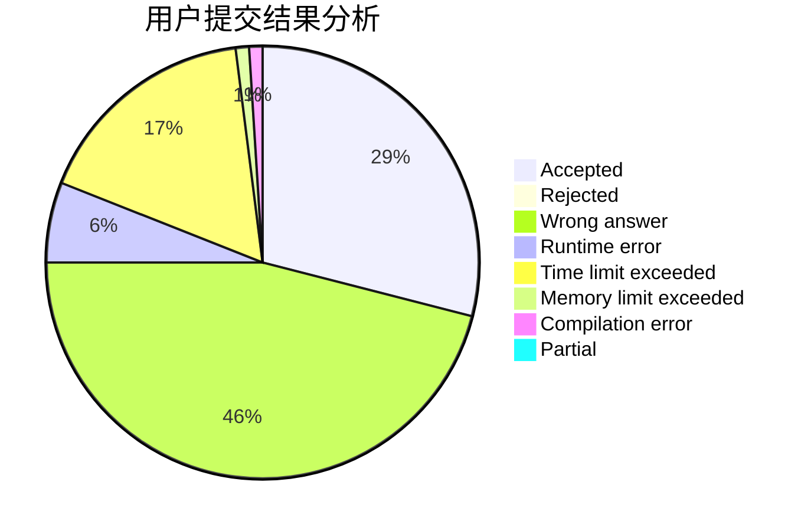
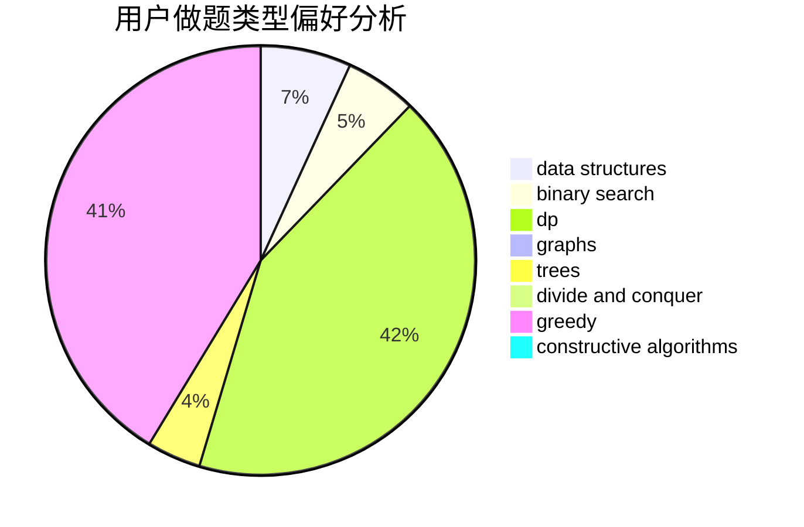
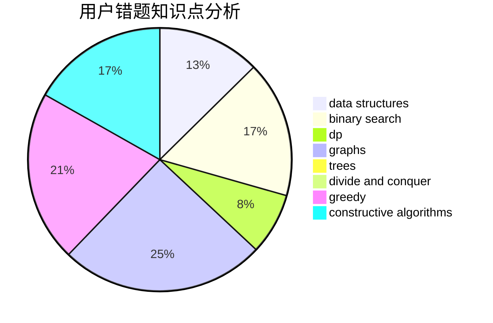

# Khoray

<!-- tabs:start -->

#### **用户提交结果分析**

#### **用户做题类型偏好分析**

#### **用户错题知识点分析**

<!-- tabs:end -->
# 推荐题目
[682A](https://codeforces.com/contest/682/problem/A)		constructive algorithms,
                        math,
                        number theory		  
[1416F](https://codeforces.com/contest/1416/problem/F)		flows,
                        graph matchings,
                        greedy,
                        implementation		  
[1028A](https://codeforces.com/contest/1028/problem/A)		implementation		  
[529B](https://codeforces.com/contest/529/problem/B)		brute force,
                        greedy,
                        sortings		  
[1119B](https://codeforces.com/contest/1119/problem/B)		binary search,
                        flows,
                        greedy,
                        sortings		  
[1284B](https://codeforces.com/contest/1284/problem/B)		binary search,
                        combinatorics,
                        data structures,
                        dp,
                        implementation,
                        sortings		  
[870E](https://codeforces.com/contest/870/problem/E)		dfs and similar,
                        dsu,
                        graphs,
                        trees		  
[871C](https://codeforces.com/contest/871/problem/C)		dsu,graphs,sortings,trees		  
[402B](https://codeforces.com/contest/402/problem/B)		brute force,
                        implementation		  
[281D](https://codeforces.com/contest/281/problem/D)		dsu,graphs,sortings,trees		  
