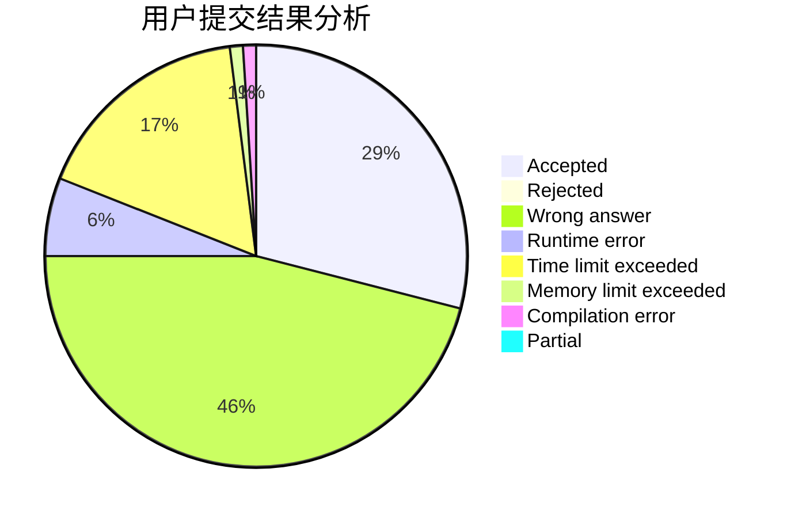
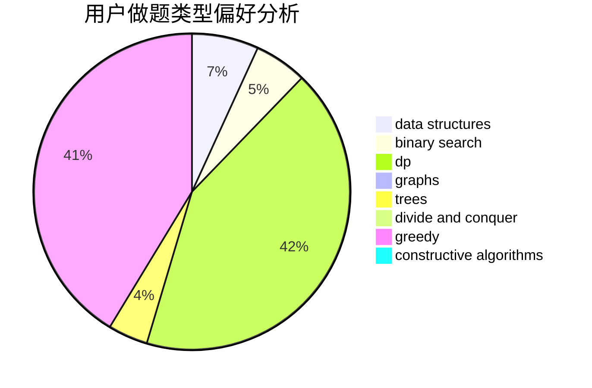
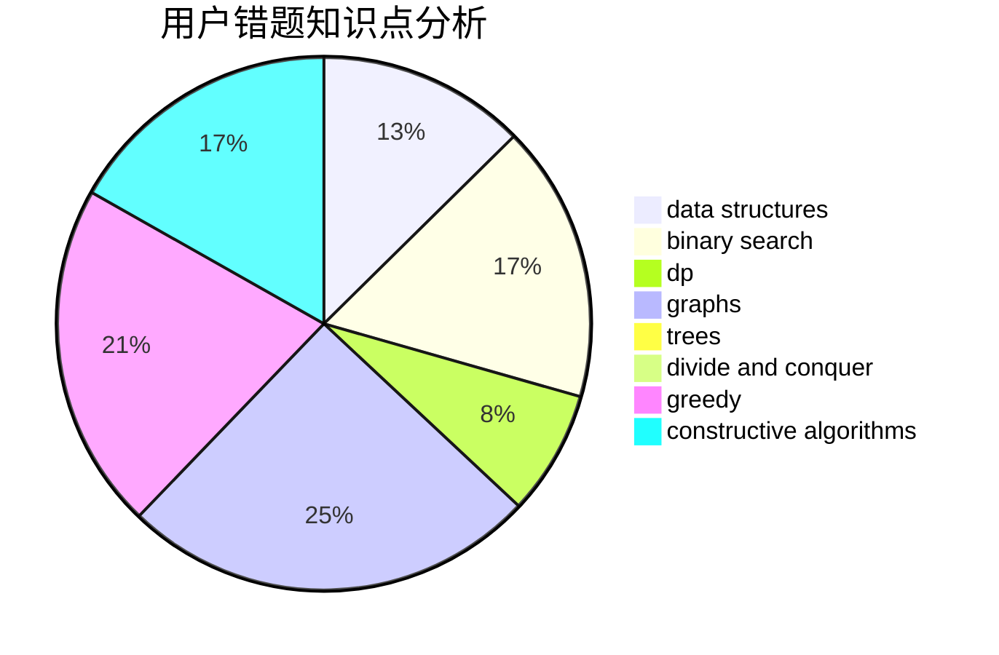

# Khoray
<!-- tabs:start -->
#### **用户提交结果分析**

#### **用户做题类型偏好分析**

#### **用户错题知识点分析**

<!-- tabs:end -->
# 推荐题目
[Star sky](http://codeforces.com/problemset/problem/835/C)		dp,
                        implementation		  
[Find Square](http://codeforces.com/problemset/problem/1028/A)		implementation		  
[Recovering BST](http://codeforces.com/problemset/problem/1025/D)		brute force,
                        dp,
                        math,
                        number theory,
                        trees		  
[Alyona and Numbers](http://codeforces.com/problemset/problem/682/A)		constructive algorithms,
                        math,
                        number theory		  
[A Game With Numbers](http://codeforces.com/problemset/problem/919/F)		games,
                        graphs,
                        shortest paths		  
[Valera and Contest](http://codeforces.com/problemset/problem/369/B)		constructive algorithms,
                        implementation,
                        math		  
[Decoding](http://codeforces.com/problemset/problem/746/B)		implementation,
                        strings		  
[Maximum Xor Secondary](https://codeforces.com/contest/281/problem/D)		data structures,
                        implementation,
                        two pointers		  
[Zigzag Game](http://codeforces.com/problemset/problem/1147/F)		games,
                        interactive		  
[Showing Off](http://codeforces.com/problemset/problem/1416/F)		flows,
                        graph matchings,
                        greedy,
                        implementation		  
<!-- tabs:start -->
#### **data structures**
[Star sky](https://codeforces.com/contest/281/problem/D)		data structures,
                        implementation,
                        two pointers		  
[Find Square](http://codeforces.com/problemset/problem/1284/B)		binary search,
                        combinatorics,
                        data structures,
                        dp,
                        implementation,
                        sortings		  
[Recovering BST](http://codeforces.com/problemset/problem/1207/G)		data structures,
                        dfs and similar,
                        hashing,
                        string suffix structures,
                        strings,
                        trees		  
[Alyona and Numbers](http://codeforces.com/problemset/problem/617/E)		data structures		  
[A Game With Numbers](http://codeforces.com/problemset/problem/1492/C)		binary search,
                        data structures,
                        dp,
                        greedy,
                        two pointers		  
[Valera and Contest](http://codeforces.com/problemset/problem/1490/G)		binary search,
                        data structures,
                        math		  
[Decoding](http://codeforces.com/problemset/problem/1479/D)		binary search,
                        bitmasks,
                        brute force,
                        data structures,
                        probabilities,
                        trees		  
[Maximum Xor Secondary](http://codeforces.com/problemset/problem/1497/A)		brute force,
                        data structures,
                        greedy,
                        sortings		  
[Zigzag Game](http://codeforces.com/problemset/problem/1491/C)		brute force,
                        data structures,
                        dp,
                        greedy,
                        implementation		  
[Showing Off](http://codeforces.com/problemset/problem/1492/B)		data structures,
                        greedy,
                        math		  
#### **binary search**
[Star sky](http://codeforces.com/problemset/problem/1119/B)		binary search,
                        flows,
                        greedy,
                        sortings		  
[Find Square](http://codeforces.com/problemset/problem/1284/B)		binary search,
                        combinatorics,
                        data structures,
                        dp,
                        implementation,
                        sortings		  
[Recovering BST](http://codeforces.com/problemset/problem/1462/E1)		binary search,
                        combinatorics,
                        math,
                        sortings,
                        two pointers		  
[Alyona and Numbers](http://codeforces.com/problemset/problem/1492/C)		binary search,
                        data structures,
                        dp,
                        greedy,
                        two pointers		  
[A Game With Numbers](http://codeforces.com/problemset/problem/1463/D)		binary search,
                        constructive algorithms,
                        greedy,
                        two pointers		  
[Valera and Contest](http://codeforces.com/problemset/problem/1490/G)		binary search,
                        data structures,
                        math		  
[Decoding](http://codeforces.com/problemset/problem/1479/D)		binary search,
                        bitmasks,
                        brute force,
                        data structures,
                        probabilities,
                        trees		  
[Maximum Xor Secondary](http://codeforces.com/problemset/problem/1436/E)		binary search,
                        data structures,
                        two pointers		  
[Zigzag Game](http://codeforces.com/problemset/problem/1461/D)		binary search,
                        brute force,
                        data structures,
                        divide and conquer,
                        implementation,
                        sortings		  
[Showing Off](http://codeforces.com/problemset/problem/1493/C)		binary search,
                        brute force,
                        constructive algorithms,
                        greedy,
                        strings		  
#### **dp**
[Star sky](http://codeforces.com/problemset/problem/835/C)		dp,
                        implementation		  
[Find Square](http://codeforces.com/problemset/problem/1025/D)		brute force,
                        dp,
                        math,
                        number theory,
                        trees		  
[Recovering BST](http://codeforces.com/problemset/problem/1284/B)		binary search,
                        combinatorics,
                        data structures,
                        dp,
                        implementation,
                        sortings		  
[Alyona and Numbers](https://codeforces.com/contest/810/problem/E)		combinatorics,
                        divide and conquer,
                        dp		  
[A Game With Numbers](http://codeforces.com/problemset/problem/446/A)		dp,
                        implementation,
                        two pointers		  
[Valera and Contest](http://codeforces.com/problemset/problem/1472/C)		dp,
                        graphs		  
[Decoding](http://codeforces.com/problemset/problem/375/E)		dp,
                        implementation,
                        math		  
[Maximum Xor Secondary](http://codeforces.com/problemset/problem/81/E)		dfs and similar,
                        dp,
                        dsu,
                        graphs,
                        implementation,
                        trees		  
[Zigzag Game](http://codeforces.com/problemset/problem/1492/C)		binary search,
                        data structures,
                        dp,
                        greedy,
                        two pointers		  
[Showing Off](https://codeforces.com/contest/1457/problem/C)		brute force,
                        dp,
                        implementation		  
#### **graph**
[Star sky](http://codeforces.com/problemset/problem/919/F)		games,
                        graphs,
                        shortest paths		  
[Find Square](http://codeforces.com/problemset/problem/1416/F)		flows,
                        graph matchings,
                        greedy,
                        implementation		  
[Recovering BST](https://codeforces.com/contest/871/problem/C)		dfs and similar,
                        dsu,
                        graphs,
                        trees		  
[Alyona and Numbers](http://codeforces.com/problemset/problem/870/E)		dfs and similar,
                        dsu,
                        graphs,
                        trees		  
[A Game With Numbers](http://codeforces.com/problemset/problem/160/D)		dfs and similar,
                        dsu,
                        graphs,
                        sortings		  
[Valera and Contest](http://codeforces.com/problemset/problem/1472/C)		dp,
                        graphs		  
[Decoding](http://codeforces.com/problemset/problem/81/E)		dfs and similar,
                        dp,
                        dsu,
                        graphs,
                        implementation,
                        trees		  
[Maximum Xor Secondary](http://codeforces.com/problemset/problem/1487/C)		brute force,
                        constructive algorithms,
                        dfs and similar,
                        graphs,
                        greedy,
                        implementation,
                        math		  
[Zigzag Game](http://codeforces.com/problemset/problem/1437/C)		dp,
                        flows,
                        graph matchings,
                        greedy,
                        math,
                        sortings		  
[Showing Off](http://codeforces.com/problemset/problem/1470/D)		constructive algorithms,
                        dfs and similar,
                        graph matchings,
                        graphs,
                        greedy		  
#### **trees**
[Star sky](http://codeforces.com/problemset/problem/1025/D)		brute force,
                        dp,
                        math,
                        number theory,
                        trees		  
[Find Square](https://codeforces.com/contest/871/problem/C)		dfs and similar,
                        dsu,
                        graphs,
                        trees		  
[Recovering BST](http://codeforces.com/problemset/problem/870/E)		dfs and similar,
                        dsu,
                        graphs,
                        trees		  
[Alyona and Numbers](http://codeforces.com/problemset/problem/1207/G)		data structures,
                        dfs and similar,
                        hashing,
                        string suffix structures,
                        strings,
                        trees		  
[A Game With Numbers](http://codeforces.com/problemset/problem/81/E)		dfs and similar,
                        dp,
                        dsu,
                        graphs,
                        implementation,
                        trees		  
[Valera and Contest](http://codeforces.com/problemset/problem/1110/G)		constructive algorithms,
                        games,
                        trees		  
[Decoding](http://codeforces.com/problemset/problem/1479/D)		binary search,
                        bitmasks,
                        brute force,
                        data structures,
                        probabilities,
                        trees		  
[Maximum Xor Secondary](http://codeforces.com/problemset/problem/1511/C)		brute force,
                        data structures,
                        implementation,
                        trees		  
[Zigzag Game](http://codeforces.com/problemset/problem/1499/F)		combinatorics,
                        dfs and similar,
                        dp,
                        trees		  
[Showing Off](http://codeforces.com/problemset/problem/1491/E)		brute force,
                        dfs and similar,
                        divide and conquer,
                        number theory,
                        trees		  
#### **divide and conquer**
[Star sky](https://codeforces.com/contest/810/problem/E)		combinatorics,
                        divide and conquer,
                        dp		  
[Find Square](http://codeforces.com/problemset/problem/1461/D)		binary search,
                        brute force,
                        data structures,
                        divide and conquer,
                        implementation,
                        sortings		  
[Recovering BST](http://codeforces.com/problemset/problem/1466/G)		combinatorics,
                        divide and conquer,
                        hashing,
                        math,
                        string suffix structures,
                        strings		  
[Alyona and Numbers](http://codeforces.com/problemset/problem/1490/D)		dfs and similar,
                        divide and conquer,
                        implementation		  
[A Game With Numbers](https://codeforces.com/contest/1483/problem/C)		data structures,
                        divide and conquer,
                        dp		  
[Valera and Contest](http://codeforces.com/problemset/problem/1491/E)		brute force,
                        dfs and similar,
                        divide and conquer,
                        number theory,
                        trees		  
[Decoding](http://codeforces.com/problemset/problem/1303/G)		data structures,
                        divide and conquer,
                        geometry,
                        trees		  
[Maximum Xor Secondary](http://codeforces.com/problemset/problem/1494/D)		constructive algorithms,
                        data structures,
                        dfs and similar,
                        divide and conquer,
                        dsu,
                        greedy,
                        sortings,
                        trees		  
[Zigzag Game](http://codeforces.com/problemset/problem/1482/E)		data structures,
                        divide and conquer,
                        dp		  
[Showing Off](http://codeforces.com/problemset/problem/566/C)		dfs and similar,
                        divide and conquer,
                        trees		  
#### **greedy**
[Star sky](http://codeforces.com/problemset/problem/1416/F)		flows,
                        graph matchings,
                        greedy,
                        implementation		  
[Find Square](http://codeforces.com/problemset/problem/1119/B)		binary search,
                        flows,
                        greedy,
                        sortings		  
[Recovering BST](http://codeforces.com/problemset/problem/529/B)		brute force,
                        greedy,
                        sortings		  
[Alyona and Numbers](http://codeforces.com/problemset/problem/464/A)		greedy,
                        strings		  
[A Game With Numbers](http://codeforces.com/problemset/problem/1492/C)		binary search,
                        data structures,
                        dp,
                        greedy,
                        two pointers		  
[Valera and Contest](https://codeforces.com/contest/1496/problem/C)		geometry,
                        greedy,
                        math,
                        sortings		  
[Decoding](http://codeforces.com/problemset/problem/1493/A)		constructive algorithms,
                        greedy		  
[Maximum Xor Secondary](http://codeforces.com/problemset/problem/1463/D)		binary search,
                        constructive algorithms,
                        greedy,
                        two pointers		  
[Zigzag Game](http://codeforces.com/problemset/problem/1462/C)		brute force,
                        greedy,
                        math		  
[Showing Off](http://codeforces.com/problemset/problem/1494/B)		bitmasks,
                        brute force,
                        greedy,
                        implementation		  
#### **constructive algorithms**
[Star sky](http://codeforces.com/problemset/problem/682/A)		constructive algorithms,
                        math,
                        number theory		  
[Find Square](http://codeforces.com/problemset/problem/369/B)		constructive algorithms,
                        implementation,
                        math		  
[Recovering BST](http://codeforces.com/problemset/problem/1063/E)		constructive algorithms,
                        math		  
[Alyona and Numbers](http://codeforces.com/problemset/problem/1110/E)		constructive algorithms,
                        math,
                        sortings		  
[A Game With Numbers](http://codeforces.com/problemset/problem/1455/C)		constructive algorithms,
                        games,
                        math		  
[Valera and Contest](http://codeforces.com/problemset/problem/1110/G)		constructive algorithms,
                        games,
                        trees		  
[Decoding](http://codeforces.com/problemset/problem/1493/A)		constructive algorithms,
                        greedy		  
[Maximum Xor Secondary](http://codeforces.com/problemset/problem/1463/D)		binary search,
                        constructive algorithms,
                        greedy,
                        two pointers		  
[Zigzag Game](https://codeforces.com/contest/1456/problem/B)		bitmasks,
                        brute force,
                        constructive algorithms		  
[Showing Off](http://codeforces.com/problemset/problem/1492/D)		bitmasks,
                        constructive algorithms,
                        greedy,
                        math		  
#### **sortings**
[Star sky](http://codeforces.com/problemset/problem/1119/B)		binary search,
                        flows,
                        greedy,
                        sortings		  
[Find Square](http://codeforces.com/problemset/problem/1284/B)		binary search,
                        combinatorics,
                        data structures,
                        dp,
                        implementation,
                        sortings		  
[Recovering BST](http://codeforces.com/problemset/problem/529/B)		brute force,
                        greedy,
                        sortings		  
[Alyona and Numbers](http://codeforces.com/problemset/problem/1110/E)		constructive algorithms,
                        math,
                        sortings		  
[A Game With Numbers](http://codeforces.com/problemset/problem/160/D)		dfs and similar,
                        dsu,
                        graphs,
                        sortings		  
[Valera and Contest](http://codeforces.com/problemset/problem/1462/E1)		binary search,
                        combinatorics,
                        math,
                        sortings,
                        two pointers		  
[Decoding](https://codeforces.com/contest/1496/problem/C)		geometry,
                        greedy,
                        math,
                        sortings		  
[Maximum Xor Secondary](http://codeforces.com/problemset/problem/1495/A)		geometry,
                        greedy,
                        math,
                        sortings		  
[Zigzag Game](http://codeforces.com/problemset/problem/1497/A)		brute force,
                        data structures,
                        greedy,
                        sortings		  
[Showing Off](http://codeforces.com/problemset/problem/1427/A)		math,
                        sortings		  
<!-- tabs:end -->
