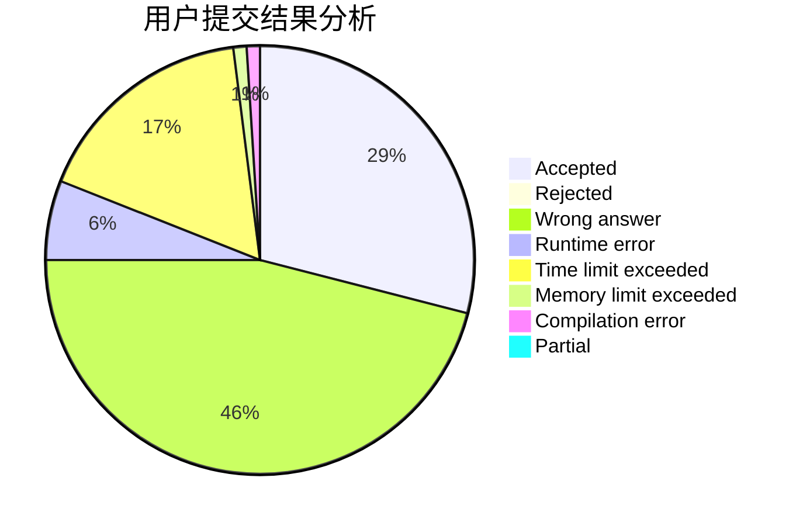
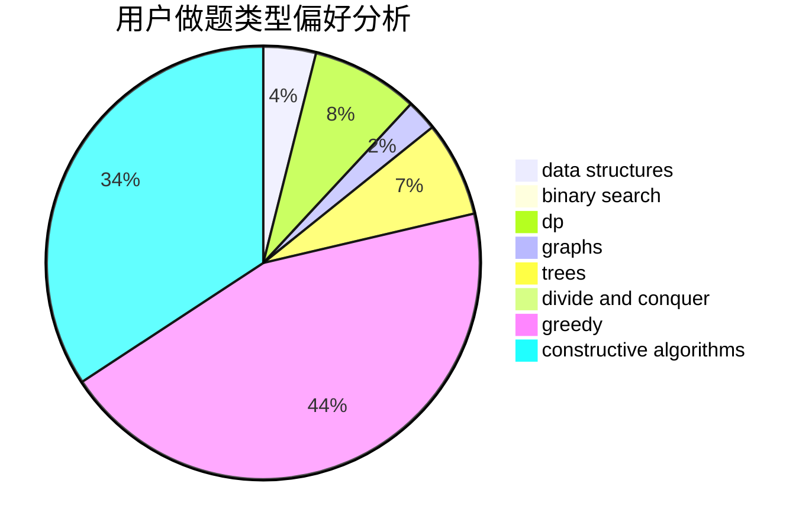
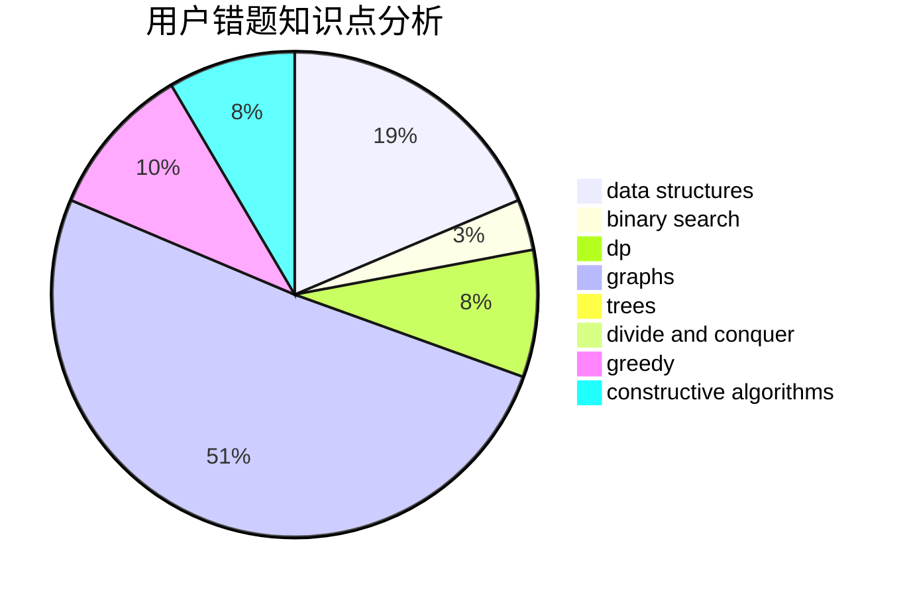

# Khoray

<!-- tabs:start -->

#### **用户提交结果分析**

#### **用户做题类型偏好分析**

#### **用户错题知识点分析**

<!-- tabs:end -->
# 推荐题目
[706A](https://codeforces.com/contest/706/problem/A)		brute force,
                        geometry,
                        implementation		  
[1424G](https://codeforces.com/contest/1424/problem/G)		data structures,
                        sortings		  
[1028D](https://codeforces.com/contest/1028/problem/D)		combinatorics,
                        data structures,
                        greedy		  
[553A](https://codeforces.com/contest/553/problem/A)		combinatorics,
                        dp,
                        math		  
[1121B](https://codeforces.com/contest/1121/problem/B)		brute force,
                        implementation		  
[1291B](https://codeforces.com/contest/1291/problem/B)		greedy,
                        implementation		  
[891B](https://codeforces.com/contest/891/problem/B)		constructive algorithms,
                        greedy		  
[892A](https://codeforces.com/contest/892/problem/A)		greedy,
                        implementation		  
[430B](https://codeforces.com/contest/430/problem/B)		brute force,
                        two pointers		  
[297D](https://codeforces.com/contest/297/problem/D)		constructive algorithms		  
