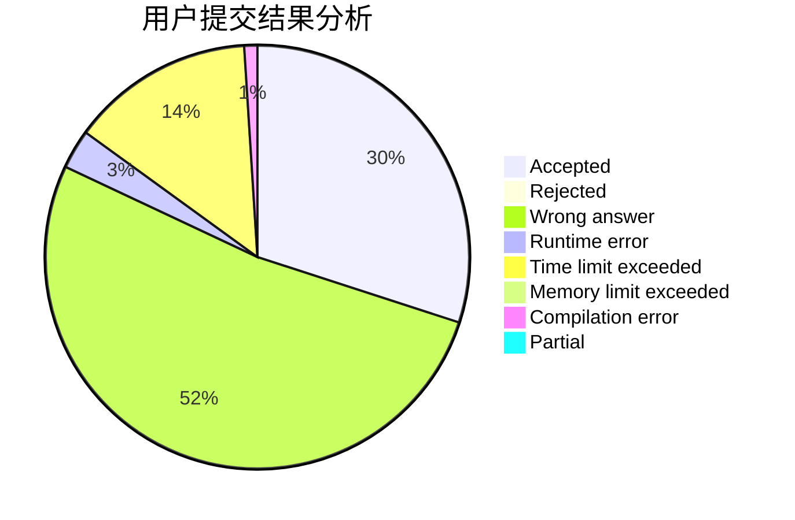
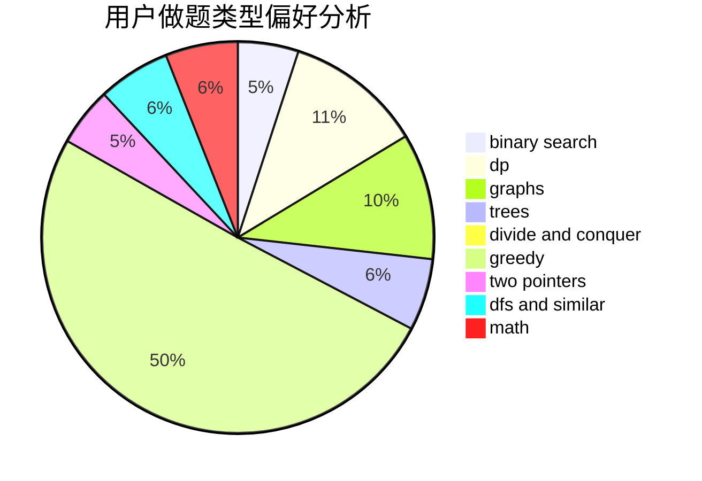

# Kidgzz

<!-- tabs:start -->

#### **用户提交结果分析**

#### **用户做题类型偏好分析**

<!-- tabs:end -->
# 推荐题目
[1470E](https://codeforces.com/contest/1470/problem/E)
[913A](https://codeforces.com/contest/913/problem/A)
[727F](https://codeforces.com/contest/727/problem/F)
[1169B](https://codeforces.com/contest/1169/problem/B)
[916B](https://codeforces.com/contest/916/problem/B)
[730C](https://codeforces.com/contest/730/problem/C)
[886F](https://codeforces.com/contest/886/problem/F)
[501C](https://codeforces.com/contest/501/problem/C)
[339A](https://codeforces.com/contest/339/problem/A)
[792E](https://codeforces.com/contest/792/problem/E)
