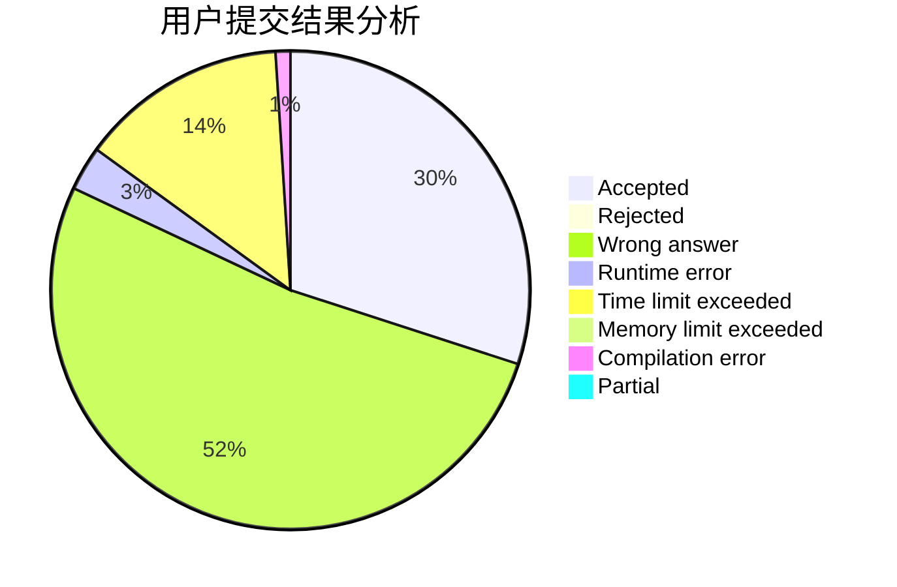
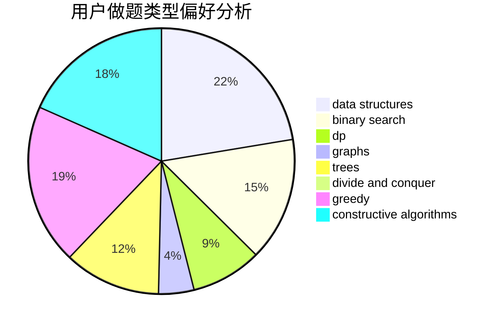
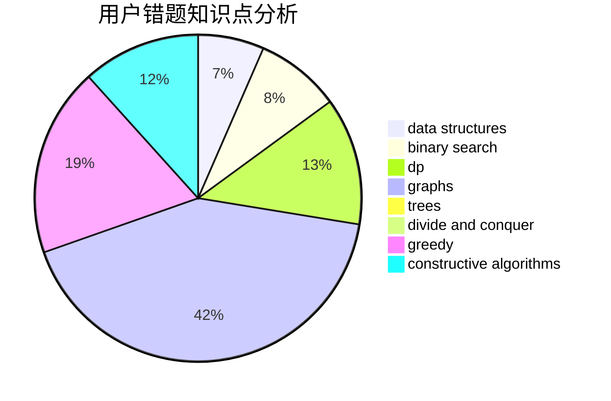

# Kidgzz

<!-- tabs:start -->

#### **用户提交结果分析**

#### **用户做题类型偏好分析**

#### **用户错题知识点分析**

<!-- tabs:end -->
# 推荐题目
[1463D](https://codeforces.com/contest/1463/problem/D)		binary search,
                        constructive algorithms,
                        greedy,
                        two pointers		  
[895C](https://codeforces.com/contest/895/problem/C)		bitmasks,
                        combinatorics,
                        dp,
                        math		  
[708D](https://codeforces.com/contest/708/problem/D)		flows		  
[1166C](https://codeforces.com/contest/1166/problem/C)		binary search,
                        sortings,
                        two pointers		  
[8D](https://codeforces.com/contest/8/problem/D)		binary search,
                        geometry		  
[70E](https://codeforces.com/contest/70/problem/E)		dp,
                        implementation,
                        trees		  
[866D](https://codeforces.com/contest/866/problem/D)		dsu,graphs,sortings,trees		  
[482D](https://codeforces.com/contest/482/problem/D)		combinatorics,
                        dp,
                        trees		  
[314B](https://codeforces.com/contest/314/problem/B)		binary search,
                        dfs and similar,
                        strings		  
[773E](https://codeforces.com/contest/773/problem/E)		data structures,
                        sortings		  
