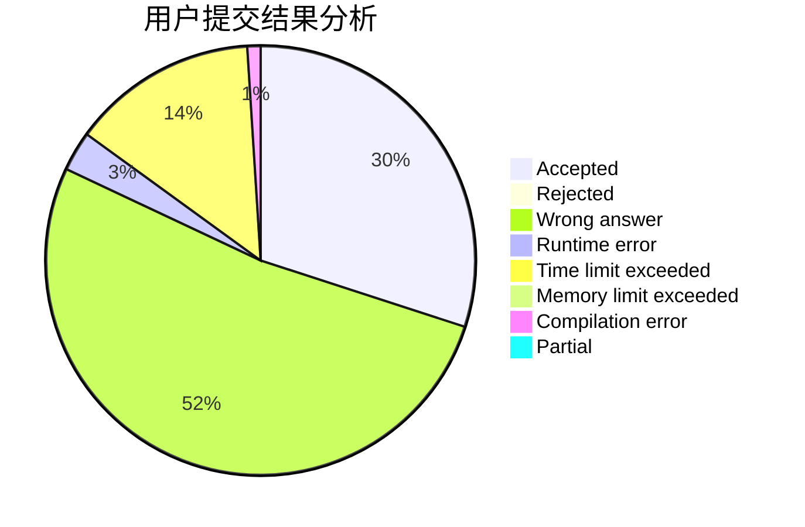
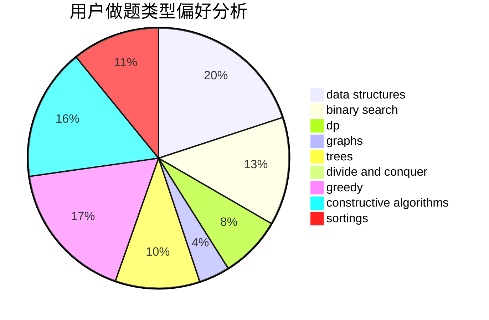
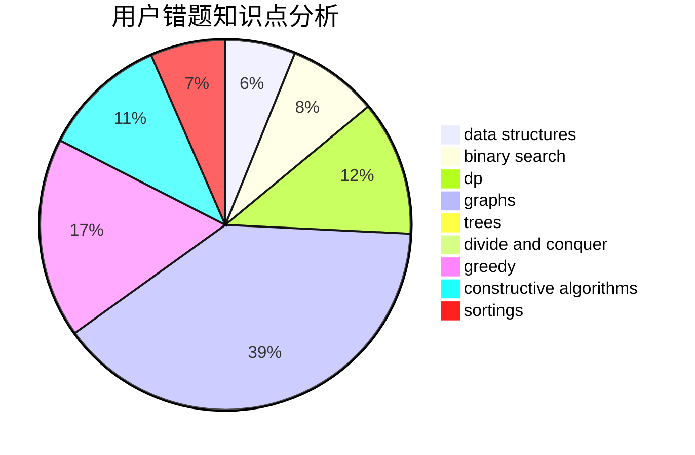

# Kidgzz
<!-- tabs:start -->
#### **用户提交结果分析**

#### **用户做题类型偏好分析**

#### **用户错题知识点分析**

<!-- tabs:end -->
# 推荐题目
[1463D](http://codeforces.com/problemset/problem/1463/D)		binary search,
                        constructive algorithms,
                        greedy,
                        two pointers		  
[866D](https://codeforces.com/contest/866/problem/D)		constructive algorithms,
                        data structures,
                        greedy		  
[773E](http://codeforces.com/problemset/problem/773/E)		data structures,
                        sortings		  
[1398G](http://codeforces.com/problemset/problem/1398/G)		bitmasks,
                        fft,
                        math,
                        number theory		  
[482D](http://codeforces.com/problemset/problem/482/D)		combinatorics,
                        dp,
                        trees		  
[742C](https://codeforces.com/contest/742/problem/C)		dfs and similar,
                        math		  
[70E](http://codeforces.com/problemset/problem/70/E)		dp,
                        implementation,
                        trees		  
[1166C](http://codeforces.com/problemset/problem/1166/C)		binary search,
                        sortings,
                        two pointers		  
[708D](http://codeforces.com/problemset/problem/708/D)		flows		  
[314B](http://codeforces.com/problemset/problem/314/B)		binary search,
                        dfs and similar,
                        strings		  
<!-- tabs:start -->
#### **data structures**
[866D](https://codeforces.com/contest/866/problem/D)		constructive algorithms,
                        data structures,
                        greedy		  
[773E](http://codeforces.com/problemset/problem/773/E)		data structures,
                        sortings		  
[1483C](https://codeforces.com/contest/1483/problem/C)		data structures,
                        divide and conquer,
                        dp		  
[1467E](http://codeforces.com/problemset/problem/1467/E)		data structures,
                        dfs and similar,
                        dp,
                        trees		  
[1398E](http://codeforces.com/problemset/problem/1398/E)		binary search,
                        data structures,
                        greedy,
                        implementation,
                        math,
                        sortings		  
[860B](https://codeforces.com/contest/860/problem/B)		data structures,
                        implementation,
                        sortings		  
[1316F](http://codeforces.com/problemset/problem/1316/F)		data structures,
                        divide and conquer,
                        probabilities		  
[1492C](http://codeforces.com/problemset/problem/1492/C)		binary search,
                        data structures,
                        dp,
                        greedy,
                        two pointers		  
[1490G](http://codeforces.com/problemset/problem/1490/G)		binary search,
                        data structures,
                        math		  
[1479D](http://codeforces.com/problemset/problem/1479/D)		binary search,
                        bitmasks,
                        brute force,
                        data structures,
                        probabilities,
                        trees		  
#### **binary search**
[1463D](http://codeforces.com/problemset/problem/1463/D)		binary search,
                        constructive algorithms,
                        greedy,
                        two pointers		  
[1166C](http://codeforces.com/problemset/problem/1166/C)		binary search,
                        sortings,
                        two pointers		  
[314B](http://codeforces.com/problemset/problem/314/B)		binary search,
                        dfs and similar,
                        strings		  
[8D](http://codeforces.com/problemset/problem/8/D)		binary search,
                        geometry		  
[1301B](http://codeforces.com/problemset/problem/1301/B)		binary search,
                        greedy,
                        ternary search		  
[1398E](http://codeforces.com/problemset/problem/1398/E)		binary search,
                        data structures,
                        greedy,
                        implementation,
                        math,
                        sortings		  
[1492C](http://codeforces.com/problemset/problem/1492/C)		binary search,
                        data structures,
                        dp,
                        greedy,
                        two pointers		  
[1463D](http://codeforces.com/problemset/problem/1463/D)		binary search,
                        constructive algorithms,
                        greedy,
                        two pointers		  
[1490G](http://codeforces.com/problemset/problem/1490/G)		binary search,
                        data structures,
                        math		  
[1479D](http://codeforces.com/problemset/problem/1479/D)		binary search,
                        bitmasks,
                        brute force,
                        data structures,
                        probabilities,
                        trees		  
#### **dp**
[482D](http://codeforces.com/problemset/problem/482/D)		combinatorics,
                        dp,
                        trees		  
[70E](http://codeforces.com/problemset/problem/70/E)		dp,
                        implementation,
                        trees		  
[895C](http://codeforces.com/problemset/problem/895/C)		bitmasks,
                        combinatorics,
                        dp,
                        math		  
[348D](http://codeforces.com/problemset/problem/348/D)		dp,
                        matrices		  
[662E](http://codeforces.com/problemset/problem/662/E)		brute force,
                        dp,
                        greedy		  
[1483C](https://codeforces.com/contest/1483/problem/C)		data structures,
                        divide and conquer,
                        dp		  
[1467E](http://codeforces.com/problemset/problem/1467/E)		data structures,
                        dfs and similar,
                        dp,
                        trees		  
[1472F](http://codeforces.com/problemset/problem/1472/F)		brute force,
                        dp,
                        graph matchings,
                        greedy,
                        sortings		  
[871A](https://codeforces.com/contest/871/problem/A)		dp,
                        greedy,
                        math,
                        number theory		  
[93E](http://codeforces.com/problemset/problem/93/E)		dp,
                        math,
                        number theory		  
#### **graph**
[700C](http://codeforces.com/problemset/problem/700/C)		dfs and similar,
                        graphs		  
[627F](http://codeforces.com/problemset/problem/627/F)		dfs and similar,
                        dsu,
                        graphs,
                        trees		  
[1472F](http://codeforces.com/problemset/problem/1472/F)		brute force,
                        dp,
                        graph matchings,
                        greedy,
                        sortings		  
[1450E](http://codeforces.com/problemset/problem/1450/E)		constructive algorithms,
                        dfs and similar,
                        graphs,
                        shortest paths		  
[1497D](http://codeforces.com/problemset/problem/1497/D)		bitmasks,
                        dp,
                        graphs,
                        number theory		  
[1487C](http://codeforces.com/problemset/problem/1487/C)		brute force,
                        constructive algorithms,
                        dfs and similar,
                        graphs,
                        greedy,
                        implementation,
                        math		  
[1437C](http://codeforces.com/problemset/problem/1437/C)		dp,
                        flows,
                        graph matchings,
                        greedy,
                        math,
                        sortings		  
[1470D](http://codeforces.com/problemset/problem/1470/D)		constructive algorithms,
                        dfs and similar,
                        graph matchings,
                        graphs,
                        greedy		  
[1476C](http://codeforces.com/problemset/problem/1476/C)		dp,
                        graphs,
                        greedy		  
[1304D](http://codeforces.com/problemset/problem/1304/D)		constructive algorithms,
                        graphs,
                        greedy,
                        two pointers		  
#### **trees**
[482D](http://codeforces.com/problemset/problem/482/D)		combinatorics,
                        dp,
                        trees		  
[70E](http://codeforces.com/problemset/problem/70/E)		dp,
                        implementation,
                        trees		  
[627F](http://codeforces.com/problemset/problem/627/F)		dfs and similar,
                        dsu,
                        graphs,
                        trees		  
[1467E](http://codeforces.com/problemset/problem/1467/E)		data structures,
                        dfs and similar,
                        dp,
                        trees		  
[1479D](http://codeforces.com/problemset/problem/1479/D)		binary search,
                        bitmasks,
                        brute force,
                        data structures,
                        probabilities,
                        trees		  
[1511C](http://codeforces.com/problemset/problem/1511/C)		brute force,
                        data structures,
                        implementation,
                        trees		  
[1499F](http://codeforces.com/problemset/problem/1499/F)		combinatorics,
                        dfs and similar,
                        dp,
                        trees		  
[1491E](http://codeforces.com/problemset/problem/1491/E)		brute force,
                        dfs and similar,
                        divide and conquer,
                        number theory,
                        trees		  
[1466D](http://codeforces.com/problemset/problem/1466/D)		data structures,
                        greedy,
                        sortings,
                        trees		  
[1495D](http://codeforces.com/problemset/problem/1495/D)		combinatorics,
                        dfs and similar,
                        graphs,
                        math,
                        shortest paths,
                        trees		  
#### **divide and conquer**
[1483C](https://codeforces.com/contest/1483/problem/C)		data structures,
                        divide and conquer,
                        dp		  
[1316F](http://codeforces.com/problemset/problem/1316/F)		data structures,
                        divide and conquer,
                        probabilities		  
[1461D](http://codeforces.com/problemset/problem/1461/D)		binary search,
                        brute force,
                        data structures,
                        divide and conquer,
                        implementation,
                        sortings		  
[1466G](http://codeforces.com/problemset/problem/1466/G)		combinatorics,
                        divide and conquer,
                        hashing,
                        math,
                        string suffix structures,
                        strings		  
[1490D](http://codeforces.com/problemset/problem/1490/D)		dfs and similar,
                        divide and conquer,
                        implementation		  
[1483C](https://codeforces.com/contest/1483/problem/C)		data structures,
                        divide and conquer,
                        dp		  
[1491E](http://codeforces.com/problemset/problem/1491/E)		brute force,
                        dfs and similar,
                        divide and conquer,
                        number theory,
                        trees		  
[1303G](http://codeforces.com/problemset/problem/1303/G)		data structures,
                        divide and conquer,
                        geometry,
                        trees		  
[1494D](http://codeforces.com/problemset/problem/1494/D)		constructive algorithms,
                        data structures,
                        dfs and similar,
                        divide and conquer,
                        dsu,
                        greedy,
                        sortings,
                        trees		  
[1482E](http://codeforces.com/problemset/problem/1482/E)		data structures,
                        divide and conquer,
                        dp		  
#### **greedy**
[1463D](http://codeforces.com/problemset/problem/1463/D)		binary search,
                        constructive algorithms,
                        greedy,
                        two pointers		  
[866D](https://codeforces.com/contest/866/problem/D)		constructive algorithms,
                        data structures,
                        greedy		  
[282B](http://codeforces.com/problemset/problem/282/B)		greedy,
                        math		  
[305C](http://codeforces.com/problemset/problem/305/C)		greedy,
                        implementation		  
[1062C](http://codeforces.com/problemset/problem/1062/C)		greedy,
                        implementation,
                        math		  
[1301B](http://codeforces.com/problemset/problem/1301/B)		binary search,
                        greedy,
                        ternary search		  
[1218I](http://codeforces.com/problemset/problem/1218/I)		2-sat,
                        dfs and similar,
                        greedy		  
[662E](http://codeforces.com/problemset/problem/662/E)		brute force,
                        dp,
                        greedy		  
[862A](http://codeforces.com/problemset/problem/862/A)		greedy,
                        implementation		  
[1093B](http://codeforces.com/problemset/problem/1093/B)		constructive algorithms,
                        greedy,
                        sortings,
                        strings		  
#### **constructive algorithms**
[1463D](http://codeforces.com/problemset/problem/1463/D)		binary search,
                        constructive algorithms,
                        greedy,
                        two pointers		  
[866D](https://codeforces.com/contest/866/problem/D)		constructive algorithms,
                        data structures,
                        greedy		  
[1093B](http://codeforces.com/problemset/problem/1093/B)		constructive algorithms,
                        greedy,
                        sortings,
                        strings		  
[1450E](http://codeforces.com/problemset/problem/1450/E)		constructive algorithms,
                        dfs and similar,
                        graphs,
                        shortest paths		  
[1407C](http://codeforces.com/problemset/problem/1407/C)		constructive algorithms,
                        interactive,
                        math,
                        two pointers		  
[1332B](http://codeforces.com/problemset/problem/1332/B)		brute force,
                        constructive algorithms,
                        greedy,
                        math,
                        number theory		  
[1454A](http://codeforces.com/problemset/problem/1454/A)		constructive algorithms,
                        probabilities		  
[1493A](http://codeforces.com/problemset/problem/1493/A)		constructive algorithms,
                        greedy		  
[1463D](http://codeforces.com/problemset/problem/1463/D)		binary search,
                        constructive algorithms,
                        greedy,
                        two pointers		  
[1456B](https://codeforces.com/contest/1456/problem/B)		bitmasks,
                        brute force,
                        constructive algorithms		  
#### **sortings**
[773E](http://codeforces.com/problemset/problem/773/E)		data structures,
                        sortings		  
[1166C](http://codeforces.com/problemset/problem/1166/C)		binary search,
                        sortings,
                        two pointers		  
[1093B](http://codeforces.com/problemset/problem/1093/B)		constructive algorithms,
                        greedy,
                        sortings,
                        strings		  
[1472F](http://codeforces.com/problemset/problem/1472/F)		brute force,
                        dp,
                        graph matchings,
                        greedy,
                        sortings		  
[1398E](http://codeforces.com/problemset/problem/1398/E)		binary search,
                        data structures,
                        greedy,
                        implementation,
                        math,
                        sortings		  
[860B](https://codeforces.com/contest/860/problem/B)		data structures,
                        implementation,
                        sortings		  
[1496C](https://codeforces.com/contest/1496/problem/C)		geometry,
                        greedy,
                        math,
                        sortings		  
[1495A](http://codeforces.com/problemset/problem/1495/A)		geometry,
                        greedy,
                        math,
                        sortings		  
[1497A](http://codeforces.com/problemset/problem/1497/A)		brute force,
                        data structures,
                        greedy,
                        sortings		  
[1427A](http://codeforces.com/problemset/problem/1427/A)		math,
                        sortings		  
<!-- tabs:end -->
