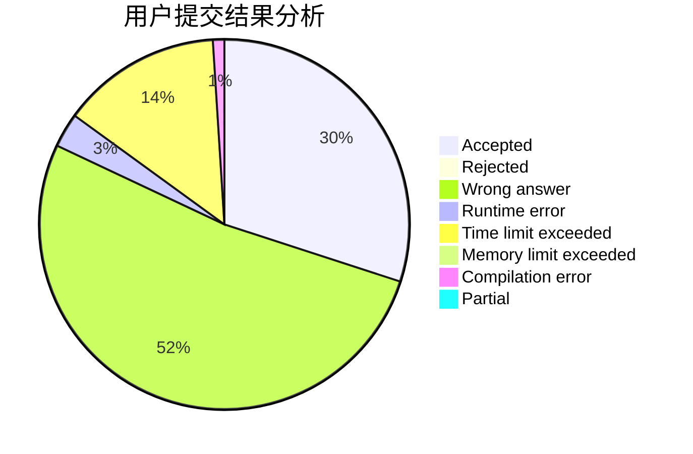
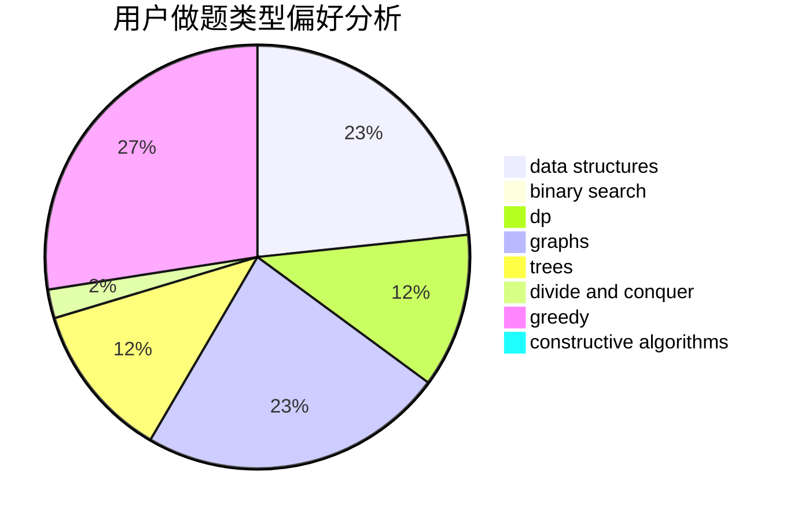
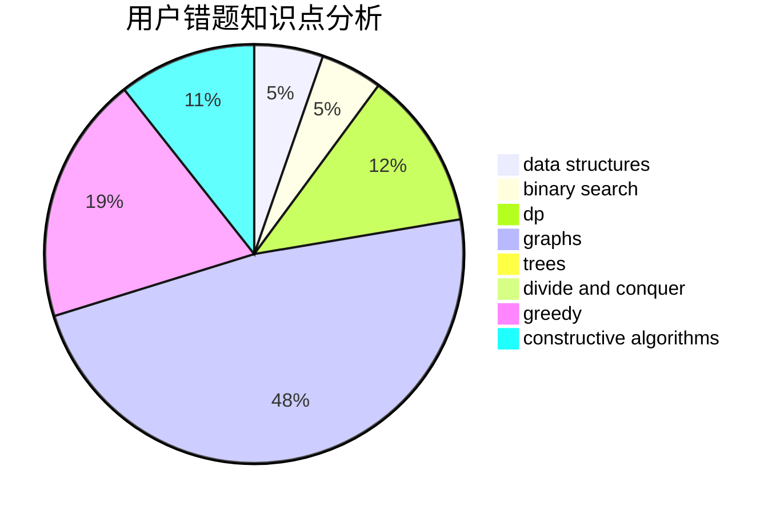

# Kidgzz

<!-- tabs:start -->

#### **用户提交结果分析**

#### **用户做题类型偏好分析**

#### **用户错题知识点分析**

<!-- tabs:end -->
# 推荐题目
[1470E](https://codeforces.com/contest/1470/problem/E)		binary search,
                        combinatorics,
                        data structures,
                        dp,
                        graphs,
                        implementation,
                        two pointers		  
[913A](https://codeforces.com/contest/913/problem/A)		implementation,
                        math		  
[727F](https://codeforces.com/contest/727/problem/F)		binary search,
                        dp,
                        greedy		  
[1169B](https://codeforces.com/contest/1169/problem/B)		graphs,
                        implementation		  
[916B](https://codeforces.com/contest/916/problem/B)		bitmasks,
                        greedy,
                        math		  
[730C](https://codeforces.com/contest/730/problem/C)		binary search,
                        dfs and similar		  
[886F](https://codeforces.com/contest/886/problem/F)		geometry		  
[501C](https://codeforces.com/contest/501/problem/C)		constructive algorithms,
                        data structures,
                        greedy,
                        sortings,
                        trees		  
[339A](https://codeforces.com/contest/339/problem/A)		greedy,
                        implementation,
                        sortings,
                        strings		  
[792E](https://codeforces.com/contest/792/problem/E)		greedy,
                        math,
                        number theory		  
