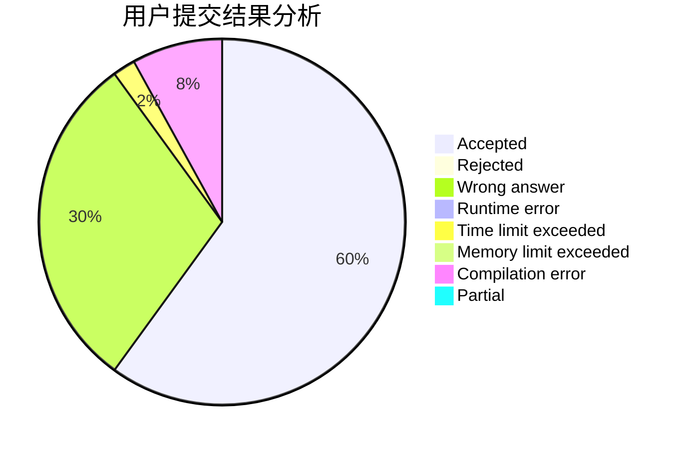
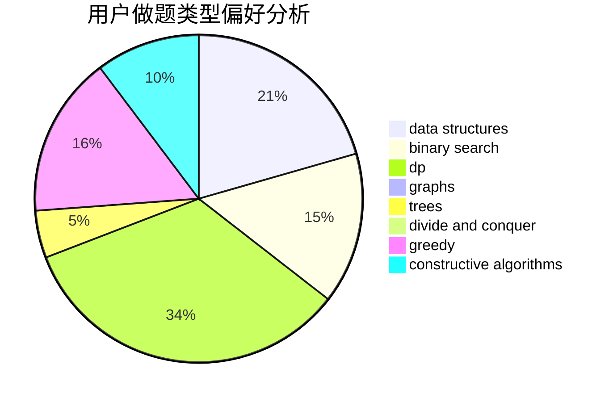
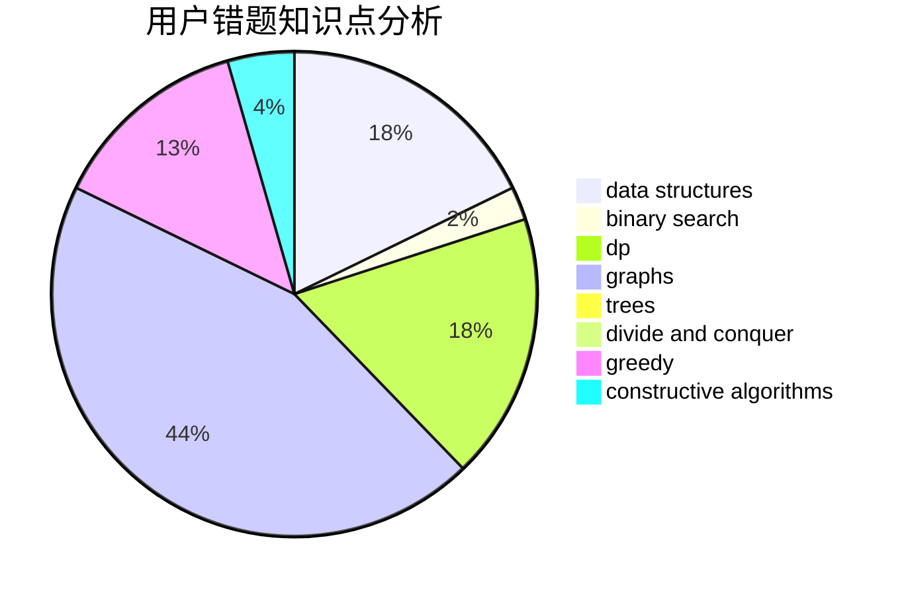

# Kinoshita

<!-- tabs:start -->

#### **用户提交结果分析**

#### **用户做题类型偏好分析**

#### **用户错题知识点分析**

<!-- tabs:end -->
# 推荐题目
[1504A](https://codeforces.com/contest/1504/problem/A)		constructive algorithms,
                        strings		  
[961E](https://codeforces.com/contest/961/problem/E)		data structures		  
[961F](https://codeforces.com/contest/961/problem/F)		binary search,
                        hashing,
                        string suffix structures		  
[763D](https://codeforces.com/contest/763/problem/D)		data structures,
                        graphs,
                        hashing,
                        shortest paths,
                        trees		  
[1250I](https://codeforces.com/contest/1250/problem/I)		binary search,
                        brute force,
                        greedy,
                        shortest paths		  
[659G](https://codeforces.com/contest/659/problem/G)		combinatorics,
                        dp,
                        number theory		  
[1250L](https://codeforces.com/contest/1250/problem/L)		binary search,
                        greedy,
                        math		  
[1176C](https://codeforces.com/contest/1176/problem/C)		dp,
                        greedy,
                        implementation		  
[46A](https://codeforces.com/contest/46/problem/A)		brute force,
                        implementation		  
[620F](https://codeforces.com/contest/620/problem/F)		data structures,
                        strings,
                        trees		  
