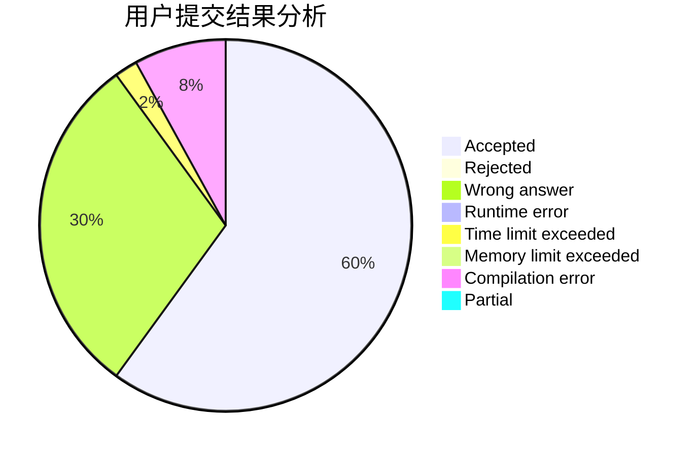
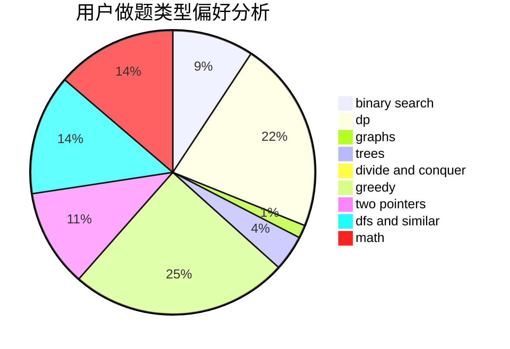

# Kinoshita

<!-- tabs:start -->

#### **用户提交结果分析**

#### **用户做题类型偏好分析**

<!-- tabs:end -->
# 推荐题目
[1504A](https://codeforces.com/contest/1504/problem/A)
[961E](https://codeforces.com/contest/961/problem/E)
[961F](https://codeforces.com/contest/961/problem/F)
[763D](https://codeforces.com/contest/763/problem/D)
[1250I](https://codeforces.com/contest/1250/problem/I)
[659G](https://codeforces.com/contest/659/problem/G)
[1250L](https://codeforces.com/contest/1250/problem/L)
[1176C](https://codeforces.com/contest/1176/problem/C)
[46A](https://codeforces.com/contest/46/problem/A)
[620F](https://codeforces.com/contest/620/problem/F)
