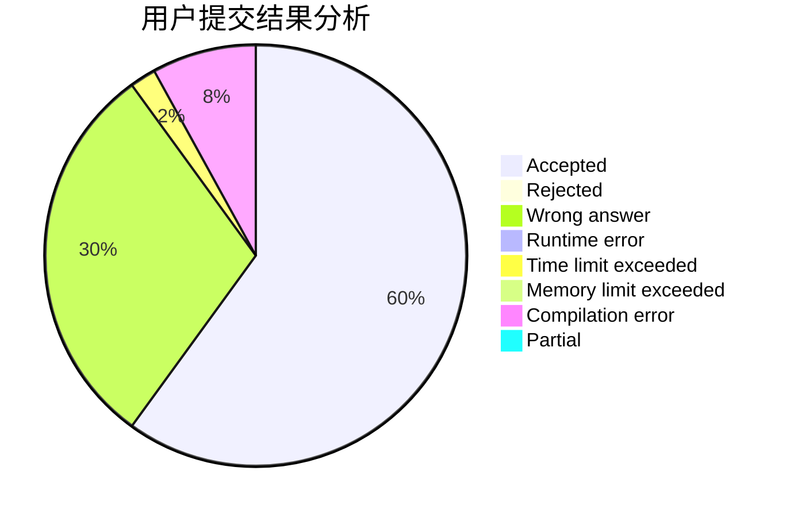
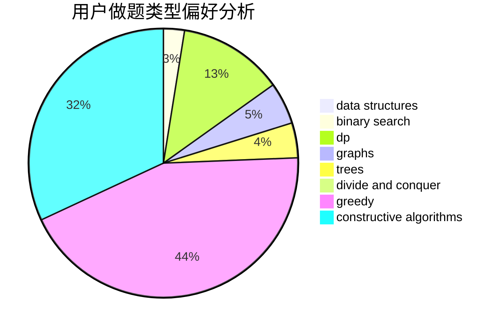
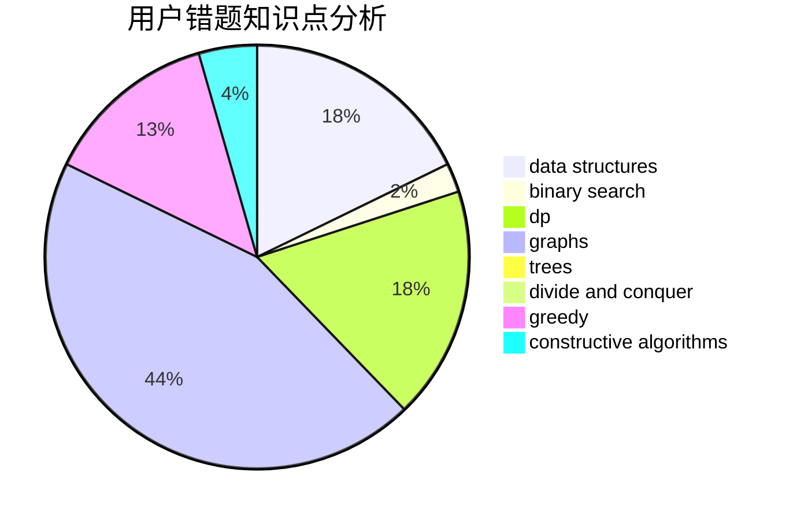

# Kinoshita

<!-- tabs:start -->

#### **用户提交结果分析**

#### **用户做题类型偏好分析**

#### **用户错题知识点分析**

<!-- tabs:end -->
# 推荐题目
[1495A](https://codeforces.com/contest/1495/problem/A)		geometry,
                        greedy,
                        math,
                        sortings		  
[940A](https://codeforces.com/contest/940/problem/A)		brute force,
                        greedy,
                        sortings		  
[940B](https://codeforces.com/contest/940/problem/B)		dp,
                        greedy		  
[743C](https://codeforces.com/contest/743/problem/C)		brute force,
                        constructive algorithms,
                        math,
                        number theory		  
[1246A](https://codeforces.com/contest/1246/problem/A)		dsu,graphs,sortings,trees		  
[62E](https://codeforces.com/contest/62/problem/E)		dp,
                        flows		  
[1246C](https://codeforces.com/contest/1246/problem/C)		dsu,graphs,sortings,trees		  
[1174A](https://codeforces.com/contest/1174/problem/A)		constructive algorithms,
                        greedy,
                        sortings		  
[449D](https://codeforces.com/contest/449/problem/D)		bitmasks,
                        combinatorics,
                        dp		  
[601D](https://codeforces.com/contest/601/problem/D)		data structures,
                        dfs and similar,
                        dsu,
                        hashing,
                        strings,
                        trees		  
