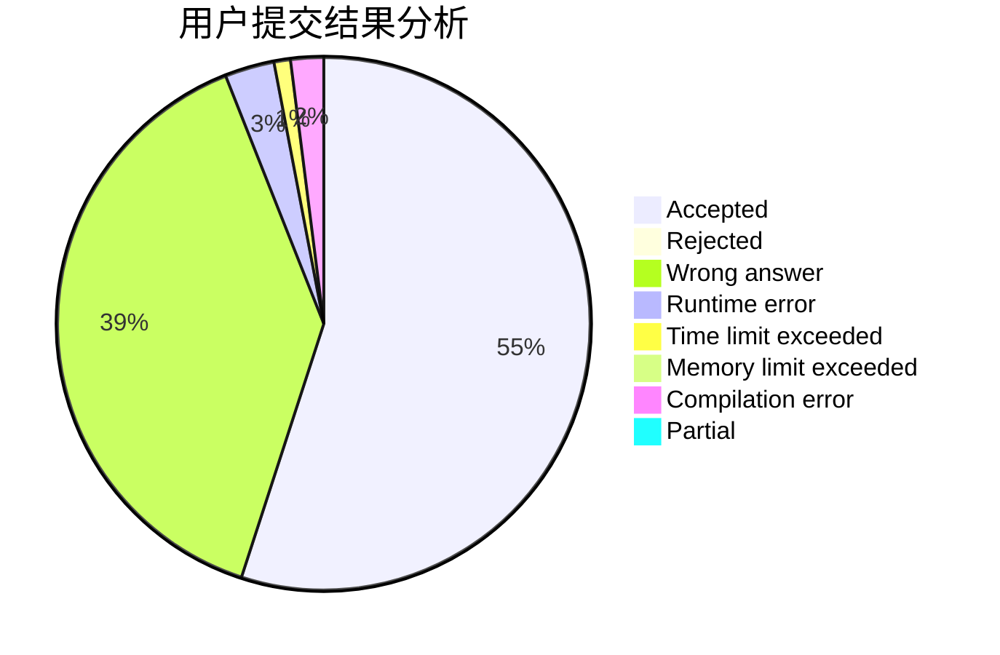
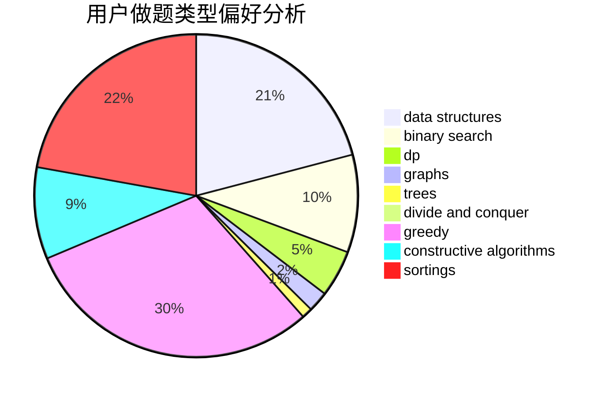
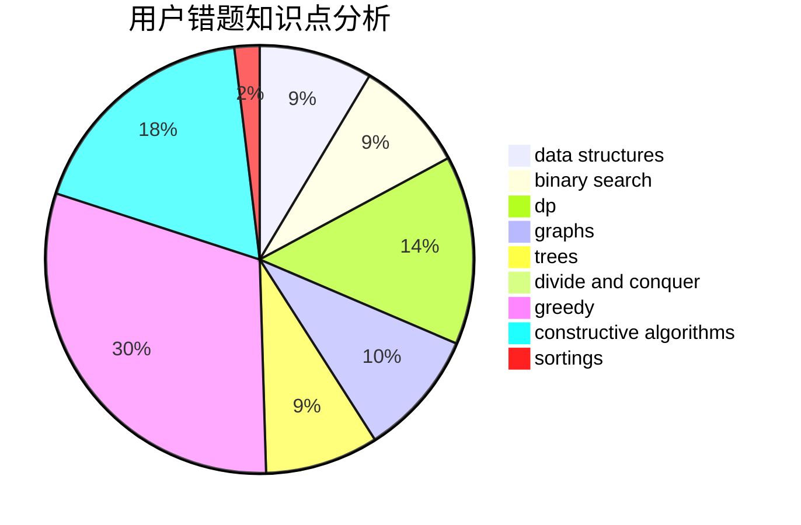

# 4790iop
<!-- tabs:start -->
#### **用户提交结果分析**

#### **用户做题类型偏好分析**

#### **用户错题知识点分析**

<!-- tabs:end -->
# 推荐题目
[1369F](http://codeforces.com/problemset/problem/1369/F)		dfs and similar,
                        dp,
                        games		  
[1370A](http://codeforces.com/problemset/problem/1370/A)		greedy,
                        implementation,
                        math,
                        number theory		  
[1371A](http://codeforces.com/problemset/problem/1371/A)		math		  
[1368D](http://codeforces.com/problemset/problem/1368/D)		bitmasks,
                        greedy,
                        math		  
[136C](https://codeforces.com/contest/136/problem/C)		constructive algorithms,
                        data structures,
                        implementation		  
[1368E](http://codeforces.com/problemset/problem/1368/E)		constructive algorithms,
                        graphs,
                        greedy		  
[1363D](http://codeforces.com/problemset/problem/1363/D)		binary search,
                        implementation,
                        interactive,
                        math		  
[1357A7](http://codeforces.com/problemset/problem/1357/A7)		nan		  
[1099B](http://codeforces.com/problemset/problem/1099/B)		binary search,
                        constructive algorithms,
                        math		  
[1270E](http://codeforces.com/problemset/problem/1270/E)		constructive algorithms,
                        geometry,
                        math		  
<!-- tabs:start -->
#### **data structures**
[136C](https://codeforces.com/contest/136/problem/C)		constructive algorithms,
                        data structures,
                        implementation		  
[1234D](http://codeforces.com/problemset/problem/1234/D)		data structures		  
[1369E](http://codeforces.com/problemset/problem/1369/E)		data structures,
                        dfs and similar,
                        greedy,
                        implementation,
                        sortings		  
[1368G](http://codeforces.com/problemset/problem/1368/G)		data structures,
                        geometry,
                        graphs,
                        trees		  
[1370E](http://codeforces.com/problemset/problem/1370/E)		binary search,
                        constructive algorithms,
                        data structures,
                        greedy		  
[1492C](http://codeforces.com/problemset/problem/1492/C)		binary search,
                        data structures,
                        dp,
                        greedy,
                        two pointers		  
[1490G](http://codeforces.com/problemset/problem/1490/G)		binary search,
                        data structures,
                        math		  
[1479D](http://codeforces.com/problemset/problem/1479/D)		binary search,
                        bitmasks,
                        brute force,
                        data structures,
                        probabilities,
                        trees		  
[1497A](http://codeforces.com/problemset/problem/1497/A)		brute force,
                        data structures,
                        greedy,
                        sortings		  
[1491C](http://codeforces.com/problemset/problem/1491/C)		brute force,
                        data structures,
                        dp,
                        greedy,
                        implementation		  
#### **binary search**
[1363D](http://codeforces.com/problemset/problem/1363/D)		binary search,
                        implementation,
                        interactive,
                        math		  
[1099B](http://codeforces.com/problemset/problem/1099/B)		binary search,
                        constructive algorithms,
                        math		  
[1371E1](http://codeforces.com/problemset/problem/1371/E1)		binary search,
                        brute force,
                        combinatorics,
                        math,
                        number theory,
                        sortings		  
[1370F2](http://codeforces.com/problemset/problem/1370/F2)		binary search,
                        dfs and similar,
                        graphs,
                        interactive,
                        shortest paths,
                        trees		  
[1370D](http://codeforces.com/problemset/problem/1370/D)		binary search,
                        dp,
                        dsu,
                        greedy,
                        implementation		  
[1370F1](http://codeforces.com/problemset/problem/1370/F1)		binary search,
                        dfs and similar,
                        graphs,
                        interactive,
                        shortest paths,
                        trees		  
[1370E](http://codeforces.com/problemset/problem/1370/E)		binary search,
                        constructive algorithms,
                        data structures,
                        greedy		  
[1492C](http://codeforces.com/problemset/problem/1492/C)		binary search,
                        data structures,
                        dp,
                        greedy,
                        two pointers		  
[1463D](http://codeforces.com/problemset/problem/1463/D)		binary search,
                        constructive algorithms,
                        greedy,
                        two pointers		  
[1490G](http://codeforces.com/problemset/problem/1490/G)		binary search,
                        data structures,
                        math		  
#### **dp**
[1369F](http://codeforces.com/problemset/problem/1369/F)		dfs and similar,
                        dp,
                        games		  
[1368H1](http://codeforces.com/problemset/problem/1368/H1)		dp,
                        flows,
                        greedy		  
[1178F1](http://codeforces.com/problemset/problem/1178/F1)		combinatorics,
                        dfs and similar,
                        dp		  
[1241E](https://codeforces.com/contest/1241/problem/E)		brute force,
                        constructive algorithms,
                        dp,
                        graphs,
                        implementation,
                        trees		  
[1032F](http://codeforces.com/problemset/problem/1032/F)		dp,
                        trees		  
[1322F](http://codeforces.com/problemset/problem/1322/F)		dp,
                        trees		  
[1077F1](http://codeforces.com/problemset/problem/1077/F1)		dp		  
[1370D](http://codeforces.com/problemset/problem/1370/D)		binary search,
                        dp,
                        dsu,
                        greedy,
                        implementation		  
[1238F](http://codeforces.com/problemset/problem/1238/F)		dfs and similar,
                        dp,
                        graphs,
                        trees		  
[1369D](http://codeforces.com/problemset/problem/1369/D)		dp,
                        graphs,
                        greedy,
                        math,
                        trees		  
#### **graph**
[1368E](http://codeforces.com/problemset/problem/1368/E)		constructive algorithms,
                        graphs,
                        greedy		  
[1241E](https://codeforces.com/contest/1241/problem/E)		brute force,
                        constructive algorithms,
                        dp,
                        graphs,
                        implementation,
                        trees		  
[1370F2](http://codeforces.com/problemset/problem/1370/F2)		binary search,
                        dfs and similar,
                        graphs,
                        interactive,
                        shortest paths,
                        trees		  
[1368G](http://codeforces.com/problemset/problem/1368/G)		data structures,
                        geometry,
                        graphs,
                        trees		  
[1238F](http://codeforces.com/problemset/problem/1238/F)		dfs and similar,
                        dp,
                        graphs,
                        trees		  
[1370F1](http://codeforces.com/problemset/problem/1370/F1)		binary search,
                        dfs and similar,
                        graphs,
                        interactive,
                        shortest paths,
                        trees		  
[1369D](http://codeforces.com/problemset/problem/1369/D)		dp,
                        graphs,
                        greedy,
                        math,
                        trees		  
[1487C](http://codeforces.com/problemset/problem/1487/C)		brute force,
                        constructive algorithms,
                        dfs and similar,
                        graphs,
                        greedy,
                        implementation,
                        math		  
[1437C](http://codeforces.com/problemset/problem/1437/C)		dp,
                        flows,
                        graph matchings,
                        greedy,
                        math,
                        sortings		  
[1470D](http://codeforces.com/problemset/problem/1470/D)		constructive algorithms,
                        dfs and similar,
                        graph matchings,
                        graphs,
                        greedy		  
#### **trees**
[1241E](https://codeforces.com/contest/1241/problem/E)		brute force,
                        constructive algorithms,
                        dp,
                        graphs,
                        implementation,
                        trees		  
[1032F](http://codeforces.com/problemset/problem/1032/F)		dp,
                        trees		  
[1370F2](http://codeforces.com/problemset/problem/1370/F2)		binary search,
                        dfs and similar,
                        graphs,
                        interactive,
                        shortest paths,
                        trees		  
[1322F](http://codeforces.com/problemset/problem/1322/F)		dp,
                        trees		  
[1368G](http://codeforces.com/problemset/problem/1368/G)		data structures,
                        geometry,
                        graphs,
                        trees		  
[1238F](http://codeforces.com/problemset/problem/1238/F)		dfs and similar,
                        dp,
                        graphs,
                        trees		  
[1370F1](http://codeforces.com/problemset/problem/1370/F1)		binary search,
                        dfs and similar,
                        graphs,
                        interactive,
                        shortest paths,
                        trees		  
[1369D](http://codeforces.com/problemset/problem/1369/D)		dp,
                        graphs,
                        greedy,
                        math,
                        trees		  
[1479D](http://codeforces.com/problemset/problem/1479/D)		binary search,
                        bitmasks,
                        brute force,
                        data structures,
                        probabilities,
                        trees		  
[1511C](http://codeforces.com/problemset/problem/1511/C)		brute force,
                        data structures,
                        implementation,
                        trees		  
#### **divide and conquer**
[1461D](http://codeforces.com/problemset/problem/1461/D)		binary search,
                        brute force,
                        data structures,
                        divide and conquer,
                        implementation,
                        sortings		  
[1466G](http://codeforces.com/problemset/problem/1466/G)		combinatorics,
                        divide and conquer,
                        hashing,
                        math,
                        string suffix structures,
                        strings		  
[1490D](http://codeforces.com/problemset/problem/1490/D)		dfs and similar,
                        divide and conquer,
                        implementation		  
[1483C](https://codeforces.com/contest/1483/problem/C)		data structures,
                        divide and conquer,
                        dp		  
[1491E](http://codeforces.com/problemset/problem/1491/E)		brute force,
                        dfs and similar,
                        divide and conquer,
                        number theory,
                        trees		  
[1303G](http://codeforces.com/problemset/problem/1303/G)		data structures,
                        divide and conquer,
                        geometry,
                        trees		  
[1494D](http://codeforces.com/problemset/problem/1494/D)		constructive algorithms,
                        data structures,
                        dfs and similar,
                        divide and conquer,
                        dsu,
                        greedy,
                        sortings,
                        trees		  
[1482E](http://codeforces.com/problemset/problem/1482/E)		data structures,
                        divide and conquer,
                        dp		  
[566C](http://codeforces.com/problemset/problem/566/C)		dfs and similar,
                        divide and conquer,
                        trees		  
[1428F](http://codeforces.com/problemset/problem/1428/F)		binary search,
                        data structures,
                        divide and conquer,
                        dp,
                        two pointers		  
#### **greedy**
[1370A](http://codeforces.com/problemset/problem/1370/A)		greedy,
                        implementation,
                        math,
                        number theory		  
[1368D](http://codeforces.com/problemset/problem/1368/D)		bitmasks,
                        greedy,
                        math		  
[1368E](http://codeforces.com/problemset/problem/1368/E)		constructive algorithms,
                        graphs,
                        greedy		  
[1368H1](http://codeforces.com/problemset/problem/1368/H1)		dp,
                        flows,
                        greedy		  
[1129A1](http://codeforces.com/problemset/problem/1129/A1)		brute force,
                        greedy		  
[1271A](http://codeforces.com/problemset/problem/1271/A)		brute force,
                        greedy,
                        math		  
[1248B](http://codeforces.com/problemset/problem/1248/B)		greedy,
                        math,
                        sortings		  
[1369E](http://codeforces.com/problemset/problem/1369/E)		data structures,
                        dfs and similar,
                        greedy,
                        implementation,
                        sortings		  
[1370D](http://codeforces.com/problemset/problem/1370/D)		binary search,
                        dp,
                        dsu,
                        greedy,
                        implementation		  
[1371C](http://codeforces.com/problemset/problem/1371/C)		greedy,
                        implementation,
                        math		  
#### **constructive algorithms**
[136C](https://codeforces.com/contest/136/problem/C)		constructive algorithms,
                        data structures,
                        implementation		  
[1368E](http://codeforces.com/problemset/problem/1368/E)		constructive algorithms,
                        graphs,
                        greedy		  
[1099B](http://codeforces.com/problemset/problem/1099/B)		binary search,
                        constructive algorithms,
                        math		  
[1270E](http://codeforces.com/problemset/problem/1270/E)		constructive algorithms,
                        geometry,
                        math		  
[1241E](https://codeforces.com/contest/1241/problem/E)		brute force,
                        constructive algorithms,
                        dp,
                        graphs,
                        implementation,
                        trees		  
[1370B](http://codeforces.com/problemset/problem/1370/B)		constructive algorithms,
                        math,
                        number theory		  
[1215C](http://codeforces.com/problemset/problem/1215/C)		constructive algorithms,
                        greedy		  
[1368C](http://codeforces.com/problemset/problem/1368/C)		constructive algorithms		  
[1266B](http://codeforces.com/problemset/problem/1266/B)		constructive algorithms,
                        math		  
[1370E](http://codeforces.com/problemset/problem/1370/E)		binary search,
                        constructive algorithms,
                        data structures,
                        greedy		  
#### **sortings**
[1248B](http://codeforces.com/problemset/problem/1248/B)		greedy,
                        math,
                        sortings		  
[1371E1](http://codeforces.com/problemset/problem/1371/E1)		binary search,
                        brute force,
                        combinatorics,
                        math,
                        number theory,
                        sortings		  
[1369E](http://codeforces.com/problemset/problem/1369/E)		data structures,
                        dfs and similar,
                        greedy,
                        implementation,
                        sortings		  
[1369C](http://codeforces.com/problemset/problem/1369/C)		greedy,
                        math,
                        sortings,
                        two pointers		  
[1496C](https://codeforces.com/contest/1496/problem/C)		geometry,
                        greedy,
                        math,
                        sortings		  
[1495A](http://codeforces.com/problemset/problem/1495/A)		geometry,
                        greedy,
                        math,
                        sortings		  
[1497A](http://codeforces.com/problemset/problem/1497/A)		brute force,
                        data structures,
                        greedy,
                        sortings		  
[1427A](http://codeforces.com/problemset/problem/1427/A)		math,
                        sortings		  
[1461D](http://codeforces.com/problemset/problem/1461/D)		binary search,
                        brute force,
                        data structures,
                        divide and conquer,
                        implementation,
                        sortings		  
[1437C](http://codeforces.com/problemset/problem/1437/C)		dp,
                        flows,
                        graph matchings,
                        greedy,
                        math,
                        sortings		  
<!-- tabs:end -->
