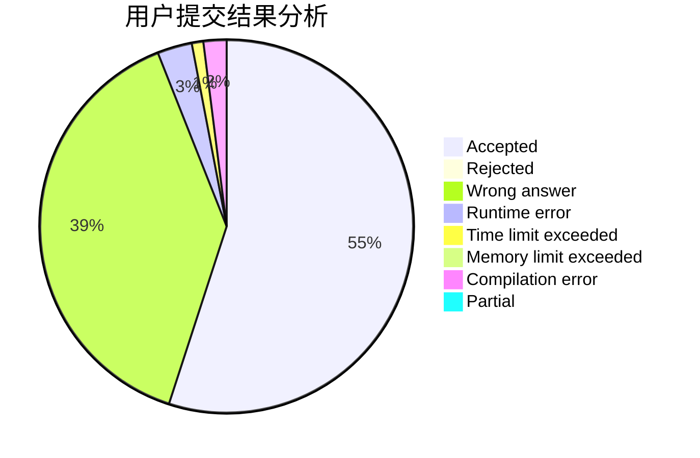
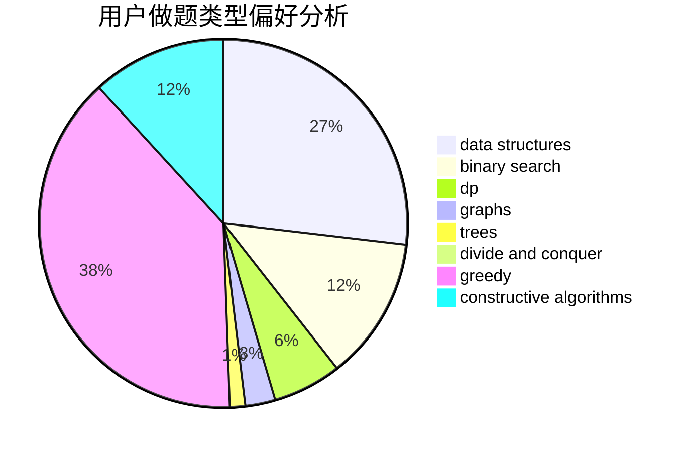
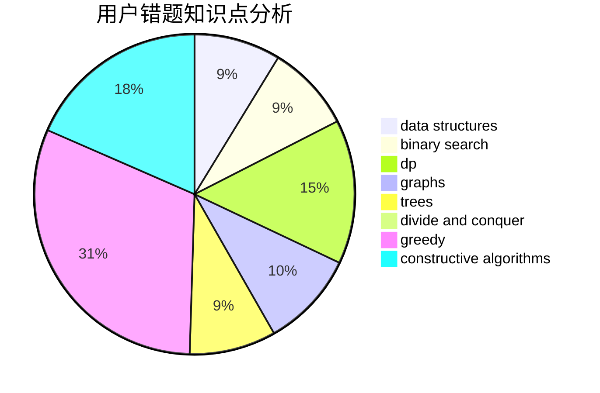

# 4790iop
<!-- tabs:start -->
#### **用户提交结果分析**

#### **用户做题类型偏好分析**

#### **用户错题知识点分析**

<!-- tabs:end -->
# 推荐题目
[BareLee](http://codeforces.com/problemset/problem/1369/F)		dfs and similar,
                        dp,
                        games		  
[Maximum GCD](http://codeforces.com/problemset/problem/1370/A)		greedy,
                        implementation,
                        math,
                        number theory		  
[Magical Sticks](http://codeforces.com/problemset/problem/1371/A)		math		  
[AND, OR and square sum](http://codeforces.com/problemset/problem/1368/D)		bitmasks,
                        greedy,
                        math		  
[Replacement](https://codeforces.com/contest/136/problem/C)		constructive algorithms,
                        data structures,
                        implementation		  
[Ski Accidents](http://codeforces.com/problemset/problem/1368/E)		constructive algorithms,
                        graphs,
                        greedy		  
[Guess The Maximums](http://codeforces.com/problemset/problem/1363/D)		binary search,
                        implementation,
                        interactive,
                        math		  
[Distinguish Y, XZ, -Y and -XZ](http://codeforces.com/problemset/problem/1357/A7)		nan		  
[Squares and Segments](http://codeforces.com/problemset/problem/1099/B)		binary search,
                        constructive algorithms,
                        math		  
[Divide Points](http://codeforces.com/problemset/problem/1270/E)		constructive algorithms,
                        geometry,
                        math		  
<!-- tabs:start -->
#### **data structures**
[Replacement](https://codeforces.com/contest/136/problem/C)		constructive algorithms,
                        data structures,
                        implementation		  
[Distinct Characters Queries](http://codeforces.com/problemset/problem/1234/D)		data structures		  
[DeadLee](http://codeforces.com/problemset/problem/1369/E)		data structures,
                        dfs and similar,
                        greedy,
                        implementation,
                        sortings		  
[Shifting Dominoes](http://codeforces.com/problemset/problem/1368/G)		data structures,
                        geometry,
                        graphs,
                        trees		  
[Binary Subsequence Rotation](http://codeforces.com/problemset/problem/1370/E)		binary search,
                        constructive algorithms,
                        data structures,
                        greedy		  
[Maximum width](http://codeforces.com/problemset/problem/1492/C)		binary search,
                        data structures,
                        dp,
                        greedy,
                        two pointers		  
[Old Floppy Drive](http://codeforces.com/problemset/problem/1490/G)		binary search,
                        data structures,
                        math		  
[Odd Mineral Resource](http://codeforces.com/problemset/problem/1479/D)		binary search,
                        bitmasks,
                        brute force,
                        data structures,
                        probabilities,
                        trees		  
[Meximization](http://codeforces.com/problemset/problem/1497/A)		brute force,
                        data structures,
                        greedy,
                        sortings		  
[Pekora and Trampoline](http://codeforces.com/problemset/problem/1491/C)		brute force,
                        data structures,
                        dp,
                        greedy,
                        implementation		  
#### **binary search**
[Guess The Maximums](http://codeforces.com/problemset/problem/1363/D)		binary search,
                        implementation,
                        interactive,
                        math		  
[Squares and Segments](http://codeforces.com/problemset/problem/1099/B)		binary search,
                        constructive algorithms,
                        math		  
[Asterism (Easy Version)](http://codeforces.com/problemset/problem/1371/E1)		binary search,
                        brute force,
                        combinatorics,
                        math,
                        number theory,
                        sortings		  
[The Hidden Pair (Hard Version)](http://codeforces.com/problemset/problem/1370/F2)		binary search,
                        dfs and similar,
                        graphs,
                        interactive,
                        shortest paths,
                        trees		  
[Odd-Even Subsequence](http://codeforces.com/problemset/problem/1370/D)		binary search,
                        dp,
                        dsu,
                        greedy,
                        implementation		  
[The Hidden Pair (Easy Version)](http://codeforces.com/problemset/problem/1370/F1)		binary search,
                        dfs and similar,
                        graphs,
                        interactive,
                        shortest paths,
                        trees		  
[Binary Subsequence Rotation](http://codeforces.com/problemset/problem/1370/E)		binary search,
                        constructive algorithms,
                        data structures,
                        greedy		  
[Maximum width](http://codeforces.com/problemset/problem/1492/C)		binary search,
                        data structures,
                        dp,
                        greedy,
                        two pointers		  
[Pairs](http://codeforces.com/problemset/problem/1463/D)		binary search,
                        constructive algorithms,
                        greedy,
                        two pointers		  
[Old Floppy Drive](http://codeforces.com/problemset/problem/1490/G)		binary search,
                        data structures,
                        math		  
#### **dp**
[BareLee](http://codeforces.com/problemset/problem/1369/F)		dfs and similar,
                        dp,
                        games		  
[Breadboard Capacity (easy version)](http://codeforces.com/problemset/problem/1368/H1)		dp,
                        flows,
                        greedy		  
[Short Colorful Strip](http://codeforces.com/problemset/problem/1178/F1)		combinatorics,
                        dfs and similar,
                        dp		  
[Paint the Tree](https://codeforces.com/contest/1241/problem/E)		brute force,
                        constructive algorithms,
                        dp,
                        graphs,
                        implementation,
                        trees		  
[Vasya and Maximum Matching](http://codeforces.com/problemset/problem/1032/F)		dp,
                        trees		  
[Assigning Fares](http://codeforces.com/problemset/problem/1322/F)		dp,
                        trees		  
[Pictures with Kittens (easy version)](http://codeforces.com/problemset/problem/1077/F1)		dp		  
[Odd-Even Subsequence](http://codeforces.com/problemset/problem/1370/D)		binary search,
                        dp,
                        dsu,
                        greedy,
                        implementation		  
[The Maximum Subtree](http://codeforces.com/problemset/problem/1238/F)		dfs and similar,
                        dp,
                        graphs,
                        trees		  
[TediousLee](http://codeforces.com/problemset/problem/1369/D)		dp,
                        graphs,
                        greedy,
                        math,
                        trees		  
#### **graph**
[Ski Accidents](http://codeforces.com/problemset/problem/1368/E)		constructive algorithms,
                        graphs,
                        greedy		  
[Paint the Tree](https://codeforces.com/contest/1241/problem/E)		brute force,
                        constructive algorithms,
                        dp,
                        graphs,
                        implementation,
                        trees		  
[The Hidden Pair (Hard Version)](http://codeforces.com/problemset/problem/1370/F2)		binary search,
                        dfs and similar,
                        graphs,
                        interactive,
                        shortest paths,
                        trees		  
[Shifting Dominoes](http://codeforces.com/problemset/problem/1368/G)		data structures,
                        geometry,
                        graphs,
                        trees		  
[The Maximum Subtree](http://codeforces.com/problemset/problem/1238/F)		dfs and similar,
                        dp,
                        graphs,
                        trees		  
[The Hidden Pair (Easy Version)](http://codeforces.com/problemset/problem/1370/F1)		binary search,
                        dfs and similar,
                        graphs,
                        interactive,
                        shortest paths,
                        trees		  
[TediousLee](http://codeforces.com/problemset/problem/1369/D)		dp,
                        graphs,
                        greedy,
                        math,
                        trees		  
[Minimum Ties](http://codeforces.com/problemset/problem/1487/C)		brute force,
                        constructive algorithms,
                        dfs and similar,
                        graphs,
                        greedy,
                        implementation,
                        math		  
[Chef Monocarp](http://codeforces.com/problemset/problem/1437/C)		dp,
                        flows,
                        graph matchings,
                        greedy,
                        math,
                        sortings		  
[Strange Housing](http://codeforces.com/problemset/problem/1470/D)		constructive algorithms,
                        dfs and similar,
                        graph matchings,
                        graphs,
                        greedy		  
#### **trees**
[Paint the Tree](https://codeforces.com/contest/1241/problem/E)		brute force,
                        constructive algorithms,
                        dp,
                        graphs,
                        implementation,
                        trees		  
[Vasya and Maximum Matching](http://codeforces.com/problemset/problem/1032/F)		dp,
                        trees		  
[The Hidden Pair (Hard Version)](http://codeforces.com/problemset/problem/1370/F2)		binary search,
                        dfs and similar,
                        graphs,
                        interactive,
                        shortest paths,
                        trees		  
[Assigning Fares](http://codeforces.com/problemset/problem/1322/F)		dp,
                        trees		  
[Shifting Dominoes](http://codeforces.com/problemset/problem/1368/G)		data structures,
                        geometry,
                        graphs,
                        trees		  
[The Maximum Subtree](http://codeforces.com/problemset/problem/1238/F)		dfs and similar,
                        dp,
                        graphs,
                        trees		  
[The Hidden Pair (Easy Version)](http://codeforces.com/problemset/problem/1370/F1)		binary search,
                        dfs and similar,
                        graphs,
                        interactive,
                        shortest paths,
                        trees		  
[TediousLee](http://codeforces.com/problemset/problem/1369/D)		dp,
                        graphs,
                        greedy,
                        math,
                        trees		  
[Odd Mineral Resource](http://codeforces.com/problemset/problem/1479/D)		binary search,
                        bitmasks,
                        brute force,
                        data structures,
                        probabilities,
                        trees		  
[Yet Another Card Deck](http://codeforces.com/problemset/problem/1511/C)		brute force,
                        data structures,
                        implementation,
                        trees		  
#### **divide and conquer**
[Divide and Summarize](http://codeforces.com/problemset/problem/1461/D)		binary search,
                        brute force,
                        data structures,
                        divide and conquer,
                        implementation,
                        sortings		  
[Song of the Sirens](http://codeforces.com/problemset/problem/1466/G)		combinatorics,
                        divide and conquer,
                        hashing,
                        math,
                        string suffix structures,
                        strings		  
[Permutation Transformation](http://codeforces.com/problemset/problem/1490/D)		dfs and similar,
                        divide and conquer,
                        implementation		  
[Skyline Photo](https://codeforces.com/contest/1483/problem/C)		data structures,
                        divide and conquer,
                        dp		  
[Fib-tree](http://codeforces.com/problemset/problem/1491/E)		brute force,
                        dfs and similar,
                        divide and conquer,
                        number theory,
                        trees		  
[Sum of Prefix Sums](http://codeforces.com/problemset/problem/1303/G)		data structures,
                        divide and conquer,
                        geometry,
                        trees		  
[Dogeforces](http://codeforces.com/problemset/problem/1494/D)		constructive algorithms,
                        data structures,
                        dfs and similar,
                        divide and conquer,
                        dsu,
                        greedy,
                        sortings,
                        trees		  
[Logistical Questions](http://codeforces.com/problemset/problem/566/C)		dfs and similar,
                        divide and conquer,
                        trees		  
[Fruit Sequences](http://codeforces.com/problemset/problem/1428/F)		binary search,
                        data structures,
                        divide and conquer,
                        dp,
                        two pointers		  
[Dr. Evil Underscores](http://codeforces.com/problemset/problem/1285/D)		bitmasks,
                        brute force,
                        dfs and similar,
                        divide and conquer,
                        dp,
                        greedy,
                        strings,
                        trees		  
#### **greedy**
[Maximum GCD](http://codeforces.com/problemset/problem/1370/A)		greedy,
                        implementation,
                        math,
                        number theory		  
[AND, OR and square sum](http://codeforces.com/problemset/problem/1368/D)		bitmasks,
                        greedy,
                        math		  
[Ski Accidents](http://codeforces.com/problemset/problem/1368/E)		constructive algorithms,
                        graphs,
                        greedy		  
[Breadboard Capacity (easy version)](http://codeforces.com/problemset/problem/1368/H1)		dp,
                        flows,
                        greedy		  
[Toy Train (Simplified)](http://codeforces.com/problemset/problem/1129/A1)		brute force,
                        greedy		  
[Suits](http://codeforces.com/problemset/problem/1271/A)		brute force,
                        greedy,
                        math		  
[Grow The Tree](http://codeforces.com/problemset/problem/1248/B)		greedy,
                        math,
                        sortings		  
[DeadLee](http://codeforces.com/problemset/problem/1369/E)		data structures,
                        dfs and similar,
                        greedy,
                        implementation,
                        sortings		  
[Odd-Even Subsequence](http://codeforces.com/problemset/problem/1370/D)		binary search,
                        dp,
                        dsu,
                        greedy,
                        implementation		  
[A Cookie for You](http://codeforces.com/problemset/problem/1371/C)		greedy,
                        implementation,
                        math		  
#### **constructive algorithms**
[Replacement](https://codeforces.com/contest/136/problem/C)		constructive algorithms,
                        data structures,
                        implementation		  
[Ski Accidents](http://codeforces.com/problemset/problem/1368/E)		constructive algorithms,
                        graphs,
                        greedy		  
[Squares and Segments](http://codeforces.com/problemset/problem/1099/B)		binary search,
                        constructive algorithms,
                        math		  
[Divide Points](http://codeforces.com/problemset/problem/1270/E)		constructive algorithms,
                        geometry,
                        math		  
[Paint the Tree](https://codeforces.com/contest/1241/problem/E)		brute force,
                        constructive algorithms,
                        dp,
                        graphs,
                        implementation,
                        trees		  
[GCD Compression](http://codeforces.com/problemset/problem/1370/B)		constructive algorithms,
                        math,
                        number theory		  
[Swap Letters](http://codeforces.com/problemset/problem/1215/C)		constructive algorithms,
                        greedy		  
[Even Picture](http://codeforces.com/problemset/problem/1368/C)		constructive algorithms		  
[Dice Tower](http://codeforces.com/problemset/problem/1266/B)		constructive algorithms,
                        math		  
[Binary Subsequence Rotation](http://codeforces.com/problemset/problem/1370/E)		binary search,
                        constructive algorithms,
                        data structures,
                        greedy		  
#### **sortings**
[Grow The Tree](http://codeforces.com/problemset/problem/1248/B)		greedy,
                        math,
                        sortings		  
[Asterism (Easy Version)](http://codeforces.com/problemset/problem/1371/E1)		binary search,
                        brute force,
                        combinatorics,
                        math,
                        number theory,
                        sortings		  
[DeadLee](http://codeforces.com/problemset/problem/1369/E)		data structures,
                        dfs and similar,
                        greedy,
                        implementation,
                        sortings		  
[RationalLee](http://codeforces.com/problemset/problem/1369/C)		greedy,
                        math,
                        sortings,
                        two pointers		  
[Diamond Miner](https://codeforces.com/contest/1496/problem/C)		geometry,
                        greedy,
                        math,
                        sortings		  
[Meximization](http://codeforces.com/problemset/problem/1497/A)		brute force,
                        data structures,
                        greedy,
                        sortings		  
[Avoiding Zero](http://codeforces.com/problemset/problem/1427/A)		math,
                        sortings		  
[Divide and Summarize](http://codeforces.com/problemset/problem/1461/D)		binary search,
                        brute force,
                        data structures,
                        divide and conquer,
                        implementation,
                        sortings		  
[Chef Monocarp](http://codeforces.com/problemset/problem/1437/C)		dp,
                        flows,
                        graph matchings,
                        greedy,
                        math,
                        sortings		  
[Replacing Elements](http://codeforces.com/problemset/problem/1473/A)		greedy,
                        implementation,
                        math,
                        sortings		  
<!-- tabs:end -->
