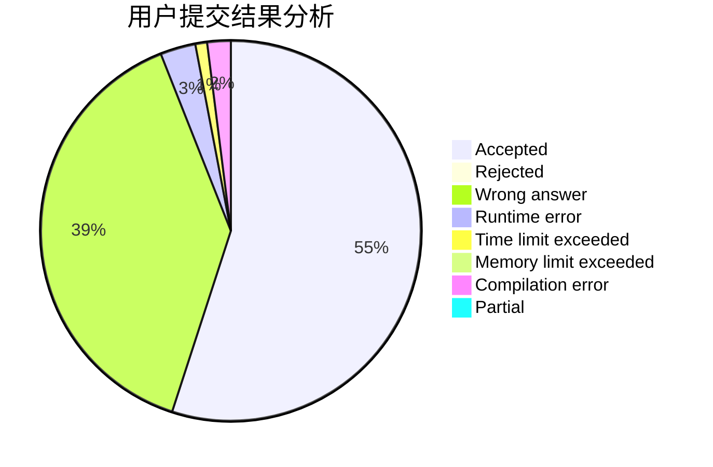
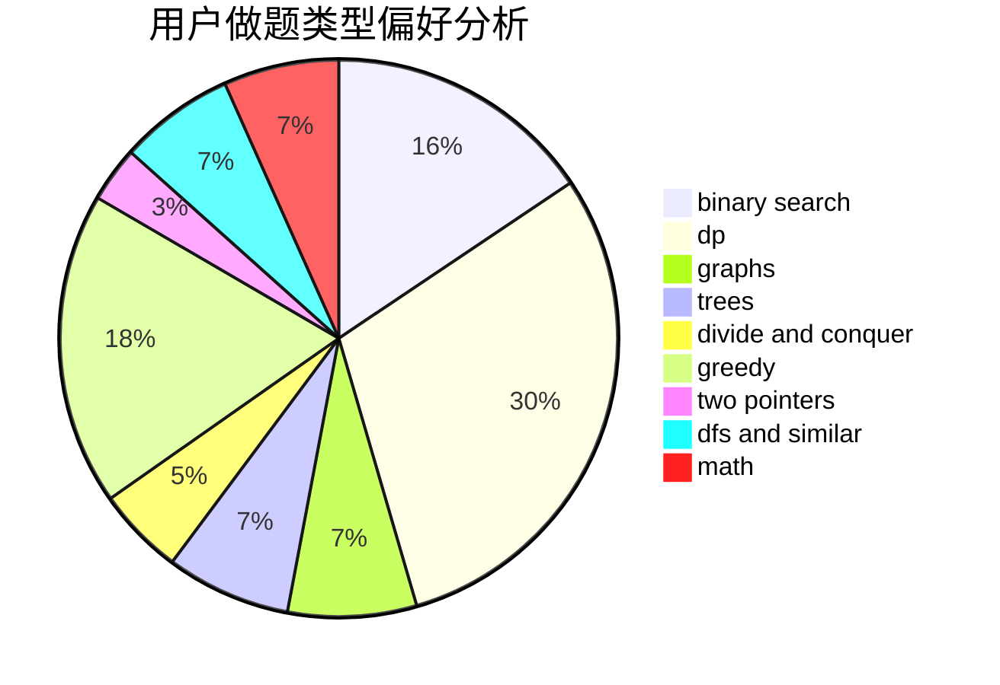

# 4790iop

<!-- tabs:start -->

#### **用户提交结果分析**

#### **用户做题类型偏好分析**

<!-- tabs:end -->
# 推荐题目
[1370C](https://codeforces.com/contest/1370/problem/C)
[1379E](https://codeforces.com/contest/1379/problem/E)
[1375I](https://codeforces.com/contest/1375/problem/I)
[1279E](https://codeforces.com/contest/1279/problem/E)
[13764](https://codeforces.com/contest/1376/problem/4)
[13771](https://codeforces.com/contest/1377/problem/1)
[13781](https://codeforces.com/contest/1378/problem/1)
[1130E](https://codeforces.com/contest/1130/problem/E)
[1280C](https://codeforces.com/contest/1280/problem/C)
[1240A](https://codeforces.com/contest/1240/problem/A)
