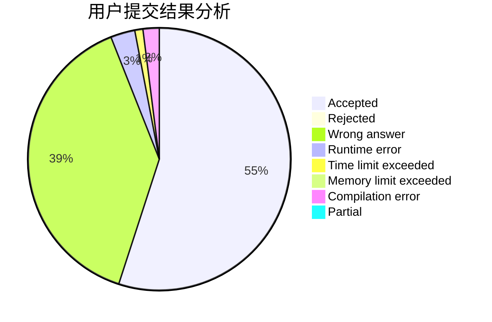
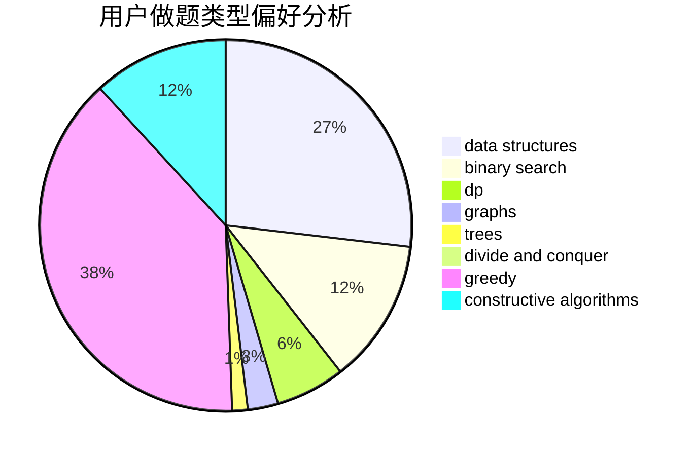
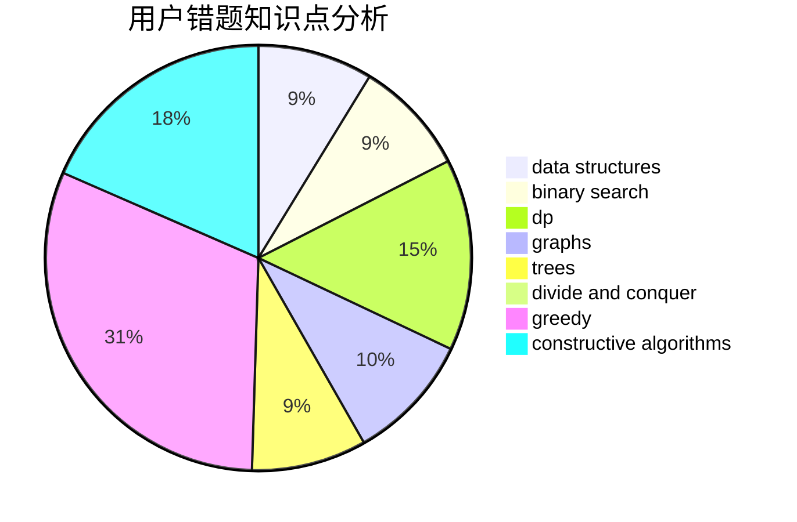

# 4790iop

<!-- tabs:start -->

#### **用户提交结果分析**

#### **用户做题类型偏好分析**

#### **用户错题知识点分析**

<!-- tabs:end -->
# 推荐题目
[1363D](https://codeforces.com/contest/1363/problem/D)		binary search,
                        implementation,
                        interactive,
                        math		  
[1371A](https://codeforces.com/contest/1371/problem/A)		math		  
[1369A](https://codeforces.com/contest/1369/problem/A)		geometry,
                        math		  
[1270E](https://codeforces.com/contest/1270/problem/E)		constructive algorithms,
                        geometry,
                        math		  
[1369E](https://codeforces.com/contest/1369/problem/E)		data structures,
                        dfs and similar,
                        greedy,
                        implementation,
                        sortings		  
[1369F](https://codeforces.com/contest/1369/problem/F)		dfs and similar,
                        dp,
                        games		  
[136C](https://codeforces.com/contest/136/problem/C)		dsu,graphs,sortings,trees		  
[1129A1](https://codeforces.com/contest/1129A/problem/1)		brute force,
                        greedy		  
[1271A](https://codeforces.com/contest/1271/problem/A)		brute force,
                        greedy,
                        math		  
[1234D](https://codeforces.com/contest/1234/problem/D)		data structures		  
