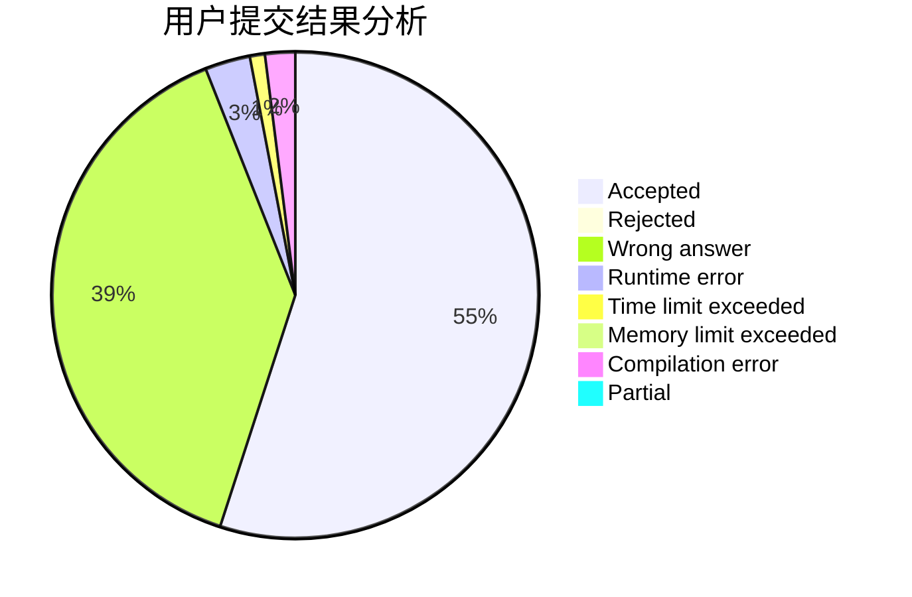
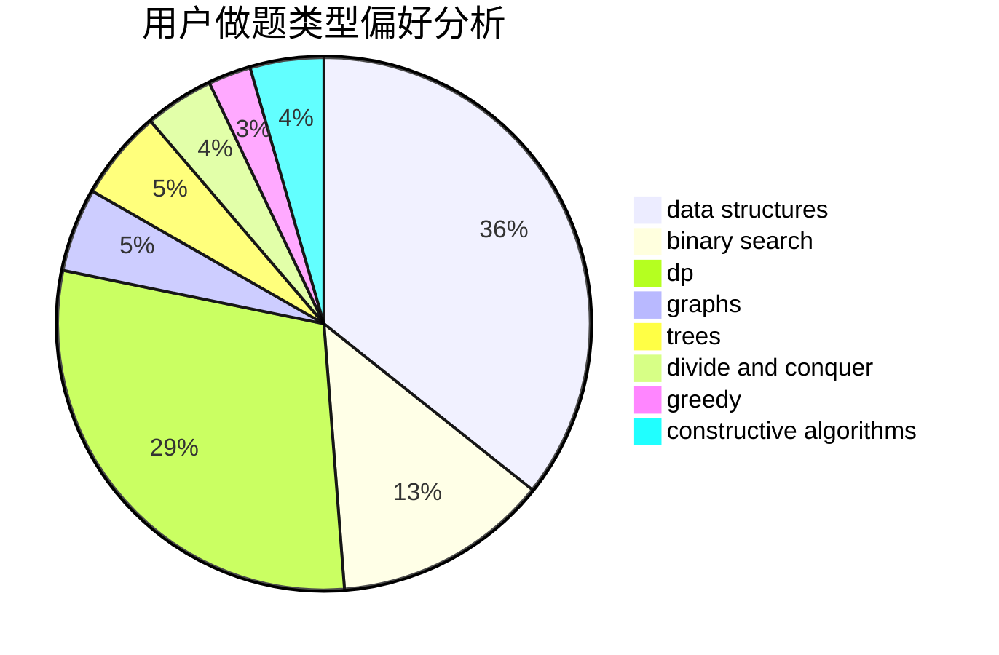
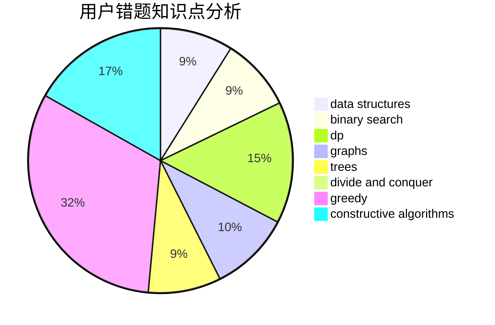

# 4790iop

<!-- tabs:start -->

#### **用户提交结果分析**

#### **用户做题类型偏好分析**

#### **用户错题知识点分析**

<!-- tabs:end -->
# 推荐题目
[1370C](https://codeforces.com/contest/1370/problem/C)		games,
                        math,
                        number theory		  
[1379E](https://codeforces.com/contest/1379/problem/E)		constructive algorithms,
                        divide and conquer,
                        dp,
                        math,
                        trees		  
[1375I](https://codeforces.com/contest/1375/problem/I)		geometry,
                        math,
                        matrices,
                        number theory		  
[1279E](https://codeforces.com/contest/1279/problem/E)		combinatorics,
                        dp		  
[13764](https://codeforces.com/contest/1376/problem/4)		dsu,graphs,sortings,trees		  
[13771](https://codeforces.com/contest/1377/problem/1)		dsu,graphs,sortings,trees		  
[13781](https://codeforces.com/contest/1378/problem/1)		dsu,graphs,sortings,trees		  
[1130E](https://codeforces.com/contest/1130/problem/E)		dsu,graphs,sortings,trees		  
[1280C](https://codeforces.com/contest/1280/problem/C)		dfs and similar,
                        graphs,
                        greedy,
                        trees		  
[1240A](https://codeforces.com/contest/1240/problem/A)		dsu,graphs,sortings,trees		  
