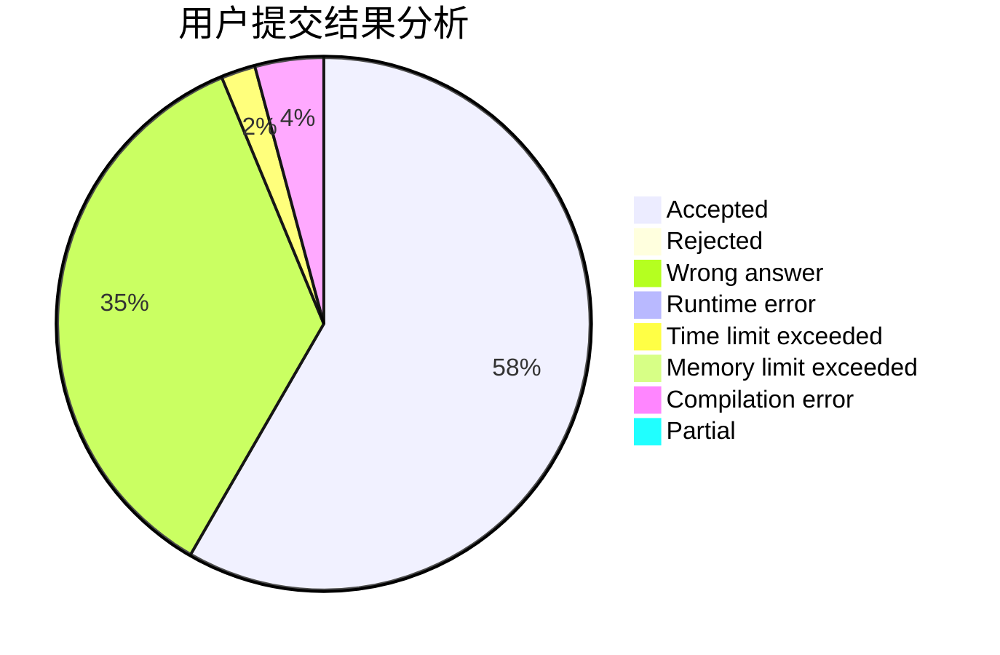
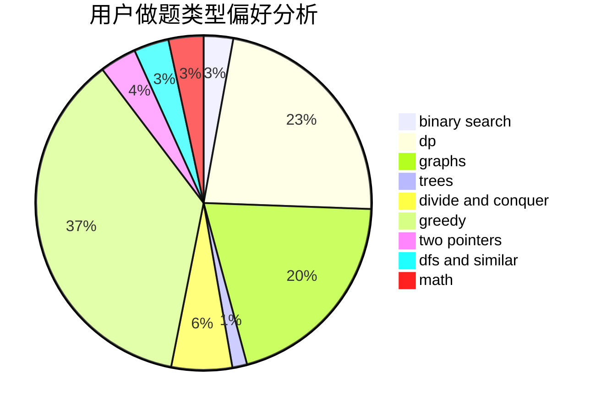

# Kirito_Rivaille

<!-- tabs:start -->

#### **用户提交结果分析**

#### **用户做题类型偏好分析**

<!-- tabs:end -->
# 推荐题目
[677C](https://codeforces.com/contest/677/problem/C)
[893F](https://codeforces.com/contest/893/problem/F)
[317A](https://codeforces.com/contest/317/problem/A)
[571C](https://codeforces.com/contest/571/problem/C)
[1040B](https://codeforces.com/contest/1040/problem/B)
[767A](https://codeforces.com/contest/767/problem/A)
[434A](https://codeforces.com/contest/434/problem/A)
[1100E](https://codeforces.com/contest/1100/problem/E)
[369A](https://codeforces.com/contest/369/problem/A)
[847F](https://codeforces.com/contest/847/problem/F)
